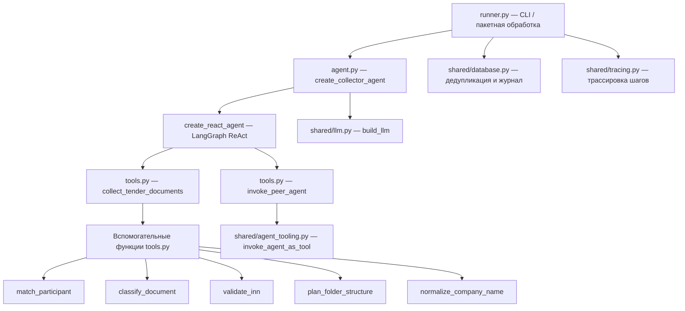

# Алгоритм Agent 3 — Сборщик документов тендерного отбора (`agent3_collector_inspector`)

> **Версия:** 1.0.0 · **Дата:** 2026-04-10  
> **Файлы модуля:** `agent.py`, `runner.py`, `tools.py`

---

## Назначение

Агент `agent3_collector_inspector` автоматизирует сбор и проверку документов от участников тендерного отбора (ТО) для Управления централизованных закупок (УЦЗ).

Агент получает список писем и участников, фильтрует письма по номеру ТО, сопоставляет отправителей с участниками, классифицирует вложения (анкета / NDA / прочее), валидирует данные (ИНН, наименование) и формирует итоговый отчёт о сборе документов.

---

## Архитектура



---

## Пошаговый алгоритм

### Шаг 0 — Входные данные

| Параметр | Откуда берётся |
|----------|---------------|
| `tender_id` | Номер тендерного отбора (например, `3115-ДИТ-Сервер`) |
| `emails` | Список писем с вложениями (JSON-массив) |
| `participants_list` | Список ожидаемых участников с ИНН, email, наименованием |
| `STORAGE_BASE_PATH` | Env-переменная; базовый путь для сохранения документов |

---

### Шаг 1 — Получение данных

1. Агент получает входные данные: `tender_id`, список писем (`emails`), список участников (`participants_list`).
2. Данные могут поступить через REST API (`api/app.py`) или через пакетный режим (`runner.py`).

---

### Шаг 2 — Фильтрация писем по номеру ТО

**Цель:** оставить только письма, относящиеся к данному тендерному отбору.

- Для каждого письма проверяется, содержит ли тема (`subject`) номер ТО (`tender_id`).
- Функция `subject_contains_tender_id` выполняет проверку без учёта регистра.
- Письма без номера ТО в теме — пропускаются.

---

### Шаг 3 — Идентификация участника

Для каждого отфильтрованного письма определяется участник в три этапа:

1. **По email:** сравнивается `from_email` с `contact_email` из списка участников.
2. **По ИНН:** если в содержимом вложений (`content_hint`) найден ИНН (паттерн `ИНН:\s*\d{10,12}`), сверяется со списком участников.
3. **По наименованию:** нечёткое сравнение `from_name` с `name` участника — нормализация организационно-правовой формы, кавычек, пробелов.

Функция `match_participant` реализует все три стратегии в порядке приоритета.

---

### Шаг 4 — Классификация вложений

Для каждого вложения определяется тип документа функцией `classify_document`:

| Тип | Маркеры в имени файла / содержимом |
|-----|-----------------------------------|
| **Анкета** (`anketa`) | «анкета участника тендерного отбора», «анкета участника то», «анкет» в имени файла |
| **NDA** (`nda`) | «соглашение о неразглашении», «nda», «non-disclosure agreement» |
| **Прочее** (`other`) | Все остальные документы |

---

### Шаг 5 — Валидация данных

#### Проверка ИНН
- ИНН из анкеты сверяется с ИНН из сводной таблицы участников (`validate_inn`).
- Если не совпадает — фиксируется расхождение с указанием ожидаемого и фактического значений.

#### Проверка наименования
- Наименование организации из анкеты сверяется с наименованием участника (`company_names_match`).
- Нормализация: удаление организационно-правовой формы (ООО, АО, ПАО и т.д.), кавычек, приведение к нижнему регистру.
- Если не совпадает — фиксируется расхождение (менее критичное, чем ИНН).

---

### Шаг 6 — Формирование структуры папок

Функция `plan_folder_structure` генерирует пути для каждого участника:

```
ТО {tender_id}/
├── Предложения/
│   ├── Участник 1 – {Наименование}/
│   │   └── Документы участника ТО/
│   │       ├── Анкета.pdf
│   │       └── NDA.pdf
│   ├── Участник 2 – {Наименование}/
│   ...
```

---

### Шаг 7 — Вызов инструмента `collect_tender_documents`

Агент вызывает инструмент `collect_tender_documents` с JSON-структурой:

```json
{
  "tender_id": "3115-ДИТ-Сервер",
  "emails": [
    {
      "from_email": "petrov@romashka.ru",
      "from_name": "Петров П.П.",
      "subject": "Re: Приглашение на участие в ТО 3115-ДИТ-Сервер",
      "attachments": [
        {"filename": "Анкета.pdf", "content_hint": "АНКЕТА УЧАСТНИКА ТО... ИНН: 7702365551"}
      ]
    }
  ],
  "participants_list": [
    {"name": "АО «Ромашка»", "inn": "7702365551", "contact_email": "petrov@romashka.ru"}
  ]
}
```

Инструмент возвращает полный отчёт с полями:
- `tender_id` — номер ТО
- `total_expected_participants` — общее количество ожидаемых участников
- `received_count` — количество участников, приславших документы
- `missing_count` — количество не приславших
- `participants` — детальная информация по каждому участнику
- `discrepancies` — список расхождений
- `folder_structure` — сопоставление участников и папок
- `report_text` — текстовый отчёт

---

### Шаг 8 — Межагентное взаимодействие (опционально)

При необходимости агент может вызвать `invoke_peer_agent` для делегирования проверки смежному агенту:

```json
{
  "target_agent": "dzo|tz|tender",
  "query_text": "текст запроса",
  "subject": "тема",
  "sender": "отправитель"
}
```

Используется `shared/agent_tooling.py` → `invoke_agent_as_tool` с контролем маршрутов и прав.

---

### Шаг 9 — Сохранение результата

1. **База данных:** `db.update_job(job_id, status="done"|"error", decision=..., result=..., trace=...)`.
2. **Файл JSON:** при пакетном режиме результат сохраняется в JSON-файл.
3. **Метрики (Prometheus):** `EMAILS_PROCESSED.labels(agent="collector").inc()` или `EMAILS_ERRORS`.
4. **Telegram-уведомление** при критической ошибке.

---

## Схема взаимодействия с другими агентами

```
agent1_dzo_inspector  ←── может вызвать collector для сбора анкет
        │
        │ invoke_peer_agent("collector", ...)
        ▼
agent3_collector_inspector  ←── основной агент сбора документов ТО
        │
        │ [при необходимости] invoke_peer_agent("tender"|"tz"|"dzo", ...)
        ▼
agent21_tender_inspector / agent2_tz_inspector
```

---

## Структура анкеты участника ТО (15 полей)

| № | Поле |
|---|------|
| 1 | Полное наименование организации (с организационно-правовой формой) |
| 2 | Организационно-правовая форма (ООО, АО, ПАО и т.д.) |
| 3 | ИНН (10 или 12 цифр) |
| 4 | КПП |
| 5 | ОГРН |
| 6 | Юридический адрес |
| 7 | Фактический адрес |
| 8 | Контактный телефон |
| 9 | Электронная почта |
| 10 | Адрес сайта (при наличии) |
| 11 | Банковские реквизиты (наименование банка, БИК, р/с, к/с) |
| 12 | Информация о вхождении в холдинг/группу компаний |
| 13 | Система налогообложения (ОСН/УСН) |
| 14 | Привлечение субподрядчиков (да/нет, перечень) |
| 15 | Уполномоченное лицо для подписания договора (ФИО, должность) |

---

## Конфигурация (env-переменные)

| Переменная | По умолчанию | Описание |
|-----------|-------------|----------|
| `EMAIL_BACKEND` | `imap` | Бэкенд для получения писем (`imap` / `exchange` / `graph`) |
| `EMAIL_HOST` | — | IMAP-хост для получения писем |
| `STORAGE_BASE_PATH` | `storage` | Базовый путь для сохранения документов |
| `LLM_BACKEND` | — | `openai` / `github_models` |
| `MODEL_NAME` | — | Имя модели LLM |
| `FORCE_REPROCESS` | `false` | Игнорировать дедупликацию |
| `OPENAI_API_KEY` | — | API-ключ OpenAI |
| `GITHUB_TOKEN` | — | Токен GitHub Models |
| `AGENT_TOOL_ENABLED` | `false` | Включить межагентные вызовы |

---

## Формат входных/выходных данных

### Вход (JSON)

```json
{
  "tender_id": "3115-ДИТ-Сервер",
  "emails": [...],
  "participants_list": [...]
}
```

### Выход (JSON)

```json
{
  "tender_id": "3115-ДИТ-Сервер",
  "total_expected_participants": 5,
  "received_count": 3,
  "missing_count": 2,
  "participants": [
    {
      "name": "АО «Ромашка»",
      "inn": "7702365551",
      "status": "received",
      "anketa_received": true,
      "nda_received": true,
      "inn_match": true,
      "name_match": true,
      "discrepancies": [],
      "folder_path": "ТО 3115-ДИТ-Сервер/Предложения/Участник 1 – Ромашка/Документы участника ТО/"
    }
  ],
  "discrepancies": [],
  "folder_structure": {...},
  "report_text": "Отчёт о сборе документов по ТО 3115-ДИТ-Сервер\n..."
}
```

---

## Ограничения и известные особенности

1. **Формат вызова инструментов:** агенту запрещено передавать оригинальные тексты писем в аргументы инструментов — только структурированный JSON.
2. **Нечёткое сравнение наименований:** алгоритм нормализации покрывает типовые случаи (ООО, АО, кавычки), но может не учесть экзотические сокращения.
3. **Auto-parse анкеты:** поддерживается опциональный парсинг анкеты через `shared/document_parser.py`, если модуль доступен.
4. **Нет собственного email-polling:** агент3 может быть вызван через REST API или пакетный runner, но не имеет самостоятельного IMAP-цикла как agent1/agent2.

---

*Подробности реализации: [`agent.py`](agent.py), [`runner.py`](runner.py), [`tools.py`](tools.py)*
