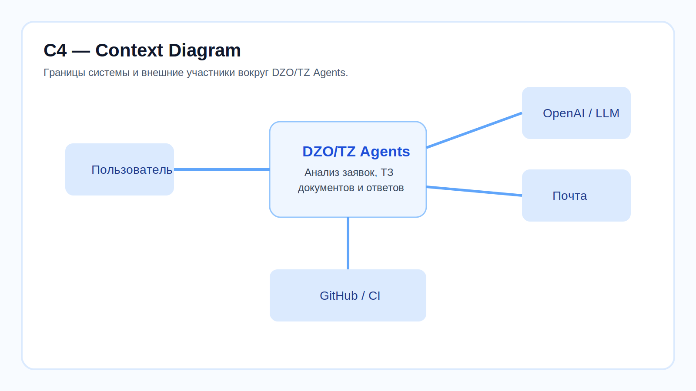
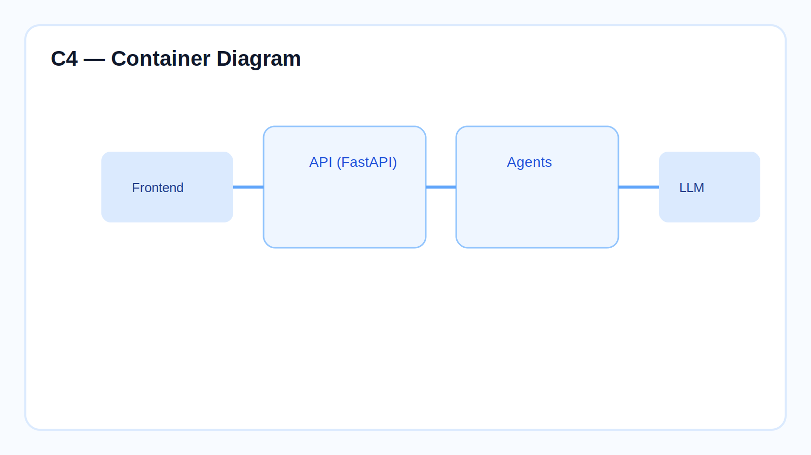
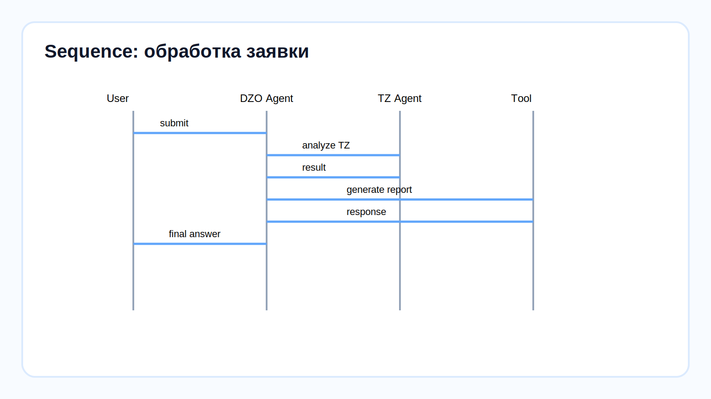

# 🏗️ Архитектурное приложение к курсу

Этот раздел дополняет учебные уроки архитектурным взглядом на систему **DZO/TZ Agents**.

Он нужен для двух задач:
- быстро вводить в контекст разработчиков и архитекторов;
- фиксировать высокоуровневую модель системы рядом с учебными материалами.

---

## 1. C4 — Context Diagram

### Что показывает эта схема
- где проходят границы системы;
- какие внешние участники и сервисы взаимодействуют с агентами;
- какие зависимости критичны для работы решения.

### Основные внешние участники
- **Пользователь** — отправляет заявку или документ на проверку;
- **LLM-провайдер** — даёт агентам модель для reasoning и tool calling;
- **Почта** — канал получения и отправки материалов;
- **GitHub / CI** — среда разработки, проверки и поставки изменений.

---

## 2. C4 — Container Diagram

### Что показывает эта схема
- из каких крупных контейнеров состоит решение;
- где находится API;
- где живут агенты;
- где происходит вызов LLM.

### Контейнеры системы
- **Frontend / client layer** — пользовательский вход;
- **API (FastAPI)** — HTTP-слой и точка входа для интеграций;
- **Agents** — прикладная логика, orchestration, prompts и tools;
- **LLM** — внешняя модель, которая обеспечивает reasoning.

---

## 3. Sequence Diagram — обработка заявки

### Что показывает эта схема
- фактический runtime-поток обработки;
- где вызывается TZ Agent;
- где происходит генерация итогового артефакта.

### Упрощённый сценарий
1. Пользователь отправляет заявку.
2. DZO Agent принимает вход и анализирует контекст.
3. При необходимости DZO Agent вызывает TZ Agent.
4. После получения результата агент вызывает tool для формирования отчёта или ответа.
5. Пользователь получает финальный результат.

---

## 4. Как использовать это приложение

Этот раздел полезно читать:
- перед погружением в уроки 9–16;
- перед обсуждением архитектуры с командой;
- перед подготовкой презентации или защиты решения.

Рекомендуемая связка чтения:
1. `course/README.md`
2. уроки 5, 9, 12, 16, 18
3. это архитектурное приложение

---

## 5. Что можно добавить дальше

Следующая итерация архитектурного слоя может включать:
- **C4 Component Diagram** для внутреннего устройства агента;
- **guardrails flow** — входная и выходная валидация;
- **evaluation layer** — как проверять качество ответов LLM;
- **deployment view** — test/prod и CI/CD-путь поставки.
