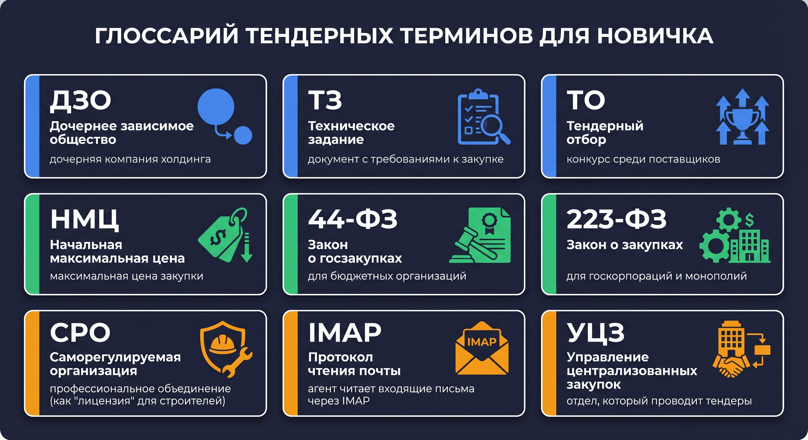

# 📖 Глоссарий: все термины проекта

Если встретили незнакомое слово в уроках — найдите его здесь.

---

## 🏢 Бизнес-термины

| Термин | Расшифровка | Что значит |
|---|---|---|
| **ДЗО** | Дочернее зависимое общество | Дочерняя компания холдинга. Отправляет заявки на закупку |
| **ТЗ** | Техническое задание | Документ с подробными требованиями к тому, что нужно купить |
| **ТО** | Тендерный отбор | Конкурс среди поставщиков — кто предложит лучшие условия |
| **УЦЗ** | Управление централизованных закупок | Отдел компании, который организует все закупки |
| **НМЦ** | Начальная максимальная цена | Максимальная цена, выше которой закупка не проводится |
| **Тезис** | Система электронного документооборота | Программа, в которой хранятся все официальные документы компании |
| **NDA** | Non-disclosure agreement | Соглашение о неразглашении — участник тендера обязуется хранить тайну |

---

## 📋 Юридические термины (законы о закупках)

| Термин | Что значит |
|---|---|
| **44-ФЗ** | Закон «О контрактной системе в сфере закупок» — регулирует госзакупки бюджетных организаций (школ, больниц, министерств) |
| **223-ФЗ** | Закон «О закупках товаров, работ, услуг отдельными видами юридических лиц» — для госкорпораций, монополий (РЖД, Газпром и т.п.) |
| **СРО** | Саморегулируемая организация — профессиональное объединение (например, строителей). Членство = разрешение работать в отрасли |
| **ОГРН** | Основной государственный регистрационный номер юрлица |
| **ИНН** | Индивидуальный номер налогоплательщика (10 цифр для организаций) |
| **КПП** | Код причины постановки на учёт в налоговой |

---

## 💻 Технические термины

| Термин | Что значит |
|---|---|
| **API** | Интерфейс для взаимодействия программ между собой. «Меню» сервера |
| **REST API** | Стандартный способ общения через HTTP-запросы |
| **JSON** | Формат данных: `{"ключ": "значение"}` — читается человеком и машиной |
| **HTTP** | Протокол передачи данных в интернете. GET = получить, POST = отправить |
| **curl** | Программа для HTTP-запросов из терминала |
| **IMAP** | Протокол для чтения электронной почты. Агент ДЗО использует IMAP для получения писем |
| **venv** | Virtual environment — изолированное окружение Python |
| **Docker** | Система запуска приложений в контейнерах (как виртуальная машина, но легче) |
| **PostgreSQL** | База данных, в которой хранятся задания и результаты агентов |
| **Git Bash** | Терминал для Windows, в котором работают Linux-команды (ls, cp, source) |
| **Makefile** | Файл с «ярлыками» команд. `make api` = короткое имя для длинной команды запуска |
| **pyproject.toml** | Конфиг Python-пакета. Описывает зависимости и дополнительные наборы ([ui], [dev]) |
| **Source** | Команда bash: выполнить скрипт в текущей оболочке (нужна для activate) |
| **State** | Состояние агента внутри запроса: история сообщений, результаты инструментов |

---

## 🤖 Термины ИИ

| Термин | Что значит |
|---|---|
| **LLM** | Large Language Model — большая языковая модель (GPT-4o, Claude) |
| **Агент** | LLM + набор инструментов + промпт. Самостоятельно принимает решения |
| **Промпт** | Системная инструкция для LLM: кто она и как действует |
| **ReAct** | Паттерн работы агента: Думать → Действовать → Наблюдать |
| **Tool / Инструмент** | Python-функция, которую LLM может вызвать сама |
| **Temperature** | Параметр 0.0–1.0: «творчество» модели. 0.0 = детерминированные ответы |
| **MCP** | Model Context Protocol — стандарт подключения агентов к AI-клиентам |
| **A2A** | Agent-to-Agent Protocol — стандарт Google для общения агентов между собой |
| **LangGraph** | Фреймворк для создания агентов с инструментами |
| **Peer-агент** | Агент, которого другой агент вызывает как инструмент |
| **JSON schema** | Описание структуры JSON: какие поля обязательны и каких типов |
| **SSE** | Server-Sent Events — потоковая передача данных от сервера к клиенту в реальном времени |
| **JSON-RPC** | Протокол удалённого вызова функций через JSON. Используется в MCP |
| **Фабрика** | Функция, которая создаёт и возвращает объект (например, `create_tz_agent()`) |
| **Кэш агента** | Уже созданный агент, сохранённый в памяти для повторного использования без пересоздания |

---

## ➡️ Вернуться к урокам

[📚 Все уроки курса](README.md)

## MCP (Model Context Protocol)
Открытый протокол Anthropic для подключения LLM к внешним инструментам и сервисам.
В проекте: Claude Desktop / Cursor подключается к агентам через MCP (`/mcp` эндпоинт).

## A2A (Agent-to-Agent)
Протокол Google для коммуникации между автономными агентами.
Агент публикует карточку по `/.well-known/agent.json`, другие агенты её читают.

## SSE (Server-Sent Events)
Технология стриминга: сервер отправляет события клиенту в реальном времени.
Используется для потоковой передачи шагов агента в Claude Desktop.

## Checkpointer
Компонент LangGraph для сохранения state между запросами (PostgreSQL/Redis).
В базовой версии проекта не используется — state живёт в памяти одного запроса.

## Peer-агент
Агент, вызываемый другим агентом как подзадача через `invoke_peer_agent`.
Например: Агент ДЗО вызывает Агент ТЗ как peer для анализа технического задания.

## ReAct (Reason + Act)
Паттерн работы агента: думать → вызвать инструмент → наблюдать → повторить.
Реализован через `create_react_agent` в LangGraph.

## Venv (виртуальная среда)
Изолированный Python-интерпретатор для проекта.
Позволяет иметь разные версии зависимостей в разных проектах.
