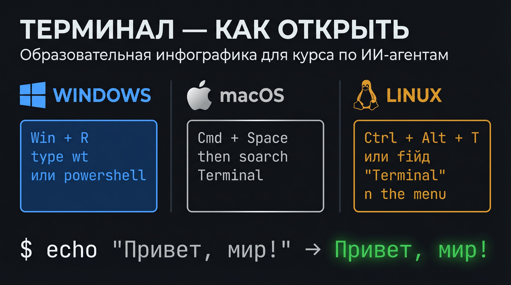

# 🖥️ Урок 0: Терминал и Git — с чего начать

> 💡 Этот урок для тех, кто видит терминал впервые. Если уже умеете — переходите к [Уроку 1](lesson_01_venv.md).

---

## 🤔 Что такое терминал?

**Терминал** — это окно, в котором вы общаетесь с компьютером текстом.
Вместо кликов мышью — вы пишете команды. Компьютер выполняет их и показывает результат.

Это мощнее, чем кажется: одной командой можно установить программу, запустить сервер или скачать проект с интернета.



### Как открыть терминал

**Windows:**
```
Win + R → введите «cmd» → Enter
```
Или: поиск в меню Пуск → «PowerShell»

**macOS:**
```
Cmd + Space → «Терминал» → Enter
```
Или: Finder → Программы → Утилиты → Терминал

**Linux:**
```
Ctrl + Alt + T
```

После открытия вы увидите мигающий курсор — **строку ввода**. Сюда вводите команды.

### Ваша первая команда

```bash
echo "Привет, мир!"
```

Нажмите Enter — терминал напишет в ответ: `Привет, мир!`

Поздравляем — вы только что написали первую команду! 🎉

---

## 🗂️ Что такое Git и GitHub?


**Git** — это система контроля версий. Представьте, что каждый раз, когда вы сохраняете работу, Git делает «снимок» — и вы всегда можете вернуться к любому прошлому состоянию.

Аналогия: **Git — это машина времени для кода.**

**GitHub** — это облачное хранилище для проектов с Git. Как Google Диск, но специально для программ.

| Действие | Команда | Что происходит |
|---|---|---|
| Скачать проект | `git clone URL` | Копирует весь проект на ваш компьютер |
| Получить обновления | `git pull` | Скачивает изменения из GitHub |
| Посмотреть изменения | `git status` | Показывает что изменилось |
| Сохранить изменения | `git commit -m "..."` | Делает «снимок» текущего состояния |

> 💡 **Зачем делать коммиты при обучении?**
> При изучении курса коммиты не обязательны — вы только скачиваете и запускаете проект.
> Коммиты нужны когда **вы сами меняете код** (например, в Уроке 6 создаёте свой инструмент).
> Тогда коммит = «зафиксировать свои изменения». Без него — при `git pull` изменения могут потеряться.

---

## ✅ Практика: скачиваем проект

### Шаг 0: Проверьте Python

> 💡 **Python нужен перед всем остальным!**
> В Windows может быть `python`, в macOS/Linux — `python3`:
> ```bash
> python --version      # Windows
> python3 --version     # macOS / Linux
> # → Python 3.11.x  (нужна версия 3.10+)
> ```
> Если Python не установлен: скачайте с [python.org](https://python.org/downloads) и установите.
> **Важно для Windows:** при установке отметьте галочку «Add Python to PATH».

### Шаг 1: Установите Git (если нет)

> 💡 **Что такое Homebrew?**
> **Homebrew** — это менеджер пакетов для macOS (аналог App Store, но для программ через терминал).
> Установите его один раз: перейдите на [brew.sh](https://brew.sh) и выполните команду с главной страницы.
> После этого `brew install <название>` устанавливает любую программу.

```bash
# macOS (через Homebrew):
brew install git

# Windows: скачайте git-scm.com и установите
# При установке: оставьте все настройки по умолчанию → просто жмите Next → Finish
# Важно: выберите «Git from the command line and also from 3rd-party software» (обычно уже выбрано)
# Linux:
sudo apt install git
```

Проверьте установку:
```bash
git --version
# → git version 2.43.0
```

### Шаг 2: Скачайте проект

```bash
git clone https://github.com/OlegKarenkikh/dzo-tz-agents.git
```

Вы увидите:
```
Cloning into 'dzo-tz-agents'...
remote: Counting objects: ...
Receiving objects: 100% — Done!
```

> 💡 **Вывод `Cloning into...` — это нормально!**
> Вы увидите несколько строк с прогрессом — это Git скачивает проект.
> Последняя строка `Receiving objects: 100%` означает успех.
> Если видите `fatal: repository not found` — проверьте URL.

### Шаг 3: Войдите в папку проекта

```bash
cd dzo-tz-agents
ls
```

`ls` показывает содержимое папки. Вы увидите файлы проекта!

> 💡 **`ls` на Windows не работает!**
> В Windows Command Prompt (`cmd`) используют `dir` вместо `ls`.
> Но если установили **Git for Windows** — там встроен **Git Bash**, где `ls` работает.
> Рекомендация: используйте Git Bash вместо стандартного cmd — команды будут такими же, как в уроках.
> Открыть Git Bash: правый клик на папке → «Git Bash Here».

---

## 📍 Что запомнить

| Понятие | Значение |
|---|---|
| Терминал | Текстовый интерфейс для управления компьютером |
| Команда | Инструкция, которую вводят в терминале |
| Git | Система сохранения версий кода |
| GitHub | Облачное хранилище для Git-проектов |
| `git clone` | Скачать проект из GitHub |
| `cd папка` | Перейти в папку |
| `ls` | Показать содержимое папки |

---

## ➡️ Следующий урок

[🖥️ Урок 1: Виртуальное окружение (venv)](lesson_01_venv.md)


