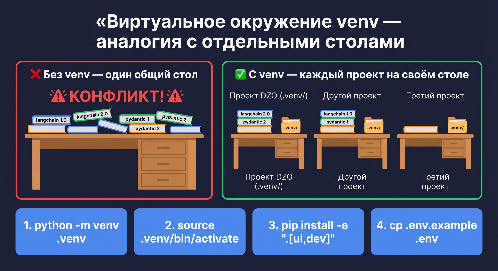
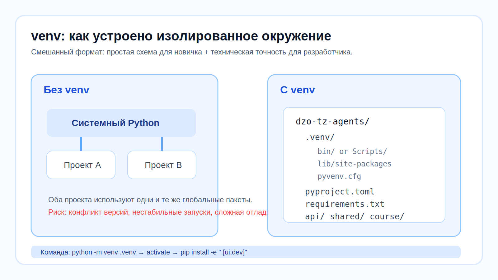
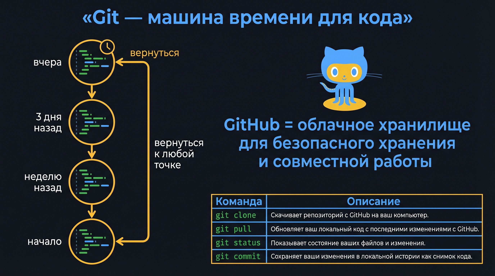

# 🖥️ Урок 1: Изолированное окружение (venv)


> 🎯 **Зачем этот урок?** Ты научишься создавать изолированное Python-окружение для проекта. Без этого пакеты разных проектов конфликтуют — «у меня работает, а у тебя нет».

> 📌 **Новичок?** Сначала прочитайте [Урок 0: Терминал и Git](lesson_00_terminal.md)





---

## 🤔 Что такое «изолированное окружение»?

Представьте, что ваш компьютер — это большой офис, а каждый Python-проект — это отдельный стол.
В одном проекте нужна версия библиотеки 1.0, в другом — 2.0.
Без изоляции они будут мешать друг другу. **venv** создаёт для каждого проекта свою отдельную папку с библиотеками.

```
Без venv:             С venv:

[Компьютер]           [Компьютер]
     |                    |
[Python 3.11]        [Python 3.11]
     |               ┌──────────┐  ┌──────────┐
[langchain 1.0]      │проект DZO│  │проект X  │
     |               │venv/     │  │venv/     │
[pydantic 2.0]       │(своя вер)│  │(своя вер)│
     |               └──────────┘  └──────────┘
  КОНФЛИКТ!          «каждый изолирован — всё работает!»
```

---

## 📦 Что в requirements.txt?

В файле [requirements.txt](../requirements.txt) сохранены **все зависимости** проекта:

```txt
langgraph>=0.2
langchain-openai>=0.1
fastapi>=0.111
streamlit>=1.35
pdfplumber>=0.11
```

---

## ✅ Практика: запускаем проект



### Шаг 1: Войти в папку проекта

```bash
cd dzo-tz-agents
```

### Шаг 2: Создать виртуальное окружение

```bash
python -m venv .venv
```

### Шаг 3: Активировать окружение

```bash
source .venv/bin/activate
```

### Шаг 4: Установить библиотеки

```bash
pip install -e ".[ui,dev]"
```

---

## 📍 Что запомнить

| Понятие | Что значит |
|---|---|
| venv | Изолированная папка |
| activate | Вход в окружение |
| pip install | Установка зависимостей |

---

## ➡️ Следующий урок

[🐛 Урок 2](lesson_02_bug.md)
