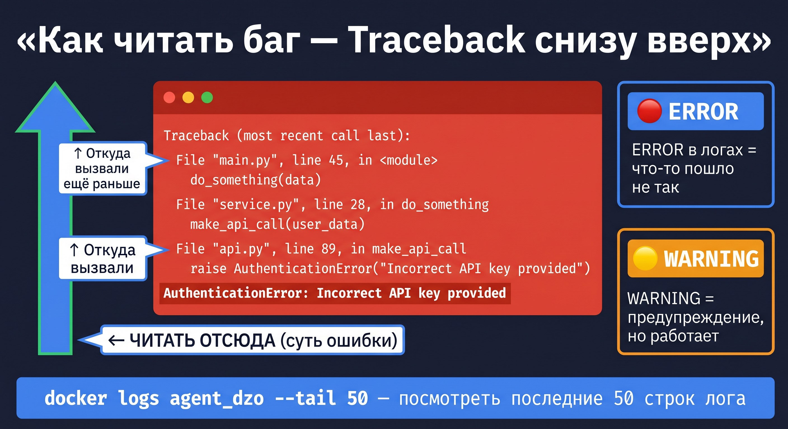

# 🐛 Урок 2: Баг — что это и как искать



---

## 🤔 Что такое баг?

**Баг** (от англ. *bug* — жук) — это ошибка в программе, из-за которой она работает не так, как ожидается.

Слово пошло от 1947 года, когда инженеры Harvard нашли настоящего мотылька в реле компьютера — это была первая задокументированная «отладка» (debugging).

Баги бывают разные:
- **Синтаксическая ошибка** — Python не понимает код (пропущена скобка, опечатка)
- **Логическая ошибка** — код работает, но даёт неверный результат
- **Ошибка окружения** — не установлена библиотека, неверный токен, нет подключения к базе

---

## 📍 Как выглядит баг в dzo-tz-agents?

Когда что-то идёт не так, агент пишет в лог. Вот два реальных примера:

**Пример 1 — PostgreSQL недоступен:**
```
ERROR: connection to server at "localhost" (127.0.0.1), port 5432 failed:
Connection refused
Is the server running on that host and accepting TCP/IP connections?
```
Это значит: нужно запустить Docker с базой данных.

**Пример 2 — неверный ключ OpenAI:**
```
openai.AuthenticationError: Error code: 401
{"error": {"message": "Incorrect API key provided: sk-proj-...XXXX"}}
```
Это значит: в файле `.env` указан неверный `OPENAI_API_KEY`.

---

## 🔍 Где искать баги?

### 1. Читать вывод терминала

Когда вы запускаете `make api`, смотрите что пишет терминал.
Если появляется слово `ERROR` или `Exception` — это баг.

```bash
make api
# → INFO: Uvicorn running on http://0.0.0.0:8000 (Press CTRL+C to quit)
# → INFO: Application startup complete.  ← ВСЁ ХОРОШО

# ИЛИ:
# → ERROR: Could not connect to PostgreSQL ← ПРОБЛЕМА
```

### 2. Запросить статус через API

```bash
curl http://localhost:8000/health
```

Ожидаемый ответ:
```json
{"status": "ok", "version": "1.0.0"}
```

Если ответа нет или другой — что-то не так.

### 3. Посмотреть логи Docker

> 💡 **Что такое Docker?**
> **Docker** — это программа для запуска приложений в изолированных контейнерах.
> Контейнер = мини-компьютер внутри вашего компьютера с уже установленным ПО.
> В нашем проекте в Docker работает **PostgreSQL** (база данных).
>
> **Установка Docker:** скачайте [Docker Desktop](https://www.docker.com/products/docker-desktop/) и установите как обычную программу.
> После установки запустите Docker Desktop — в трее появится значок кита 🐳.
> Проверка: `docker --version` должна вернуть версию.
>
> **Запуск базы данных проекта:**
> ```bash
> make db-up   # или: docker compose up -d postgres
> ```
> > Остановить базу: `make db-down` (или `docker compose down`)
> Удалить данные: `docker compose down -v` — осторожно, удаляет все данные!

После этого `docker logs` будет работать:

```bash
docker logs agent_dzo --tail 50
```

Флаг `--tail 50` показывает последние 50 строк. Это удобно, когда лог большой.

---

## 🛠️ Как читать Traceback?

**Traceback** — это «след» ошибки. Python показывает, где именно сломалось.

```
Traceback (most recent call last):
  File "api/app.py", line 42, in startup
    await database.connect()
  File "shared/database.py", line 18, in connect
    conn = await asyncpg.connect(dsn)
asyncpg.exceptions.ConnectionRefusedError: Connection refused
```

**Правило: читайте Traceback снизу вверх!**

> 💡 **Если Traceback очень длинный (30-50 строк) — не паникуйте!**
> Алгоритм для новичка:
> 1. **Смотрите только последние 3 строки** — там суть ошибки
> 2. Если последняя строка понятна (`ModuleNotFoundError`, `ConnectionRefused`) — решайте её
> 3. Если непонятна — скопируйте **только последнюю строку** в поиск
> 4. Строки посередине (`File "...", line N`) — показывают путь к ошибке, читайте только если шаги 1-3 не помогли

- Последняя строка — **суть проблемы** (`ConnectionRefusedError: Connection refused`)
- Строки выше — цепочка вызовов, которая привела к ошибке

Зная суть (`Connection refused`) — уже понятно: надо запустить базу данных.

---

## ✅ Практика: намеренно сломаем и починим

### Шаг 1: Запустим с неверным токеном

Откройте `.env` и временно поставьте неверный ключ:

```bash
OPENAI_API_KEY=sk-proj-НЕВЕРНЫЙ-КЛЮЧ
```

Запустите агента:

```bash
curl -X POST http://localhost:8000/api/v1/dzo/inspect \
  -H "Content-Type: application/json" \
  -H "X-API-Key: YOUR_API_KEY" \
  -d '{"document": "Тест"}'
```

Вы увидите ошибку аутентификации — это намеренный баг!

### Шаг 2: Почините

Верните правильный ключ в `.env`:

```bash
OPENAI_API_KEY=sk-proj-ВАШ_НАСТОЯЩИЙ_КЛЮЧ
```

Перезапустите сервер (`Ctrl+C`, затем `make api`). Убедитесь, что всё работает.

### Шаг 3: Запомните алгоритм отладки

```
1. Прочитать ошибку (Traceback снизу вверх)
2. Найти ключевое слово: ConnectionRefused / AuthenticationError / ModuleNotFoundError
3. Понять причину (нет базы / неверный токен / не установлена библиотека)
4. Исправить → перезапустить → проверить
```

---

## 🔴 Справочник частых ошибок Python

| Ошибка | Причина | Как исправить |
|---|---|---|
| `ModuleNotFoundError` | Библиотека не установлена | `pip install <название>` |
| `AttributeError` | У объекта нет такого атрибута | Проверьте тип объекта: `type(obj)` |
| `TypeError` | Неверный тип аргумента | Проверьте что передаёте |
| `ValueError` | Правильный тип, недопустимое значение | Проверьте значение |
| `KeyError` | Нет ключа в словаре | Используйте `dict.get(key)` |
| `ConnectionRefused` | Сервис не запущен | Запустите Docker/сервер |

## 📍 Что запомнить

| Термин | Значение |
|---|---|
| Баг | Ошибка в программе |
| Traceback | Трассировка ошибки — читаем **снизу вверх** |
| `ERROR` в логах | Что-то пошло не так |
| Debugging | Процесс поиска и исправления бага |
| `docker logs ... --tail 50` | Смотреть последние строки лога контейнера |

---

## ➡️ Следующий урок

[🌐 Урок 3: curl — разговариваем с агентом](lesson_03_curl.md)


