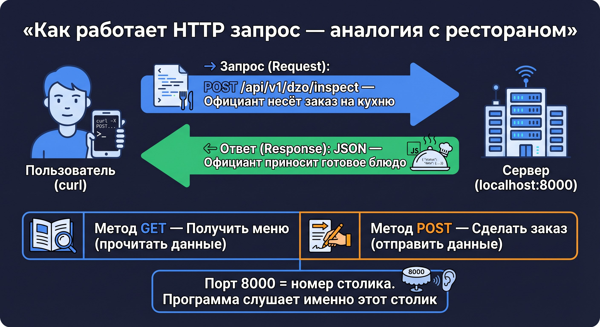

# 🌐 Урок 3: curl — разговариваем с агентом



---

## 🤔 Что такое curl?

**curl** — это программа для отправки HTTP-запросов прямо из терминала.
Когда вы открываете сайт в браузере — браузер отправляет HTTP-запрос.
curl делает то же самое, но вручную, из командной строки.

---

## 🍽️ Как работает HTTP — аналогия с рестораном

| Ресторан | HTTP |
|---|---|
| Вы (клиент) | curl / браузер |
| Официант | HTTP-протокол |
| Кухня | Сервер (localhost:8000) |
| Меню | API-документация (`/docs`) |
| Заказ | HTTP-запрос (GET / POST) |
| Готовое блюдо | HTTP-ответ (JSON) |

**GET** — «Покажи мне меню» (получить данные, не меняет состояние сервера)
**POST** — «Хочу заказать блюдо» (отправить данные, что-то происходит на сервере)

---

## 📦 Что такое JSON?

**JSON** (JavaScript Object Notation) — это формат данных. Человек его читает, машина тоже.

```json
{
  "document": "Заявка от ООО Ромашка",
  "sender": "petrov@romashka.ru",
  "score": 97
}
```

Правила JSON:
- Данные в фигурных скобках `{}`
- Ключ и значение разделены двоеточием `:`
- Строки в кавычках `""`
- Числа без кавычек `97`
- Список в квадратных скобках `["a", "b"]`

---

## 🔢 Что такое порт 8000?

**Порт** — это как «номер квартиры» в доме. Один компьютер (`localhost`) может запускать много программ, каждая на своём порту:

```
localhost:8000  ← наш агент FastAPI
localhost:5432  ← PostgreSQL (база данных)
localhost:3000  ← Streamlit (веб-интерфейс)
localhost:80    ← стандартный HTTP (браузер по умолчанию)
```

Порт 8000 — просто соглашение для разработки. В продакшне обычно используют 80 или 443.

---

## ✅ Практика: первые запросы к агенту

### Шаг 1: Запустите сервер

```bash
make api
```

### Шаг 2: Проверьте работу

```bash
curl http://localhost:8000/health
```

Ответ:
```json
{"status": "ok"}
```

### Шаг 3: Анатомия curl-запроса

```bash
curl \
  -X POST \                              # метод HTTP
  http://localhost:8000/api/v1/dzo/inspect \  # адрес
  -H "Content-Type: application/json" \ # заголовок: тип данных
  -H "X-API-Key: YOUR_API_KEY" \        # заголовок: токен
  -d '{"document": "Заявка ООО Ромашка"}'   # тело запроса
```

| Флаг | Что делает |
|---|---|
| `-X POST` | Метод запроса (по умолчанию GET) |
| `-H "Content-Type: application/json"` | Говорим серверу: данные в формате JSON |
| `-H "X-API-Key: ..."` | Передаём токен авторизации |
| `-d '{...}'` | Тело запроса с данными |
| `-s` | Silent — не показывает прогресс |
| `\| python3 -m json.tool` | Форматировать JSON с отступами для удобного чтения |

> 💡 **Зачем `| python3 -m json.tool`?**
> Без него ответ выглядит так: `{"job_id":"abc123","status":"accepted"}`
> С ним — красиво, с отступами и переносами. Символ `|` (пайп) передаёт вывод одной команды в другую.
>
> **Как узнать реальный job_id?** Первый запрос к `/inspect` возвращает `job_id` в ответе.
> Удобный способ — сохранить в переменную:
> ```bash
> JOB=$(curl -s -X POST http://localhost:8000/api/v1/dzo/inspect \
>   -H "Content-Type: application/json" -H "X-API-Key: ваш_ключ" \
>   -d '{"document":"тест"}' | python3 -c "import sys,json; print(json.load(sys.stdin)['job_id'])")
> curl -s http://localhost:8000/api/v1/jobs/$JOB -H "X-API-Key: ваш_ключ" | python3 -m json.tool
> ```

### Шаг 4: Отправьте документ ДЗО на проверку

```bash
curl -s -X POST http://localhost:8000/api/v1/dzo/inspect \
  -H "Content-Type: application/json" \
  -H "X-API-Key: ваш_api_key" \
  -d '{"document": "Заявка от ООО Ромашка на страхование КАСКО"}' \
  | python3 -m json.tool
```

Ответ:
```json
{
  "job_id": "abc123",
  "status": "accepted"
}
```

### Шаг 5: Проверьте статус задания

```bash
curl -s http://localhost:8000/api/v1/jobs/abc123 \
  -H "X-API-Key: ваш_api_key" \
  | python3 -m json.tool
```

---

## 📍 Что запомнить

| Термин | Значение |
|---|---|
| `curl` | Утилита для HTTP-запросов из терминала |
| `API` | Интерфейс программы для взаимодействия |
| `GET` | Получить данные (не меняет сервер) |
| `POST` | Отправить данные (что-то создаётся/меняется) |
| JSON | Формат данных: `{"ключ": "значение"}` |
| Header `-H` | Заголовок запроса (токен, тип данных) |
| Порт | «Номер квартиры» программы на компьютере |

> 💡 Все незнакомые термины — в [Глоссарии](glossary.md)

---

## ➡️ Следующий урок

[🔑 Урок 4: Токен — ваш ключ к агентам](lesson_04_token.md)

