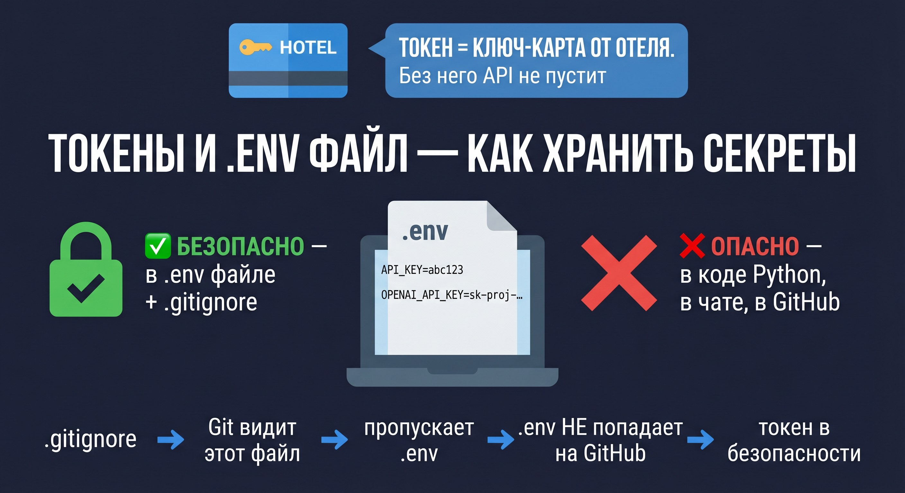

# 🔑 Урок 4: Токен — ваш ключ к агентам



---

## 🤔 Что такое токен?

**Токен** — это длинный секретный ключ, который подтверждает вашу личность при обращении к API.

Аналогия: **Токен = карточка-ключ от гостиничного номера.**
Без карточки — лифт и дверь не откроются. Без токена — API вернёт ошибку `401 Unauthorized`.

В проекте используется два вида токенов:
- **`API_KEY`** — ключ к нашему серверу FastAPI
- **`OPENAI_API_KEY`** — ключ к сервису OpenAI (GPT-4o)

---

## 📦 Где хранятся токены?

Токены хранятся в файле `.env` в корне проекта:

```bash
# Файл .env (НИКОГДА не публикуйте его!)

API_KEY=секретный_ключ_нашего_сервера
OPENAI_API_KEY=sk-proj-...ваш_ключ_openai...

POSTGRES_PASSWORD=пароль_базы_данных
IMAP_PASSWORD=пароль_почты_агента

> 💡 **Стандартные значения для локальной базы:**
> При разработке используйте:
> ```
> POSTGRES_HOST=localhost
> POSTGRES_PORT=5432
> POSTGRES_DB=dzo_agents
> POSTGRES_USER=postgres
> POSTGRES_PASSWORD=postgres   # любой пароль для локальной работы
> ```

> 💡 **Минимальный .env для запуска без email:**
> Для учебного запуска через curl вам нужны только два поля:
> ```
> API_KEY=любая_случайная_строка
> OPENAI_API_KEY=sk-proj-ВАШ_КЛЮЧ
> ```
> `POSTGRES_PASSWORD` нужен только если запускаете базу через `make db-up`.
> `IMAP_PASSWORD` нужен только для email-runner (production-режим). При обучении — не нужен.
```

---

## 🔐 Как получить OPENAI_API_KEY?

1. Зайдите на [platform.openai.com](https://platform.openai.com)
2. Зарегистрируйтесь или войдите
3. В меню: **API Keys → Create new secret key**
4. Скопируйте ключ — он начинается с `sk-proj-`
5. Вставьте в `.env` строку: `OPENAI_API_KEY=sk-proj-ВАШ_КЛЮЧ`

> ⚠️ Ключ показывается только один раз! Сразу сохраните его в `.env`.

---

## 🛡️ Что такое .gitignore и как он защищает токены?

> 💡 **Зачем `.env.example` в репозитории?**
> `.env` нельзя публиковать — он содержит секреты. Но разработчикам нужно знать **какие переменные** заполнить.
> Поэтому в репозиторий кладут `.env.example` — шаблон без реальных значений:
> ```
> API_KEY=your_api_key_here
> OPENAI_API_KEY=sk-proj-...
> ```
> Новый разработчик: 1) копирует `.env.example` → `.env`, 2) заполняет реальные значения.

> 💡 **Как проверить что `.env` не попал на GitHub?**
> ```bash
> git check-ignore -v .env
> # → .gitignore:1:.env  .env  ← файл игнорируется, всё ОК
> ```
> Если команда не вывела ничего — `.env` не защищён! Добавьте строку `.env` в `.gitignore`.

**`.gitignore`** — это файл, в котором перечислены файлы и папки, которые Git должен игнорировать.

```
# Содержимое .gitignore
.env          ← Git НЕ будет отслеживать этот файл
.venv/        ← Git НЕ будет отслеживать папку окружения
__pycache__/  ← временные файлы Python
*.pyc         ← скомпилированные байткоды
```

**Цепочка защиты:**
```
.env содержит токен
    ↓
.gitignore говорит Git: «не трогай .env»
    ↓
git push не загружает .env на GitHub
    ↓
Токен остаётся только у вас!
```

---

## ✅ Практика: работаем с токенами

### Шаг 1: Создайте .env

> 💡 Как скопировать `.env.example` → подробно в [Уроке 1, Шаг 5](lesson_01_venv.md)

```bash
cp .env.example .env    # macOS/Linux/Git Bash
copy .env.example .env  # Windows cmd
```

> 💡 **Что такое `X-API-Key` в заголовке curl?**
> Это НЕ ключ OpenAI — это ключ для доступа к **самому серверу** FastAPI.
> Значение берётся из вашего `.env` файла: поле `API_KEY`.
> **Вы сами придумываете это значение** при заполнении `.env` — любая случайная строка.
> Сгенерировать надёжное значение: `python3 -c "import secrets; print(secrets.token_hex(32))"`

### Шаг 2: Сгенерируйте API_KEY

> 💡 **`python3 -c` — запуск Python прямо в терминале!**
> Флаг `-c` означает «выполни эту строку как Python-код» — не нужно создавать файл.
> Это удобно для быстрых однострочных команд.

```bash
python3 -c "import secrets; print(secrets.token_hex(32))"
# → 8f4a2b1c9d7e6f3a5b8c2d1e4f7a9b6c...
```

Скопируйте результат и вставьте в `.env`:
```
API_KEY=8f4a2b1c9d7e6f3a5b8c2d1e4f7a9b6c...
```

### Шаг 3: Проверьте работу токена

```bash
# Без токена — ошибка 401
curl -X POST http://localhost:8000/api/v1/dzo/inspect \
  -H "Content-Type: application/json" \
  -d '{"document": "тест"}'
# → {"detail": "Not authenticated"}

# С токеном — успех
curl -X POST http://localhost:8000/api/v1/dzo/inspect \
  -H "Content-Type: application/json" \
  -H "X-API-Key: YOUR_API_KEY" \
  -d '{"document": "тест"}'
# → {"job_id": "...", "status": "accepted"}
```

---

## 🔐 Правила безопасности

| Правило | Почему |
|---|---|
| ❌ Не публикуйте токен на GitHub | Боты сканируют репозитории и крадут ключи за минуты |
| ❌ Не передавайте токен в чатах/мессенджерах | История может утечь |
| ✅ Используйте `.env` + `.gitignore` | Стандартный безопасный способ |
| ✅ Разные токены для разных сред | dev-токен и prod-токен — разные |

> 💡 Если токен случайно попал на GitHub — немедленно отзовите его в настройках OpenAI!

---

> ⚠️ **`.env` защищён от git-пуша!**
> Файл `.env` есть в `.gitignore` — он никогда не попадёт в GitHub.
> Проверка: `git status` не должен показывать `.env` как изменённый файл.
> Если видите `.env` в `git status` — добавьте его в .gitignore вручную: `echo .env >> .gitignore`

> 💡 **Что такое `SECRET_KEY` в `.env`?**
> Случайная строка для подписи JWT-токенов. Генерация:
> `python3 -c "import secrets; print(secrets.token_hex(32))"`
> Для обучения — оставьте значение из `.env.example`.

> 💡 **После смены `API_KEY` нужен перезапуск?**
> Да — `.env` читается при старте. Алгоритм: изменить → `Ctrl+C` → `make api`.

> 💡 **Как проверить что .env прочитался правильно?**
> ```bash
> # Показать все переменные из .env (без секретов не выводить в публичные логи!)
> grep -v "^#" .env | grep -v "^$"
>
> # Проверить конкретную переменную:
> python3 -c "import os; from dotenv import load_dotenv; load_dotenv(); print(os.getenv('API_KEY','НЕ НАЙДЕН'))"
> ```
> Если выводит `НЕ НАЙДЕН` — dotenv не видит `.env`. Убедитесь что вы в корне проекта.

> 💡 **Где получить QWEN_API_KEY (альтернатива)?**
> 1. Зарегистрируйтесь на [dashscope.aliyuncs.com](https://dashscope.aliyuncs.com)
> 2. API Keys → Create API Key
> 3. В `.env`: `QWEN_API_KEY=sk-ваш_ключ` и `LLM_PROVIDER=qwen`
> Qwen бесплатный лимит — хорошо для обучения без бюджета.

> 💡 **Где получить OPENAI_API_KEY?**
> 1. Зарегистрируйтесь на [platform.openai.com](https://platform.openai.com)
> 2. Перейдите: API Keys → Create new secret key
> 3. Скопируйте ключ — он показывается **только один раз**
> 4. Вставьте в `.env`: `OPENAI_API_KEY=sk-proj-ваш_ключ`
> Минимальный баланс для тестирования: $5 (хватит на сотни запросов с gpt-4o-mini).

## 📍 Что запомнить

| Понятие | Значение |
|---|---|
| Токен | Секретный ключ для аутентификации в API |
| `.env` | Файл с секретными настройками (не в Git!) |
| `.gitignore` | Список файлов, которые Git игнорирует |
| `401 Unauthorized` | Ошибка: нет токена или токен неверный |
| `403 Forbidden` | Токен правильный, но нет прав на это действие |

> 💡 **401 vs 403 — в чём разница?**
> `401` — вы не представились (нет токена или неверный). Сервер не знает кто вы.
> `403` — вы представились, сервер вас знает, но у вас нет прав на эту операцию.
> В нашем проекте 403 встречается редко — если `AGENT_TOOL_PERMISSIONS` запрещает вызов.
| `sk-proj-...` | Формат ключа OpenAI |

---

## ➡️ Следующий урок

[🧠 Урок 5: LLM — мозг агента](lesson_05_llm.md)


