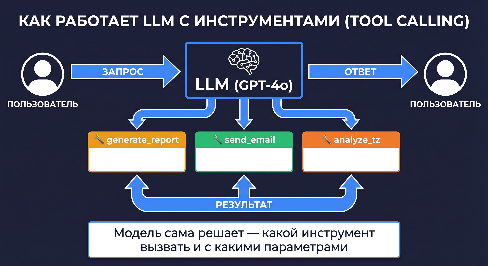
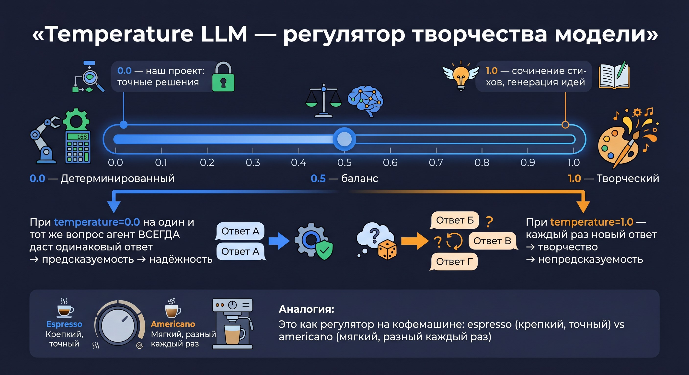

# 🧠 Урок 5: LLM — мозг агента



---

## 🤔 Что такое LLM?

> 💡 **«Токены» — два разных значения!**
> В этом курсе слово «токен» встречается в двух смыслах — не перепутайте:
> - **Токен API** (Урок 4) = секретный ключ для авторизации (`API_KEY`, `OPENAI_API_KEY`)
> - **Токен LLM** = кусочек текста при обработке языка (слово/часть слова → число)
> В данном уроке речь о **токенах LLM** — единицах обработки текста нейросетью.

**LLM** (Large Language Model, большая языковая модель) — это нейросеть, обученная на огромном количестве текстов.

> 💡 **Как нейросеть «читает»?** Она не читает как человек. Текст разбивается на «токены» (кусочки слов), каждый токен превращается в число, и нейросеть вычисляет — какой токен идёт следующим. Это называется «предсказание следующего токена». Так модель и «понимает» язык.

Примеры LLM:
- **GPT-4o** (OpenAI) — используется в нашем проекте
- **Claude** (Anthropic)
- **Qwen** (Alibaba) — поддерживается как альтернатива

В проекте модель создаётся в `shared/llm.py`:

```python
from shared.llm import build_llm

llm = build_llm(temperature=0.0)
```

---

## 🌡️ Что такое temperature?



**Temperature** — это параметр «творчества» модели от 0.0 до 1.0.

| Значение | Поведение | Пример использования |
|---|---|---|
| **0.0** | Всегда один и тот же ответ | ✅ Проверка документов (наш проект) |
| **0.5** | Небольшое разнообразие | Чат-бот поддержки |
| **1.0** | Каждый раз разный ответ | Генерация стихов, творчество |

**Аналогия:** Temperature как регулятор на кофемашине:
- `0.0` = espresso — крепкий, чёткий, всегда одинаковый
- `1.0` = avocado latte — каждый раз новый рецепт

> ⚠️ В нашем проекте `temperature=0.0` — агент должен давать **предсказуемые решения**. Нельзя, чтобы сегодня он принял заявку, а завтра с теми же данными — отклонил.

---

## 🔄 Как LLM работает в цикле ReAct?

Агенты проекта используют паттерн **ReAct** (Reason + Act):

```
1. Думать (Reason)   → модель анализирует задачу
2. Действовать (Act) → вызывает инструмент
3. Наблюдать (Observe) → получает результат инструмента
4. Повторить         → пока задача не решена
```

Пример ReAct-цикла для Агента ДЗО:

```
Мысль:     Нужно проверить наличие ТЗ в письме.
Действие:  analyze_tz_with_agent(tz_text="...")
Наблюдение: {"overall_status": "Соответствует", ...}
Мысль:     ТЗ в порядке. Проверяю реквизиты...
Действие:  generate_validation_report(decision="Заявка полная", ...)
Финальный ответ: Заявка принята.
```

---

## 🏗️ Что такое LangGraph?

**LangGraph** — это фреймворк для создания агентов с инструментами.

> 💡 **Зачем LangGraph, если есть GPT-4o?**
> GPT-4o — это только «мозг». Он умеет отвечать на вопросы.
> Но чтобы мозг мог: вызывать функции Python, управлять состоянием разговора, запускать несколько шагов — нужен оркестратор. Это и есть LangGraph.
>
> Аналогия: GPT-4o — хирург. LangGraph — операционная со всем оборудованием.

```python
from langgraph.prebuilt import create_react_agent
from shared.llm import build_llm

llm = build_llm(temperature=0.0)

agent = create_react_agent(
    model=llm,       # мозг (GPT-4o)
    tools=tools,     # инструменты (Python-функции)
    prompt="Ты — инспектор заявок ДЗО..."  # личность
)
```

---

## 📍 Что запомнить

| Понятие | Значение |
|---|---|
| LLM | Большая языковая модель (GPT-4o, Claude) |
| Temperature | 0.0 = предсказуемо, 1.0 = творчески |
| ReAct | Паттерн: думать → действовать → наблюдать |
| LangGraph | Фреймворк-оркестратор для агентов |
| `create_react_agent` | Создать агента: модель + инструменты + промпт |

---

## ➡️ Следующий урок

[🔧 Урок 6: Инструмент — как его создать](lesson_06_what_is_tool.md)

