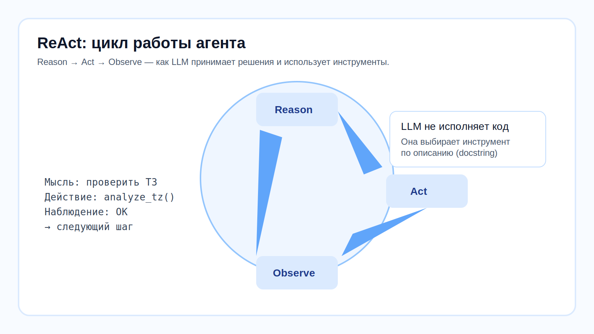
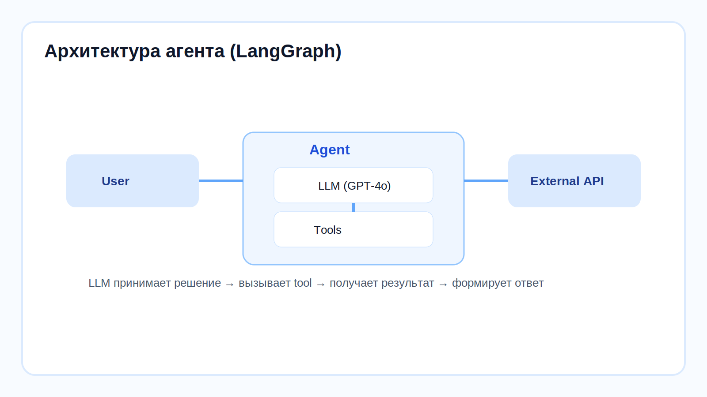

# 🧠 Урок 5: LLM — мозг агента


> 🎯 **Зачем этот урок?** Чтобы понимать почему агент иногда «галлюцинирует» и как управлять этим через температуру и системный промпт.






---

## 🤔 Что такое LLM?

**LLM** (Large Language Model, большая языковая модель) — это нейросеть, обученная на огромном количестве текстов.

Примеры LLM:
- **GPT-4o**
- **Claude**
- **Qwen**

```python
from shared.llm import build_llm

llm = build_llm(temperature=0.0)
```

---

## 🌡️ Что такое temperature?


**Temperature** — это параметр «творчества» модели от 0.0 до 1.0.

| Значение | Поведение | Пример использования |
|---|---|---|
| 0.0 | Предсказуемо | Проверка документов |
| 0.2 | Немного гибче | Формальные письма |
| 0.5 | Более разнообразно | Чат-бот |
| 1.0 | Творчески | Генерация идей |

---

## 🔄 Как LLM работает в цикле ReAct?

Агенты проекта используют паттерн **ReAct**:

1. **Reason** — модель анализирует задачу
2. **Act** — вызывает инструмент
3. **Observe** — получает результат
4. **Repeat** — идёт дальше, пока задача не решена

Пример:

```text
Мысль: проверить ТЗ
Действие: analyze_tz_with_agent(...)
Наблюдение: overall_status = Соответствует
Следующий шаг: собрать финальный отчёт
```

---

## 🏗️ Что такое LangGraph?

**LangGraph** — это оркестратор агента.

- LLM = мозг
- tools = руки
- prompt = правила поведения
- LangGraph = логика, которая связывает всё вместе

```python
from langgraph.prebuilt import create_react_agent
from shared.llm import build_llm

llm = build_llm(temperature=0.0)

agent = create_react_agent(
    model=llm,
    tools=tools,
    prompt="Ты — инспектор заявок ДЗО..."
)
```

---

## 📍 Что запомнить

| Понятие | Значение |
|---|---|
| LLM | Большая языковая модель |
| Temperature | Степень предсказуемости ответа |
| ReAct | Думать → действовать → наблюдать |
| LangGraph | Оркестратор для агента |
| Tool | Функция, которую агент может вызвать |

---

## ➡️ Следующий урок

[🔧 Урок 6: Инструмент — как его создать](lesson_06_what_is_tool.md)
