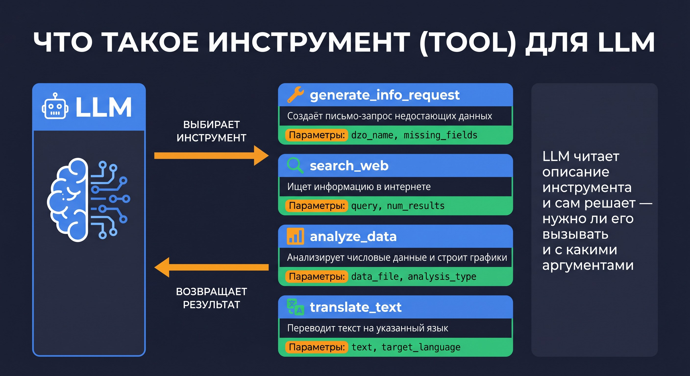
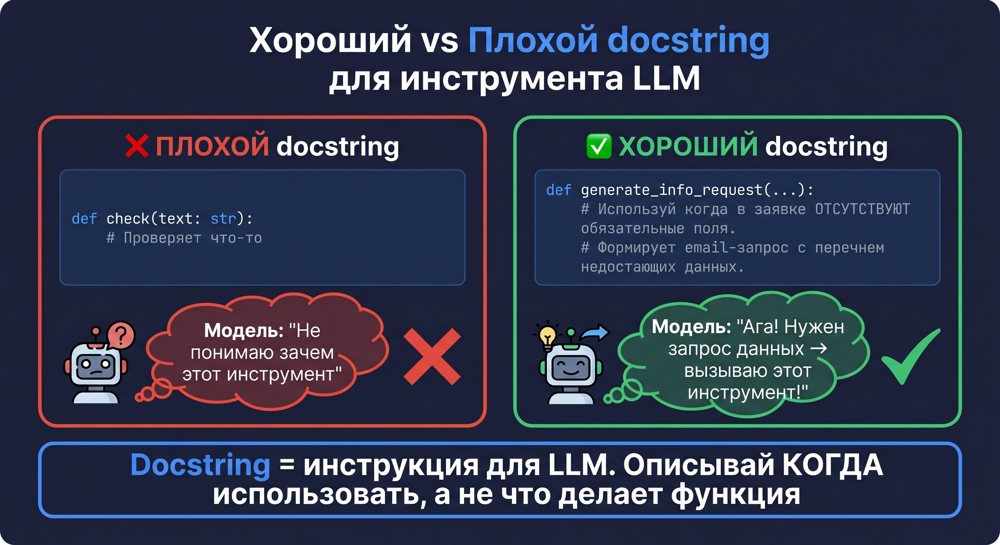

# 🔧 Урок 6: Инструмент — что это и как создать



---

## 🤔 Что такое инструмент (tool)?

**Инструмент** — это обычная Python-функция, которую LLM может вызвать самостоятельно.

Модель не выполняет Python-код напрямую — она **описывает вызов** (имя + аргументы),
а фреймворк (LangGraph) выполняет реальный вызов и возвращает результат.

Ключевое: LLM выбирает инструмент по его **описанию (docstring)**.
Если описание понятное — модель использует инструмент правильно.
Если описание плохое — модель может выбрать не тот инструмент или не вызвать его вовсе.

---

## 🧱 Что такое Pydantic и BaseModel?

> 💡 **Pydantic** — это библиотека для проверки данных в Python.
>
> **BaseModel** — базовый класс Pydantic. Когда вы создаёте класс на его основе, Python автоматически проверяет типы данных.

```python
from pydantic import BaseModel, Field

class InfoRequestInput(BaseModel):
    dzo_name: str = Field(description="Название ДЗО (компании)")
    missing_fields: list[str] = Field(description="Список отсутствующих полей")
```

Что здесь происходит:
- `dzo_name: str` — поле должно быть строкой
- `missing_fields: list[str]` — список строк
- `Field(description=...)` — описание поля, которое **LLM читает**, чтобы правильно заполнить аргументы

> 💡 **Зачем это нужно?**
> LLM генерирует JSON-аргументы для вызова инструмента. Pydantic проверяет: правильные ли типы. Если LLM прислала число вместо строки — Pydantic поймает ошибку до того, как функция запустится.

---

## 🎯 Что такое декоратор @tool?

**Декоратор** — это специальный синтаксис Python `@что-то`, который «оборачивает» функцию дополнительной логикой.

> 💡 **Аналогия для декоратора:**
> Представьте посылку в интернет-магазине. Ваша функция — это товар.
> `@tool` — это упаковка: кладёт товар в коробку с этикеткой, штрихкодом и инструкцией.
> LangGraph работает с «упакованными» функциями — видит этикетку (имя + описание) и может вызвать.

> 💡 **Что значит `-> dict` и `list[str]`?**
> `-> dict` — это **аннотация типа возврата**: функция обещает вернуть словарь (dict).
> Это не обязательно для работы, но помогает IDE и LLM понять структуру данных.
> `list[str]` — список строк. В JSON выглядит так: `["адрес поставки", "срок"]`

```python
@tool("generate_info_request", args_schema=InfoRequestInput)
def generate_info_request(dzo_name: str, missing_fields: list[str]) -> dict:
    ...
```

`@tool` делает три вещи:
1. Регистрирует функцию как инструмент для LLM
2. Привязывает схему аргументов (Pydantic)
3. Добавляет функцию в список доступных инструментов агента

---

## 🖊️ Хороший vs Плохой docstring



LLM читает docstring, чтобы решить: нужен ли этот инструмент прямо сейчас?

| ❌ Плохой docstring | ✅ Хороший docstring |
|---|---|
| `# Проверяет что-то` | `# Используй, когда в заявке ОТСУТСТВУЮТ поля и нужно запросить их.` |
| `# Генерирует форму` | `# Используй ТОЛЬКО если decision="Заявка полная". Создаёт HTML-форму для Тезис.` |
| `# Обрабатывает документ` | `# Используй, если обнаружен признак мошенничества. Формирует уведомление руководителю.` |

> 💡 **Docstring на русском или английском?**
> LLM понимает оба языка. Но **рекомендуем русский** если весь проект на русском.
> Модель будет лучше соотносить русские документы с русскими docstring-инструкциями.
> Главное — быть последовательным: либо всё на русском, либо всё на английском.

> 💡 **Сколько инструментов можно дать агенту?**
> Технически — нет жёсткого лимита. Практически:
> - До 10 инструментов: агент выбирает уверенно
> - 10-20: возможны ошибки выбора, нужны чёткие docstring
> - 20+: рекомендуется разбить на специализированных peer-агентов
> В нашем проекте у каждого агента 4-6 инструментов — оптимальное количество.

> ⚠️ **Антипаттерн: как НЕ надо писать инструмент:**
> ```python
> @tool("process_document")
> def process_document(text: str) -> dict:
>     """Обрабатывает документ и возвращает результат."""  # плохой!
>     ...
> ```
> Проблема: LLM не знает **когда** вызывать. У LLM нет контекста применения.

**Правило:** В docstring пиши **КОГДА** использовать инструмент — не что делает функция.

---

## 📦 Как выглядит инструмент в коде?

Вот реальный инструмент из `agent1_dzo_inspector/tools.py`:

```python
from langchain.tools import tool
from pydantic import BaseModel, Field

class InfoRequestInput(BaseModel):
    dzo_name: str = Field(description="Название ДЗО (компании)")
    missing_fields: list[str] = Field(description="Список отсутствующих полей")

@tool("generate_info_request", args_schema=InfoRequestInput)
def generate_info_request(dzo_name: str, missing_fields: list[str]) -> dict:
    """Используй этот инструмент, когда в заявке отсутствуют обязательные поля
    и нужно запросить их у отправителя. Формирует письмо-запрос."""
    subject = f"Запрос недостающих данных: {dzo_name}"
    body = "<p>Уважаемый партнёр,</p><ul>"
    for field in missing_fields:
        body += f"<li>{field}</li>"
    body += "</ul>"
    return {"subject": subject, "email_html": body}
```

---

> 💡 **Что если инструмент упал с исключением?**
> LangGraph перехватывает исключение и возвращает его текст как результат «наблюдения» агенту.
> Агент видит: `ToolError: connection refused` и может принять решение — попробовать снова или завершить.
> Чтобы агент не зависал — добавьте обработку в инструмент:
> ```python
> try:
>     result = do_something()
> except Exception as e:
>     return {"error": str(e), "status": "failed"}
> ```

## 🔄 Жизненный цикл вызова инструмента

```
1. LLM получает запрос пользователя
2. LLM читает docstring всех доступных инструментов
3. LLM решает: "Нужен generate_info_request — нет места поставки"
4. LLM формирует JSON:
   {"dzo_name": "ООО Ромашка", "missing_fields": ["адрес поставки"]}
5. LangGraph вызывает Python-функцию с этими аргументами
6. Функция выполняется → возвращает результат
7. Результат возвращается в LLM как "наблюдение"
8. LLM продолжает рассуждение
```

---

## ✅ Практика: создайте свой инструмент

Добавьте счётчик слов в `agent1_dzo_inspector/tools.py`:

```python
from pydantic import BaseModel, Field
from langchain.tools import tool

class WordCountInput(BaseModel):
    text: str = Field(description="Текст для подсчёта объёма")

@tool("count_words", args_schema=WordCountInput)
def count_words(text: str) -> dict:
    """Используй, если нужно определить объём документа в словах.
    Помогает оценить размер ТЗ или заявки."""
    return {"word_count": len(text.split()), "char_count": len(text)}
```

Добавьте его в список `tools` при создании агента — и LLM сможет его вызывать!


> 💡 **Как проверить, что агент вызвал новый инструмент?**
> Отправьте запрос с текстом, где явно нужен подсчёт слов:
> ```bash
> curl -s -X POST http://localhost:8000/api/v1/dzo/inspect \
>   -H "Content-Type: application/json" \
>   -H "X-API-Key: ваш_ключ" \
>   -d '{"document": "Определи объём этого документа в словах."}' \
>   | python3 -m json.tool
> ```
> В логах терминала (make api) увидите строку Tool called: count_words.

> 💡 **`args_schema` обязателен?**
> Нет! Для простых инструментов можно обойтись без Pydantic — просто добавьте тип аргумента:
> `args_schema` рекомендуется когда параметров несколько или нужны подробные описания для LLM.

> 💡 **Где именно добавить новый инструмент в `agent.py`?**
> Откройте `agent1_dzo_inspector/agent.py` и найдите строку `tools = [`:
> ```python
> tools = [
>     generate_info_request,
>     generate_validation_report,
>     generate_tezis_form,
>     generate_response_email,
>     generate_escalation,
>     analyze_tz_with_agent,
>     generate_corrected_application,
>     count_words,           # ← ваш новый инструмент добавляется сюда
> ]
> ```
> После добавления — перезапустите сервер (`Ctrl+C` → `make api`).

> 💡 **Где находится список `tools`?**
> Откройте файл `agent1_dzo_inspector/agent.py`:
> ```python
> from agent1_dzo_inspector.tools import (
>     analyze_tz_with_agent,
>     generate_validation_report,
>     generate_tezis_form,
>     generate_info_request,
>     count_words,        # ← ваш новый инструмент добавьте сюда
> )
>
> tools = [
>     analyze_tz_with_agent,
>     generate_validation_report,
>     generate_tezis_form,
>     generate_info_request,
>     count_words,        # ← и сюда
> ]
>
> agent = create_react_agent(model=llm, tools=tools, prompt=PROMPT)
> ```
> Два шага: 1) импорт функции, 2) добавить в список `tools`.

---

## 📍 Что запомнить

| Понятие | Значение |
|---|---|
| `@tool` | Декоратор: превращает функцию в инструмент для LLM |
| `args_schema` | Pydantic-модель с описанием параметров |
| `BaseModel` | Базовый класс Pydantic для схем данных |
| `Field(description=...)` | Описание параметра — LLM читает его |
| Docstring | Описание КОГДА использовать — главное для выбора инструмента |
| Декоратор | `@что-то` перед функцией — добавляет поведение |

---

> 💡 **Ожидаемый ответ агента после добавления `count_words`:**
> Если отправить заявку с текстом и спросить «Сколько слов в документе?» — агент вызовет `count_words` и ответит:
> ```json
> {"word_count": 42, "document": "От: ООО Ромашка..."}
> ```

## 📝 Задание уровня 2: инструмент с несколькими параметрами

Создайте инструмент `format_decision_letter` который принимает:
- `dzo_name: str` — название ДЗО
- `decision: str` — решение («Принята» / «Отклонена»)
- `reason: str` — причина

> 💡 **Где найти инструменты всех агентов:**
> - Агент ДЗО: `agent1_dzo_inspector/tools.py`
> - Агент ТЗ: `agent2_tz_inspector/tools.py`
> - Агент Тендер: `agent3_tender_inspector/tools.py`
> - Агент Collector: `agent4_collector/tools.py`

## ➡️ Следующий урок

[🤝 Урок 7: Агент как инструмент](lesson_07_agent_as_tool.md)


