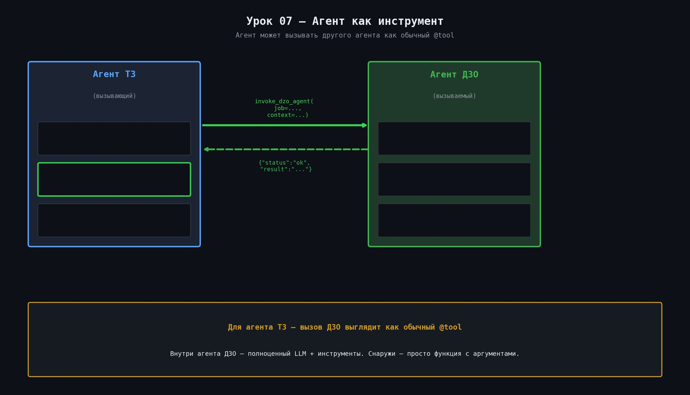

# 🤝 Урок 7: Агент как инструмент



---

## 🤔 Зачем одному агенту вызывать другого?

В проекте есть несколько специализированных агентов:
- **Агент ДЗО** — проверяет заявки от дочерних обществ
- **Агент ТЗ** — специализируется на анализе технических заданий
- **Агент Тендер** — разбирает тендерную документацию
- **Агент Collector** — собирает анкеты участников

Каждый агент — эксперт в своей области. Когда Агент ДЗО встречает техническое задание в письме — он не анализирует его сам, а **делегирует** эту работу специалисту — Агенту ТЗ.

---

## 🔗 Как это работает в проекте?

В заявке ДЗО может быть приложено техническое задание (ТЗ).
Согласно промпту (`prompts/dzo_v1.md`):

```
ШАГ 1.1 — Если найдено ТЗ (или текст ТЗ в теле/вложении),
           вызови analyze_tz_with_agent.
           Результат анализа ТЗ обязательно включи в итоговое резюме.
```

Инструмент `analyze_tz_with_agent` в `agent1_dzo_inspector/tools.py`:

```python
@tool("analyze_tz_with_agent")
def analyze_tz_with_agent(tz_text: str, email_subject: str, source_sender: str) -> dict:
    # Делегирует анализ ТЗ агенту ТЗ и возвращает сводку.
    # Используй, если в письме ДЗО есть вложение с техническим заданием.
    result = invoke_agent_as_tool(
        source_agent="dzo",
        target_agent="tz",
        query=tz_text,
    )
    return result
```

---

## ⚙️ Как устроен bridge `shared/agent_tooling.py`?

Файл `shared/agent_tooling.py` — это универсальный мост между агентами:

```
AGENT_TOOL_REGISTRY = {
    "dzo":       "agent1_dzo_inspector.agent:create_dzo_agent",
    "tz":        "agent2_tz_inspector.agent:create_tz_agent",
    "tender":    "agent21_tender_inspector.agent:create_tender_agent",
    "collector": "agent3_collector_inspector.agent:create_collector_agent",
}
```

Когда `dzo` вызывает `tz`:
1. `agent_tooling` находит фабрику `create_tz_agent` в реестре
2. Создаёт экземпляр агента ТЗ (или берёт из кэша)

> 💡 **Что такое «фабрика»?**
> **Фабрика** — это функция, которая создаёт объект. `create_tz_agent()` — фабрика агента ТЗ.
> Вы вызываете фабрику → она собирает агента из LLM + инструментов + промпта и возвращает готовый объект.
> Паттерн называется «Фабричный метод» (Factory Method).

> 💡 **Зачем нужен кэш агентов?**
> Создание агента — дорогая операция: загружается промпт, инициализируется LangGraph.
> Кэш хранит уже созданного агента в памяти. Второй вызов ДЗО→ТЗ использует того же агента мгновенно.
> Без кэша — каждый межагентный вызов создавал бы нового агента = +500 мс задержки.
3. Передаёт текст ТЗ как запрос
4. Возвращает результат обратно в агент ДЗО

---

## 🔐 Разрешения (permissions)

Можно ограничить, какой агент кого может вызывать:

> 💡 **Да, JSON прямо внутри .env!**
> Файл `.env` — это просто текст формата `КЛЮЧ=значение`. Значением может быть строка JSON:
> ```
> AGENT_TOOL_PERMISSIONS={"*":["*"]}
> ```
> Python читает это как строку, потом парсит через `json.loads()`. Кавычки не экранируются.

```bash
# .env — разрешить всем вызывать всех (по умолчанию)
AGENT_TOOL_PERMISSIONS={"*":["*"]}

# Только ДЗО может вызывать ТЗ и Тендер
AGENT_TOOL_PERMISSIONS={"dzo":["tz","tender"]}

> 💡 **Что означают звёздочки ?**
> Синтаксис: .
>  = «любой» (wildcard). Поэтому:
> -  = любой агент может вызывать любого — режим без ограничений (для разработки)
> -  = только Агент ДЗО может вызывать ТЗ и Тендер
> -  = межагентные вызовы полностью запрещены
> В продакшне используйте конкретные имена вместо .

> 💡 ** — это встроенная функция LangGraph?**
> Нет — это кастомная функция проекта из файла .
> Она оборачивает межагентный вызов: проверяет разрешения, создаёт (или берёт из кэша) нужного агента и возвращает результат.
> LangGraph сам по себе не знает о других агентах — вся логика оркестрации в .


# Полностью отключить межагентные вызовы
AGENT_TOOL_ENABLED=false

> 💡 **Нужно ли перезапускать сервер после изменения .env?**
> **Да.** Файл `.env` читается только при старте. Алгоритм:
> 1. Измените `.env` (например, `AGENT_TOOL_ENABLED=false`)
> 2. Остановите сервер: `Ctrl+C` в терминале где запущен `make api`
> 3. Запустите снова: `make api`
> Изменение вступит в силу немедленно.
```

---

## ✅ Практика: проверить межагентный вызов

```bash
# Отправляем заявку ДЗО с текстом ТЗ — агент ДЗО должен вызвать агент ТЗ
curl -X POST http://localhost:8000/api/v1/dzo/inspect \
  -H "Content-Type: application/json" \
  -H "X-API-Key: YOUR_API_KEY" \
  -d '{
    "document": "Заявка на закупку серверов.\n\nТЕХНИЧЕСКОЕ ЗАДАНИЕ:\n1. Цель: приобретение серверов\n2. Требования: CPU Intel Xeon\n3. Объём: 5 шт.\n4. Место поставки: г. Москва"
  }'
```

В логах вы увидите вызов обоих агентов:
```
INFO agent_dzo: Запуск агента...
INFO agent_tooling: dzo → tz (межагентный вызов)
INFO agent_tz: Запуск агента ТЗ...
```

---

> 💡 **Защита от циклов агентов:**
> Может ли ДЗО → ТЗ → ДЗО зациклиться? Защита работает через `AGENT_TOOL_PERMISSIONS`:
> ```
> AGENT_TOOL_PERMISSIONS={"dzo":["tz","tender"],"tz":["dzo"]}
> ```
> Здесь ТЗ может вызвать ДЗО — потенциальный цикл! Лучшая практика:
> ```
> AGENT_TOOL_PERMISSIONS={"dzo":["tz","tender"]}
> ```
> Только ДЗО вызывает других — односторонняя иерархия, циклы исключены.
> Дополнительно: `shared/agent_tooling.py` ведёт глубину вызовов и прерывает при >5 уровнях.

> 💡 **MCP vs A2A — чем они отличаются?**
> (Подробно в Уроке 8, но краткое сравнение:)
> - **MCP** — протокол между AI-клиентом (Claude, Cursor) и агентом. Человек → инструмент.
> - **A2A** — протокол между агентами. Агент → агент (без участия человека).
> Аналогия: MCP = телефон для звонков людям. A2A = внутренняя переговорная система между роботами.

> 💡 **Зачем нужен кэш агентов?**
> Создание агента (загрузка промпта, инициализация LLM) занимает ~300-500 мс.
> При первом обращении к агенту он создаётся и сохраняется в словарь `_agent_cache`.
> Все последующие обращения — мгновенно (берут готового агента из кэша).
> Если агент не использовался долго — запись очищается через TTL (по умолчанию 5 минут).

> 💡 **Кэш агентов очищается при перезапуске?**
> Да — кэш хранится в памяти процесса. При `Ctrl+C` + `make api` кэш пустой.
> Первый вызов после перезапуска создаёт агента заново (~500 мс). Все последующие — мгновенно.

> 💡 **Допустимые значения `agent_name` в `invoke_peer_agent`:**
> ```
> "dzo_inspector"       ← Агент ДЗО
> "tz_inspector"        ← Агент ТЗ
> "tender_inspector"    ← Агент Тендер
> "collector"           ← Агент Collector
> ```
> Имена определены в `shared/agent_registry.py`. Неправильное имя → ошибка `AgentNotFoundError`.

> 💡 **Что будет если peer-агент недоступен?**
> `invoke_peer_agent` вернёт ошибку `PeerAgentError` с описанием.
> ДЗО-агент обрабатывает это как ошибку ТЗ и возвращает `decision: "Требуется эскалация"`, `reason: "Агент ТЗ недоступен"`.

> 💡 **Peer-вызов синхронный или асинхронный?**
> Синхронный — вызывающий агент ждёт пока peer не вернёт результат.
> Время curl-ответа = сумма времени всех агентов в цепочке. Для двух агентов ~5-10 секунд.

> 💡 **AGENT_TOOL_PERMISSIONS в .env — нужны ли кавычки вокруг JSON?**
> Нет — значение берётся буквально без кавычек:
> ```
> AGENT_TOOL_PERMISSIONS={"dzo":["tz","tender"]}   ← правильно
> AGENT_TOOL_PERMISSIONS='{"dzo":["tz"]}' ← неправильно
> ```

> 💡 **Curl-пример: вызвать ДЗО, который сам вызовет агент ТЗ:**
> ```bash
> curl -s -X POST http://localhost:8000/api/v1/dzo/inspect \
>   -H "Content-Type: application/json" \
>   -H "X-API-Key: ваш_ключ" \
>   -d '{
>     "document": "ТЕХНИЧЕСКОЕ ЗАДАНИЕ\n1. Цель: закупка серверов...\n\nОт: ООО Ромашка\nИНН: 1234567890"
>   }' | python3 -m json.tool
> ```
> Если документ содержит ТЗ — Агент ДЗО автоматически вызовет `analyze_tz_with_agent`.
> В ответе в поле `steps` увидите: `peer_call: agent2_tz_inspector`.

## 📍 Что запомнить

| Понятие | Значение |
|---|---|
| `analyze_tz_with_agent` | Инструмент ДЗО для делегирования анализа ТЗ |
| `invoke_agent_as_tool` | Универсальная функция вызова агента как инструмента |
| `AGENT_TOOL_REGISTRY` | Реестр доступных агентов |
| `AGENT_TOOL_PERMISSIONS` | Разрешения: кто кого может вызывать |
| `AGENT_TOOL_ENABLED` | Включить/выключить межагентные вызовы |

---

## ➡️ Следующий урок

[🌐 Урок 8: MCP и A2A — как подключить агентов к внешнему миру](lesson_08_mcp_a2a.md)


