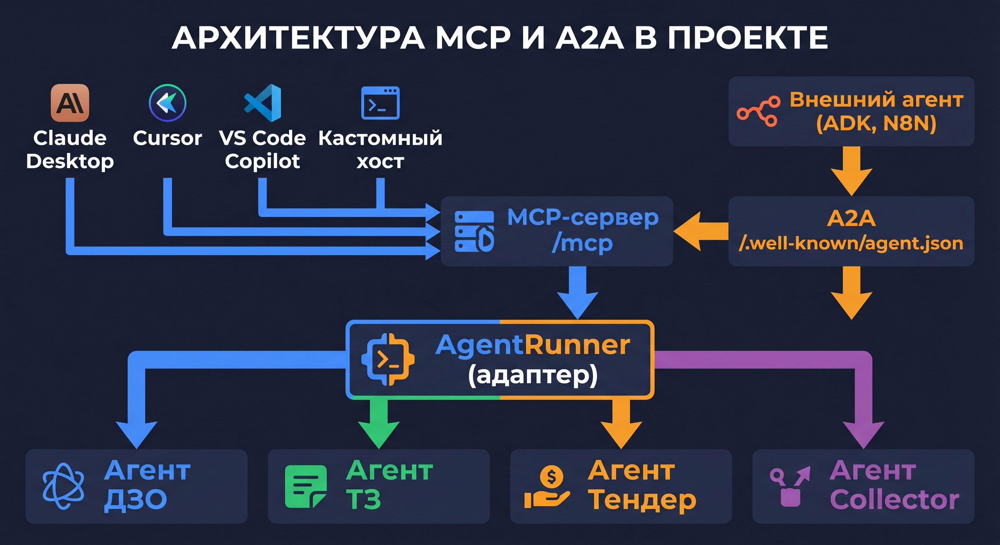

# 🌐 Урок 8: MCP и A2A — агенты для внешнего мира



---

## 🤔 Зачем нужны MCP и A2A?

По умолчанию агенты доступны через REST API (`/api/v1/dzo/inspect`).
Но что если вы хотите вызвать агента прямо из **Claude Desktop** или **Cursor**?

> 💡 **Что такое SSE (Server-Sent Events)?**
> Технология однонаправленного стриминга: сервер шлёт данные клиенту в реальном времени.
> `streamable-http` = HTTP + SSE: агент шлёт каждый шаг (мысль, инструмент) по мере выполнения.
> Это позволяет Claude Desktop показывать шаги агента до финального ответа.

> 💡 **Подключение к Cursor:**
> В Cursor откройте Settings → MCP → Add MCP Server → введите URL: `http://localhost:8000/mcp`
> Cursor автоматически обнаружит все инструменты агента. Конфиг аналогичен Claude Desktop.

Для этого существуют два стандартных протокола:

| Протокол | Расшифровка | Зачем |
|---|---|---|
| **MCP** | Model Context Protocol | Подключить агентов к AI-клиентам (Claude, Cursor, VS Code) |
| **A2A** | Agent-to-Agent | Описать агента для других AI-систем (Google ADK, N8N) |

---

## 🔌 MCP — подключение к AI-клиентам

MCP-сервер монтируется автоматически при запуске FastAPI по адресу `/mcp`.

### Доступные инструменты через MCP

| Инструмент MCP | Что делает |
|---|---|
| `inspect_dzo` | Проверяет заявку ДЗО |
| `inspect_tz` | Анализирует техническое задание |
| `inspect_tender` | Парсит тендерную документацию |
| `collect_documents` | Собирает анкеты участников |
| `list_agents` | Список доступных агентов |

### Подключение Claude Desktop

> 💡 **Где скачать Claude Desktop?**
> Перейдите на [claude.ai/download](https://claude.ai/download) — доступен для macOS и Windows.
> Установите приложение, войдите в аккаунт Anthropic, затем настройте конфигурацию ниже.

Добавьте в файл конфигурации Claude Desktop:

> 💡 **Где найти этот файл?**
> - **macOS:** `~/.config/claude/claude_desktop_config.json`
> - **Windows:** `%APPDATA%\Claude\claude_desktop_config.json`
>   (введите `%APPDATA%` в адресной строке проводника — откроется нужная папка)
> - Если файл не существует — создайте его вручную.
>
> **Что такое `transport: streamable-http`?**
> Transport — это способ передачи данных между Claude и агентом.
> `streamable-http` = HTTP-соединение с поддержкой потоковой передачи (SSE).
> Это позволяет Claude получать промежуточные шаги агента в реальном времени.
>
> **`streamable-http` vs `stdio`:**
> - `streamable-http` — агент запущен отдельно (`make api`), Claude обращается к нему по HTTP. Наш вариант.
> - `stdio` — Claude сам запускает агента как дочерний процесс через стандартный ввод/вывод. Для локальных скриптов.
> Для нашего проекта всегда используйте `streamable-http`.

Добавьте в `~/.config/claude/claude_desktop_config.json`:

```json
{
  "mcpServers": {
    "dzo-tz-agents": {
      "url": "http://localhost:8000/mcp",
      "transport": "streamable-http"
    }
  }
}
```

После этого Claude Desktop видит агентов как встроенные инструменты!

> 💡 **Как проверить подключение MCP в Cursor:**
> В Cursor: Chat → иконка инструментов (🔧) — если агенты в списке — подключение работает.
> Проверка: напишите «Проверь заявку: ООО Ромашка» — Cursor сам вызовет агента.

> 💡 **Нужна ли авторизация для `/mcp`? Кто может вызвать агента?**
> Да — эндпоинт `/mcp` защищён тем же `X-API-Key` из вашего `.env`.
> Claude Desktop автоматически передаёт ключ из конфигурации (`headers.X-API-Key`).
> Посторонний не сможет вызвать агента без ключа — получит `401 Unauthorized`.

> 💡 **Что такое Server-Sent Events (SSE)?**
> SSE — это способ, при котором сервер **непрерывно отправляет** данные клиенту, пока не закончит.
> Аналогия: обычный запрос = SMS (один ответ), SSE = телефонный звонок (поток данных).
> Агент использует SSE, чтобы стримить промежуточные шаги мышления клиенту в реальном времени.

> 💡 **Что такое JSON-RPC?**
> JSON-RPC — стандартный протокол удалённого вызова функций через JSON.
> Поле `"jsonrpc": "2.0"` — версия протокола. `"method"` — что вызвать. `"id"` — номер запроса для сопоставления ответа.
> MCP использует JSON-RPC как «язык общения» между клиентом (Claude) и агентом.

### Проверка MCP через curl

```bash
# Список инструментов MCP
curl -s -X POST http://localhost:8000/mcp \
  -H "Content-Type: application/json" \
  -d '{"jsonrpc":"2.0","method":"tools/list","id":1}' | python3 -m json.tool

# Вызов inspect_dzo через MCP
curl -s -X POST http://localhost:8000/mcp \
  -H "Content-Type: application/json" \
  -d '{
    "jsonrpc": "2.0",
    "method": "tools/call",
    "params": {
      "name": "inspect_dzo",
      "arguments": {"document": "Заявка на закупку серверов..."}
    },
    "id": 2
  }'
```

---

## 🤖 A2A — карточка агента

A2A-карточка — это стандартный JSON-файл

> 💡 **Где хранится A2A-карточка в проекте?**
> Файл автоматически генерируется сервером — он **не хранится на диске**.
> Откройте в браузере: `http://localhost:8000/.well-known/agent.json`
> Это стандартный URL, по которому другие системы (Google ADK, N8N) находят карточку автоматически.
> Исходный шаблон карточки — в файле `api/a2a.py`., который описывает возможности сервиса.
Другие AI-системы читают его и узнают, как взаимодействовать с агентами.

```bash
# Получить карточку агента
curl http://localhost:8000/.well-known/agent.json
```

Ответ:
```json
{
  "name": "DZO/TZ Inspector",
  "version": "1.5.0",
  "skills": [
    {"id": "inspect_dzo", "name": "Проверка заявок ДЗО"},
    {"id": "inspect_tz", "name": "Проверка технических заданий"}
  ]
}
```

### Использование с Google ADK

```python
from google.adk.agents import RemoteAgent

dzo_inspector = RemoteAgent(
    agent_card_url="http://localhost:8000/.well-known/agent.json"
)
result = await dzo_inspector.run("Проверь заявку: ...")
```

---

## 🔐 Безопасность A2A

Обязательно задайте в `.env`:

```bash
PUBLIC_BASE_URL=https://agents.company.ru
```

Без этого поле `url` в карточке формируется из Host-заголовка запроса — риск подмены!

---

> 💡 **Как происходит A2A discovery (обнаружение агента)?**
> Система A2A основана на стандарте: агент публикует карточку по адресу `/.well-known/agent.json`.
> Другая система делает GET-запрос на этот адрес и получает описание агента.
> В нашем проекте: `http://localhost:8000/.well-known/agent.json`
> ```bash
> curl http://localhost:8000/.well-known/agent.json | python3 -m json.tool
> ```
> Это автоматически — никакой ручной регистрации не нужно. Сервер отдаёт карточку по умолчанию.

> 💡 **Откуда взялось `/.well-known/`?**
> Это веб-стандарт RFC 8615: зарезервированный путь для метаданных сервиса.
> `/.well-known/robots.txt`, `/.well-known/security.txt` — вы видели похожие.
> Google A2A Protocol использует `/.well-known/agent.json` как стандартное место для карточки агента.

## 📍 Что запомнить

| Понятие | Значение |
|---|---|
| MCP | Протокол для подключения агентов к AI-клиентам |
| A2A | Стандарт описания возможностей агента (карточка) |
| `/mcp` | Адрес MCP-сервера в нашем проекте |
| `/.well-known/agent.json` | Адрес A2A-карточки агента |
| `PUBLIC_BASE_URL` | Обязательная переменная для безопасного A2A |

---

## ➡️ Следующий урок

[🤖 Урок 9: Агент ДЗО — разбираем изнутри](lesson_09_agent_dzo.md)


