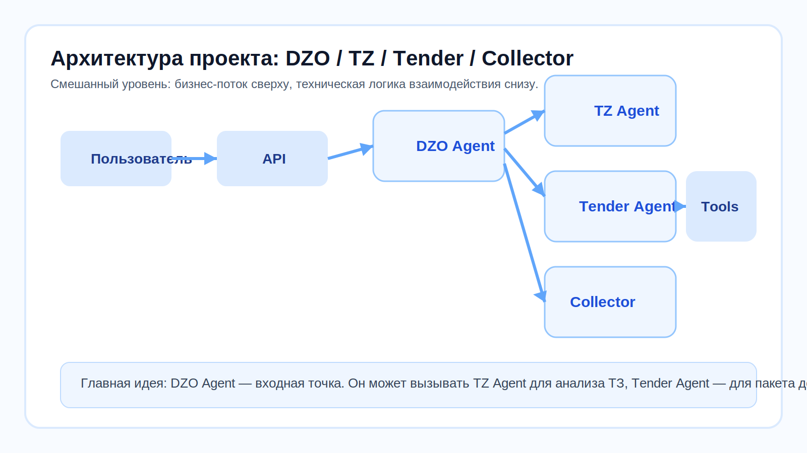
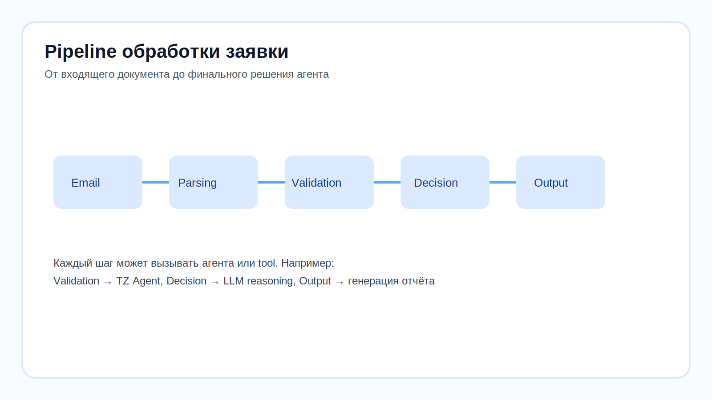

# 🤖 Урок 9: Агент ДЗО — разбираем изнутри


> 🎯 **Зачем этот урок?** Агент ДЗО — центральный в проекте. Ты поймёшь, как он думает, какие инструменты вызывает и что возвращает.






---

## 📌 Назначение

**Агент ДЗО** — это центральный инспектор заявок от дочерних обществ.
Он получает входящие материалы, анализирует письмо и вложения, затем принимает одно из решений:
- заявка полная;
- требуется доработка;
- нужна эскалация.

Главная идея урока: агент ДЗО не делает всё сам. Он может вызывать другие агенты и инструменты по мере необходимости.

---

## 🏗️ Где агент ДЗО в общей архитектуре?

В проекте **DZO Agent** — это входная точка бизнес-потока.
Через него проходит основной сценарий обработки заявки.

Он может:
- вызвать **TZ Agent**, если нужно проверить техническое задание;
- вызвать **Tender Agent**, если нужно собрать состав тендерного пакета;
- вызвать **Collector**, если нужно собрать, классифицировать и проверить документы;
- использовать локальные **tools**, чтобы сформировать отчёт, письмо или HTML-форму.

Именно поэтому агент ДЗО удобно разбирать первым: через него видно всю систему целиком.

---

## 📁 Файлы агента

```text
agent1_dzo_inspector/
├── agent.py
├── runner.py
├── tools.py
└── ALGORITHM.md
```

### Что делает каждый файл

- `agent.py` — собирает ReAct-агента через LangGraph.
- `runner.py` — запускает обработку входящих материалов.
- `tools.py` — хранит инструменты, которые может вызвать агент.
- `ALGORITHM.md` — описывает бизнес-логику и порядок принятия решений.

---

## 🔧 Инструменты агента ДЗО

| Инструмент | Когда вызывается | Что делает |
|---|---|---|
| `analyze_tz_with_agent` | Если найдено ТЗ | Делегирует анализ агенту ТЗ |
| `invoke_peer_agent` | Когда нужен другой агент | Выполняет межагентный вызов |
| `generate_validation_report` | После анализа | Формирует структурированный отчёт |
| `generate_tezis_form` | При полном комплекте | Создаёт HTML-форму для «Тезис» |
| `generate_info_request` | Если не хватает данных | Готовит письмо с запросом |
| `generate_escalation` | При критических проблемах | Формирует эскалацию |
| `generate_response_email` | В финале | Готовит итоговое письмо |
| `generate_corrected_application` | При доработке | Формирует проект исправленной заявки |

---

## 🔄 Как проходит обработка заявки

Упрощённый сценарий такой:

1. Приходит письмо или документ.
2. Система извлекает текст и вложения.
3. Агент ДЗО оценивает комплектность и содержание.
4. При необходимости делегирует часть проверки другому агенту.
5. Формирует решение.
6. Генерирует выходной артефакт: отчёт, письмо, форму или эскалацию.

Это и есть основной pipeline проекта.

---

## 🧠 Системный промпт (кратко)

Промпт хранится в `prompts/dzo_v1.md`.
Он задаёт:
- роль агента;
- чек-листы проверки;
- порядок шагов;
- ограничения на интерпретацию данных.

То есть промпт отвечает не только за стиль ответа, но и за дисциплину принятия решений.

---

## ✅ Практика: запустить агента ДЗО вручную

```bash
make api

curl -s -X POST http://localhost:8000/api/v1/dzo/inspect \
  -H "Content-Type: application/json" \
  -H "X-API-Key: YOUR_API_KEY" \
  -d '{"document": "Тестовая заявка"}'
```

---

## 📍 Что запомнить

| Понятие | Значение |
|---|---|
| `agent1_dzo_inspector` | Пакет агента ДЗО |
| `agent.py` | Сборка ReAct-агента |
| `tools.py` | Набор доступных инструментов |
| `prompts/dzo_v1.md` | Системный промпт |
| `/api/v1/dzo/inspect` | Эндпоинт вызова агента |

---

## ➡️ Следующий урок

[📄 Урок 10: Агент ТЗ — специалист по техническим заданиям](lesson_10_agent_tz.md)
