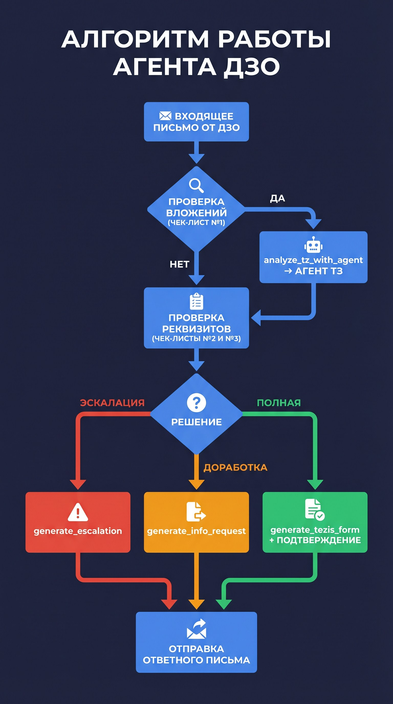
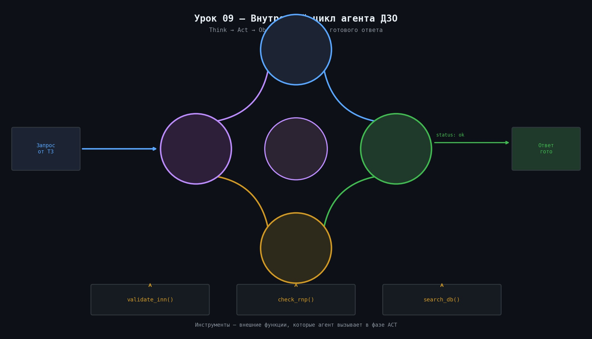

# 🤖 Урок 9: Агент ДЗО — разбираем изнутри


> ⏱️ **30 минут** | 🟠 Средний
> ⬅️ [Урок 8 — MCP и A2A](lesson_08_mcp_a2a.md)

> 🎯 **Зачем этот урок?** Агент ДЗО — центральный в проекте. Ты поймёшь как он думает, какие инструменты вызывает и что возвращает.



---

## 📌 Назначение

**Агент ДЗО** — инспектор заявок от дочерних обществ (ДЗО).
Он получает входящие письма по IMAP

> 💡 **`make api` vs email-runner — в чём разница?**
> Проект состоит из **двух процессов**:
> - `make api` — запускает HTTP-сервер (FastAPI). Принимает запросы через curl/браузер/MCP.
> - `make email` (или `python -m agent1_dzo_inspector.runner`) — отдельный процесс, который каждые N минут читает почту через IMAP и запускает агента.
> В учебных целях достаточно `make api` + отправлять документы через curl.
> Email-runner нужен для production-режима с реальной почтой.

**Агент ДЗО** — инспектор заявок от дочерних обществ (ДЗО).
Он получает входящие письма по IMAP, анализирует вложения и тело письма,
и автоматически отвечает: принять заявку, запросить дополнения или эскалировать.

### SLA (контрактные сроки)

| Операция | Срок |
|---|---|
| Реакция на входящее письмо | 2 часа |
| Запрос недостающих данных | 1 час |
| Эскалация при нет ответа от ДЗО | 2 дня |

> 💡 **Что происходит при нарушении SLA?**
> Агент сам не следит за временем. Нарушение SLA фиксирует внешний мониторинг (дашборд).
> При истечении 2 ч (SLA ответа) мониторинг отправляет уведомление в слак-канал.
> При истечении 2 дней без ответа от ДЗО — агент автоматически запускает `generate_escalation`.

---

## 🏢 Что такое система «Тезис»?

> 💡 **Тезис** — это система электронного документооборота (СЭД), которую используют крупные компании для хранения официальных документов.
> Когда заявка принята — агент создаёт HTML-форму в формате Тезис (`generate_tezis_form`).
> Эта форма затем автоматически загружается в корпоративную систему как официальный документ.
> Вам не нужно знать устройство Тезис — агент создаёт форму по фиксированному шаблону.




> 💡 **Настройки IMAP для популярных почтовых сервисов:**
>
> | Сервис | IMAP_HOST | IMAP_PORT | Примечание |
> |---|---|---|---|
> | Gmail | `imap.gmail.com` | 993 | Нужен App Password (2FA) |
> | Яндекс | `imap.yandex.ru` | 993 | Пароль приложения в настройках |
> | Mail.ru | `imap.mail.ru` | 993 | Внешний пароль в настройках |
> | Корпоративный Exchange | зависит от настроек | 993/143 | Уточните у IT-отдела |

> 💡 **Какие форматы вложений поддерживает агент?**
> - ✅ PDF — через `pdfplumber`
> - ✅ DOCX — через `python-docx`
> - ✅ TXT — напрямую
> - ⚠️ DOC (старый Word) — не поддерживается, попросите отправителя сохранить как DOCX
> - ❌ Excel, изображения — не поддерживаются в базовой версии

## 📬 Как агент читает почту (IMAP)?

> 💡 **Как часто runner.py проверяет почту?**
> По умолчанию — каждые **60 секунд** (настраивается в `.env`):
> ```
> EMAIL_POLL_INTERVAL=60    # секунды между проверками почты
> ```
> Уменьшите до 30 для более быстрой реакции, увеличьте до 300 для экономии лимитов IMAP.

> 💡 **Как агент узнаёт куда отправить ответ?**
> Агент читает заголовок письма `Reply-To` (если есть) или `From`.
> Ответ отправляется на этот адрес автоматически через SMTP.
> SMTP-настройки аналогичны IMAP: `SMTP_HOST`, `SMTP_PORT`, `SMTP_USER`, `SMTP_PASSWORD` в `.env`.

> 💡 **IMAP** (Internet Message Access Protocol) — протокол чтения электронной почты.
> Агент подключается к почтовому серверу через IMAP и «просматривает» входящие письма, как почтовый клиент.
> `make api` запускает HTTP-сервер (FastAPI). Отдельно работает **email-runner** (`runner.py`), который:
> 1. Каждые N минут подключается к почте через IMAP
> 2. Находит новые письма от ДЗО
> 3. Извлекает вложения (PDF, DOCX)
> 4. Запускает агента и отправляет ответ

> 💡 **Что такое `ALGORITHM.md`?**
> Файл бизнес-логики агента на русском языке. Рекомендуем читать перед работой с промптом.
> Содержит: порядок принятия решений, что проверяется, краевые случаи, сценарии эскалации.
> `ALGORITHM.md` = техническое тадание для LLM-промпта.

## 📁 Файлы агента

```
agent1_dzo_inspector/
├── agent.py      ← создание ReAct-агента (LangGraph)
├── runner.py     ← оркестратор: читает почту, запускает агента
├── tools.py      ← 8 инструментов агента
└── ALGORITHM.md  ← бизнес-логика на русском языке
```

---

## 🔧 Инструменты агента ДЗО

| Инструмент | Когда вызывается | Что делает |
|---|---|---|
| `analyze_tz_with_agent` | Если в письме есть ТЗ | Делегирует анализ ТЗ агенту ТЗ |
| `invoke_peer_agent` | По необходимости | Вызывает любой другой агент |
| `generate_validation_report` | Всегда | Формирует JSON-отчёт по чек-листам |
| `generate_tezis_form` | Заявка полная | Создаёт HTML-форму для системы «Тезис» |

> 💡 **Как выглядит HTML-форма `generate_tezis_form`?**
> Функция возвращает готовый HTML-шаблон для загрузки в систему Тезис:
> ```html
> <form id="tezis-application">
>   <field name="dzo_name">ООО Ромашка</field>
>   <field name="subject">Страхование КАСКО</field>
>   <field name="decision">Заявка полная</field>
>   <field name="status">Принята</field>
> </form>
> ```
> Тезис читает этот HTML и создаёт карточку документа автоматически.

> 💡 **Что такое `job_id`? Как выглядит?**
> `job_id` — уникальный идентификатор задания формата UUID:
> `"job_id": "550e8400-e29b-41d4-a716-446655440000"`
> Используйте его в запросе: `GET /api/v1/jobs/{job_id}`
| `generate_info_request` | Нужна доработка | Письмо с запросом недостающих данных |
| `generate_escalation` | Критические проблемы | Уведомление руководителю |
| `generate_response_email` | Всегда | Итоговое письмо отправителю |
| `generate_corrected_application` | При доработке | Проект исправленной заявки |

> 💡 **Куда сохраняется `corrected_application`?**
> Функция возвращает DOCX-документ в виде base64 строки.
> `generate_response_email` вставляет его как вложение к ответному письму.
> В API-режиме — ищите поле `attachments[].content` (base64).

> 💡 **Когда вызывается `generate_corrected_application`?**
> Этот инструмент вызывается **дополнительно** к `generate_response_email` — не вместо него.
> Порядок при решении «Требуется доработка»:
> 1. `generate_info_request` — письмо с запросом недостающих данных
> 2. `generate_validation_report` — JSON-отчёт по чек-листам
> 3. `generate_response_email` — итоговое письмо отправителю
> 4. `generate_corrected_application` — проект исправленной заявки (приложение к письму)

---

## 🧠 Системный промпт (кратко)

Промпт хранится в `prompts/dzo_v1.md` и задаёт агенту:
- Роль: «Ты — ИИ-инспектор заявок ДЗО»
- 3 чек-листа проверки
- Чёткий алгоритм из 6 шагов
- Запрет расширительного толкования (нет данных = данных нет)

---

## ✅ Практика: запустить агента ДЗО вручную

```bash
# 1. Убедитесь, что API запущен
make api

# 2. Отправьте заявку на проверку
curl -s -X POST http://localhost:8000/api/v1/dzo/inspect \
  -H "Content-Type: application/json" \
  -H "X-API-Key: YOUR_API_KEY" \
  -d '{
    "document": "От: ООО Ромашка\nТема: Заявка на закупку ноутбуков\nКоличество: 10 шт.\nИнициатор: Иванов И.И., тел. +7-900-000-00-00\nМесто поставки: г. Москва, ул. Тестовая, 1\nСрок: 30.06.2024\nБюджет: 500 000 руб."
  }' | python3 -m json.tool

# 3. Проверьте статус задания (job_id из предыдущего ответа)
curl -s http://localhost:8000/api/v1/jobs/JOB_ID \
  -H "X-API-Key: YOUR_API_KEY" | python3 -m json.tool
```

> 💡 **Что происходит при таймауте агента?**
> Если LLM не успел завершить за лимит времени — сервер вернёт:
> ```json
> {"status": "timeout", "job_id": "...", "error": "Agent execution timeout (60s)"}
> ```
> Причины таймаута: слишком длинный документ, нестабильный интернет к OpenAI.
> Решение: уменьшите документ или увеличьте `AGENT_TIMEOUT` в `.env`.

> 💡 **Кто следит за SLA (2 ч, 4 ч)?**
> Агент сам **не следит** за временем — он фиксирует время получения заявки в БД.
> Мониторинг SLA — задача внешней системы (или dashboard-а), которая читает из PostgreSQL.
> Агент создаёт запись с `received_at`, а дашборд считает: `now() - received_at > SLA`.

### Три возможных результата

```json
// Заявка полная ✅
{"decision": "Заявка полная", "missing_fields": []}

// Требуется доработка ⚠️
{"decision": "Требуется доработка", "missing_fields": ["Место поставки", "Срок"]}

// Требуется эскалация 🔴
{"decision": "Требуется эскалация", "reason": "Критические противоречия в документах"}
```

---

## 📍 Что запомнить

| Понятие | Значение |
|---|---|
| `agent1_dzo_inspector` | Пакет агента ДЗО |
| `create_dzo_agent()` | Фабрика — создаёт и возвращает агента |
| `AgentRunner.invoke()` | Запустить агента с входными данными |
| `prompts/dzo_v1.md` | Системный промпт агента ДЗО |
| `/api/v1/dzo/inspect` | REST-эндпоинт (HTTP-адрес для вызова) для вызова агента |

---

## ➡️ Следующий урок

[📄 Урок 10: Агент ТЗ — специалист по техническим заданиям](lesson_10_agent_tz.md)

---

## ✅ Проверь себя

1. Опиши цикл Think → Act → Observe своими словами.
2. Сколько итераций максимум делает агент ДЗО перед остановкой?
3. Какой инструмент агент вызывает для проверки ИНН?
4. Что означает `status: inn_not_found` в ответе?
5. Найди в коде файл где реализован агент ДЗО.
