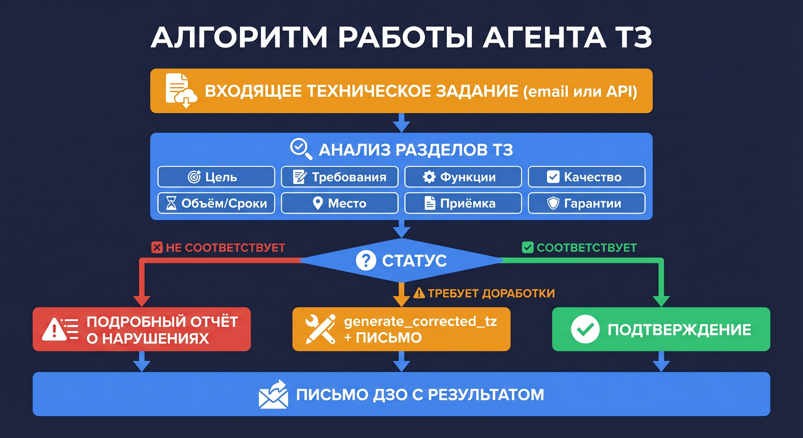
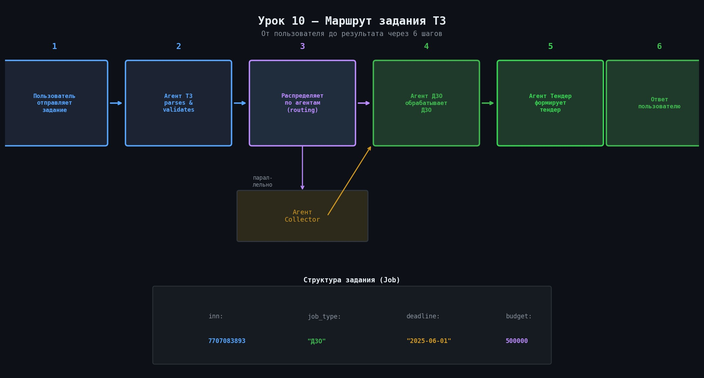

# 📄 Урок 10: Агент ТЗ — специалист по техническим заданиям


> 🎯 **Зачем этот урок?** Агент ТЗ — «диспетчер» всей системы. Поняв как он работает, ты поймёшь как задачи распределяются между остальными агентами.



---

## 📌 Назначение

> 💡 **Аналогия:** Агент ТЗ — как диспетчер в call-центре. Он принимает входящие задачи, определяет куда их направить и следит за исполнением. Сам работу не делает — координирует.


> 💡 **Два режима работы Агента ТЗ:**
>
> | Режим | Как запустить | Кто вызывает |
> |---|---|---|
> | API (самостоятельный) | `POST /api/v1/tz/inspect` через curl | Вы или внешняя система |
> | Email | `make email` (email-runner) | Агент читает почту сам |
> | Peer-агент | Агент ДЗО вызывает через `analyze_tz_with_agent` | Агент ДЗО |
>
> **Ключевое отличие режимов:**
> В API-режиме агент **не отправляет email** — только возвращает JSON.
> В Email-режиме агент **сам отправляет** ответное письмо через SMTP.
>
> При обучении используйте API-режим — он проще всего запустить через curl.

**Агент ТЗ** — инспектор технических заданий.
Проверяет ТЗ на соответствие стандартам по 8 разделам.
Может работать как самостоятельный агент (через email или API) или как инструмент внутри Агента ДЗО.

---

## 📁 Файлы агента




```
agent2_tz_inspector/
├── agent.py      ← создание ReAct-агента
├── runner.py     ← оркестратор email-обработки
├── tools.py      ← 4 инструмента
└── ALGORITHM.md  ← бизнес-правила
```

---

## 📋 8 разделов технического задания

| № | Раздел | Что проверяется |
|---|---|---|
| 1 | Цель и задачи | Цель закупки, ожидаемые результаты |
| 2 | Технические требования | Характеристики, стандарты |
| 3 | Функциональные требования | Функции, режимы работы |
| 4 | Требования к качеству | Сертификаты, стандарты качества |
| 5 | Объём и сроки | Количество, единицы, даты |
| 6 | Место поставки | Точный адрес, условия доставки |
| 7 | Порядок приёмки | Процедура проверки |
| 8 | Гарантийные обязательства | Срок гарантии, обслуживание |

---

> 💡 **Чем v1 отличается от v2 промпта агента ТЗ?**
>
> | Аспект | v1 (строгий) | v2 (мягкий) |
> |---|---|---|
> | Разделы 4, 7, 8 | Обязательные | Рекомендованные |
> | При отсутствии раздела 4 | «Критическое нарушение» | «Рекомендуется добавить» |
> | Общий статус | Чаще «Требует доработки» | Чаще «Соответствует с замечаниями» |
>
> Для учебных задач используйте v1 — он строже и нагляднее показывает работу агента.
> v2 подходит для реальных проектов где часть разделов действительно необязательна.

## 🔧 Инструменты агента ТЗ

| Инструмент | Когда вызывается | Что делает |
|---|---|---|
| `generate_json_report` | Всегда | JSON-отчёт по 8 разделам с статусами |
| `generate_corrected_tz` | При доработке | HTML-документ исправленного ТЗ |
| `generate_email_to_dzo` | Всегда | Письмо ДЗО с результатом проверки |
| `invoke_peer_agent` | По необходимости | Вызов другого агента |

---

## ✅ Практика: отправить ТЗ на проверку

> 💡 **Пример полного ТЗ которое агент примет сразу (8 разделов):**
> ```
> 1. Цель: приобретение серверов для ЦОД.
> 2. Тех. требования: CPU Intel Xeon 16+ ядер, RAM 256 ГБ ECC.
> 3. Функциональные: 99.9% uptime.
> 4. Качество: ISO 9001.
> 5. Объём: 5 шт, поставка до 30.06.2024.
> 6. Место: г. Москва, ул. Тестовая, 1.
> 7. Порядок приёмки: комиссия, акт в 5 дней.
> 8. Гарантия: 3 года, выезд 24 ч.
> ```
> Ожидаемый ответ: `overall_status: "Соответствует"`, `stats: {ok: 8}`.

```bash
# Проверка технического задания через API
curl -s -X POST http://localhost:8000/api/v1/tz/inspect \
  -H "Content-Type: application/json" \
  -H "X-API-Key: YOUR_API_KEY" \
  -d '{
    "document": "ТЕХНИЧЕСКОЕ ЗАДАНИЕ\n\n1. Цель закупки\nПриобретение серверов для ЦОД.\n\n2. Технические требования\nCPU: Intel Xeon, не менее 16 ядер.\nRAM: не менее 256 ГБ ECC.\n\n3. Объём и сроки\n5 штук, срок поставки: 30.06.2024.\n\n4. Место поставки\nг. Москва, ул. Тестовая, д. 1."
  }' | python3 -m json.tool
```

Пример ответа (требует доработки):

```json
{
  "overall_status": "Требует доработки",
  "stats": {"ok": 4, "issues": 4, "total": 8},
  "critical_issues": [
    "Отсутствует раздел 4 (требования к качеству)",
    "Отсутствует раздел 7 (порядок приёмки)",
    "Отсутствует раздел 8 (гарантии)"
  ]
}
```

---

> 💡 **Почему в уроке 8 разделов, а агент может проверять строже или мягче?**
> 8 разделов — это **эталонная структура** ТЗ. Промпт агента версии v2 помечает разделы 4, 7, 8 как «рекомендованные».
> Значит: при отсутствии раздела 4 (качество) — статус будет «предупреждение», а не «блокирующая ошибка».
> В версии v1 все 8 разделов были обязательными. При переключении промпта поведение меняется.
> Как переключить версию промпта — смотрите в [Уроке 12](lesson_12_prompts.md).

> 💡 **Агент ТЗ работает с документами на английском?**
> Да — GPT-4o понимает любой язык. Агент проверит структуру разделов 1-8 вне зависимости от языка.
> Но промпт написан на русском, поэтому **ответ** агент сформирует на русском.
> Если нужен английский ответ — добавьте в промпт секцию: «Если входящий документ на английском — отвечай на английском».

## 🔄 Агент ТЗ как инструмент ДЗО

Когда Агент ДЗО находит ТЗ в письме — он вызывает Агент ТЗ через `analyze_tz_with_agent`.
Это «невидимый» вызов: пользователь отправляет запрос в один эндпоинт (`/dzo/inspect`),
а внутри два агента работают последовательно.

```
Пользователь → /api/v1/dzo/inspect
                    ↓
              Агент ДЗО (анализирует письмо)
                    ↓ (нашёл ТЗ)
              analyze_tz_with_agent()
                    ↓
              Агент ТЗ (проверяет разделы)
                    ↓
              Результат возвращается в Агент ДЗО
                    ↓
              Итоговый ответ пользователю
```

---

> 💡 **Curl для получения исправленного ТЗ (через прямой вызов):**
> ```bash
> curl -s -X POST http://localhost:8000/api/v1/tz/inspect \
>   -H "Content-Type: application/json" \
>   -H "X-API-Key: ваш_ключ" \
>   -d '{"document": "ТЗ на закупку...", "return_corrected": true}' \
>   | python3 -m json.tool
> ```
> В ответе будет поле `corrected_tz_html` — готовый HTML-документ с исправлениями.

## 📍 Что запомнить

| Понятие | Значение |
|---|---|
| `agent2_tz_inspector` | Пакет агента ТЗ |
| `create_tz_agent()` | Фабрика агента ТЗ |
| `/api/v1/tz/inspect` | REST-эндпоинт агента ТЗ |
| `prompts/tz_v1.md` | Системный промпт агента ТЗ |
| 8 разделов | Стандартная структура технического задания |

---

## ➡️ Следующий урок

[📊 Урок 11: Агент Тендер и Агент Collector](lesson_11_agents_tender_collector.md)

---

## ✅ Проверь себя

1. Что делает агент ТЗ при получении нового задания?
2. Как он решает — отправить задание агенту ДЗО или агенту Тендер?
3. Что такое `Job` объект и какие поля обязательны?
4. Может ли агент ТЗ сам проверить ИНН — или он делегирует?
