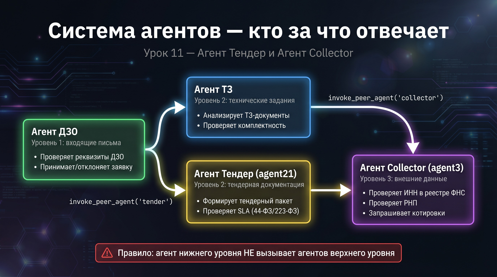

# 📊 Урок 11: Агент Тендер и Агент Collector — независимые специалисты


> 🎯 **Зачем этот урок?** В системе 4 агента — и важно понять кто за что отвечает. После урока ты сможешь объяснить архитектуру коллеге.




---

## 📌 Агент Тендер (agent21) — аналитик тендерной документации

> 💡 **Аналогия:** Четыре агента — как отделы в компании: ТЗ — reception, ДЗО — юридический, Тендер — тендерный, Collector — аналитический. Каждый знает своё дело.


### Назначение

**Агент Тендер** анализирует тендерную документацию и извлекает полный перечень документов,
которые участник закупки обязан предоставить в составе заявки.

Агент работает в **двух режимах**:
1. **Самостоятельно** — через REST API `/api/v1/tender/inspect` (получает документ напрямую)
2. **Как peer-агент** — вызывается Агентом ДЗО через `invoke_peer_agent` при необходимости

### Два вида требований, которые он ищет

| Тип | Что это | Пример |
|---|---|---|
| **Прямые** | Явно перечислены в разделе «Состав заявки» | Выписка из ЕГРЮЛ |
| **Косвенные** | Вытекают из квалификационных требований | Лицензия СРО (раз нужны строительные работы) |

### Защита от галлюцинаций в промпте

> 💡 **Что такое JSON schema?**
> **JSON schema** — это описание структуры JSON-документа: какие поля обязательны, какой у них тип.
> Агент Collector использует JSON schema, чтобы валидировать анкеты участников.
> Пример: поле `inn` должно быть строкой из 10 или 12 цифр — schema это проверяет автоматически.
>
> **Что такое «анкета участника»?**
> Анкета — это документ (обычно Word или PDF), который участник тендера заполняет и присылает.
> Содержит реквизиты компании: ИНН, ОГРН, адрес, банковские данные и т.д.
> Агент Collector проверяет, что все 15 полей заполнены корректно.

Промпт содержит обязательное поле `quote`:
```
quote = ДОСЛОВНАЯ ЦИТАТА из текста, подтверждающая требование
АНТИГАЛЛЮЦИНАЦИЯ: только реальный текст из документации!
```

LLM обязана процитировать реальный текст — невозможно придумать документ, которого нет.

> 💡 **Куда Агент Collector сохраняет собранные анкеты?**
> Результаты сохраняются в PostgreSQL: таблица `collector_results`.
> Каждая запись содержит: `tender_id`, `participant_id`, `status`, `data` (JSON с полями анкеты), `collected_at`.
> Посмотреть через psql: `SELECT * FROM collector_results WHERE tender_id='3115-ДИТ-Сервер';`

> 💡 **Роль агента в работе с NDA:**
> Агент Тендер **не отправляет** NDA — он только проверяет наличие NDA-требования в тендерной документации.
> Само NDA отправляется вручную или через отдельный процесс. Агент фиксирует: «НДА требуется: да/нет».

### Практика: вызов через curl

```bash
# Анализ тендерной документации (самостоятельный режим)
curl -s -X POST http://localhost:8000/api/v1/tender/inspect \
  -H "Content-Type: application/json" \
  -H "X-API-Key: YOUR_API_KEY" \
  -d '{
    "document": "ТЕНДЕРНАЯ ДОКУМЕНТАЦИЯ (44-ФЗ)\n\nПредмет закупки: Поставка серверного оборудования\n\nТребования к участникам:\n- Лицензия на деятельность в сфере ИТ\n- Опыт работы от 3 лет (договоры/акты)\n\nСостав заявки:\n1. Заявка на участие (форма)\n2. Выписка из ЕГРЮЛ\n3. Справка об отсутствии задолженностей\n\nНМЦ: 5 000 000 руб."
  }' | python3 -m json.tool
```

Пример ответа:
```json
{
  "decision": "ДОКУМЕНТАЦИЯ ПОЛНАЯ",
  "documents_found": 5,
  "completeness_pct": 85,
  "documents": [
    {"name": "Заявка на участие", "mandatory": true, "basis": "Прямое требование"},
    {"name": "Лицензия на ИТ-деятельность", "mandatory": true, "basis": "Вытекает из квалификационных требований"}
  ]
}
```

---

## 📦 Агент Collector (agent3) — сборщик анкет тендерного отбора


### Назначение

> 💡 **Curl пример: проверка тендерной документации по 44-ФЗ:**
> ```bash
> curl -s -X POST http://localhost:8000/api/v1/tender/inspect \
>   -H "Content-Type: application/json" \
>   -H "X-API-Key: ваш_ключ" \
>   -d '{"document": "ТЕНДЕРНАЯ ДОКУМЕНТАЦИЯ (44-ФЗ)\n\nПредмет: серверы\nНМЦ: 5 000 000 руб.\nТребования: лицензия ИТ, опыт 3 года"}'  \
>   | python3 -m json.tool
> ```

> 💡 **Откуда агент Tender берёт список участников?**
> Три источника (настраивается в промпте):
> 1. **Email** — участник отвечает на приглашение письмом с анкетой во вложении
> 2. **API** — внешняя система отправляет POST-запрос с данными участника
> 3. **БД** — агент Collector читает из таблицы `participants` куда уже загружены данные
> В учебном примере — Email-режим: участники отвечают на письмо-приглашение.

> 💡 **Схема таблицы `collector_results`:**
> ```sql
> tender_id     VARCHAR(50)   -- ID тендера (3115-ДИТ-Сервер)
> participant_id VARCHAR(50)  -- ИНН или ID участника
> status        VARCHAR(20)   -- valid / invalid / pending
> data          JSONB         -- все 15 полей анкеты
> issues        JSONB         -- список замечаний
> collected_at  TIMESTAMP     -- время получения
> ```

**Агент Collector** автоматизирует сбор документов от участников тендерного отбора (ТО).
Он получает письма участников, сверяет анкеты с эталонным списком и формирует отчёт.

Работает **только самостоятельно** — это конечный агент, не вызывается другими.

> 💡 **Разница peer-агента и самостоятельного на практике:**
>
> | Режим | Как вызвать | Кто инициирует |
> |---|---|---|
> | Самостоятельный | `POST /api/v1/tender/inspect` через curl/браузер | Пользователь или внешняя система |
> | Peer-агент | Агент ДЗО вызывает `invoke_peer_agent("tender", ...)` | Другой агент внутри системы |
>
> Один и тот же агент Тендер — он поддерживает оба режима.
> В peer-режиме агент не обращается к API по сети — вызов идёт напрямую через Python (внутри процесса).

### Что он получает на вход

```json
{
  "tender_id": "3115-ДИТ-Сервер",
  "emails": [
    {
      "from_email": "petrov@romashka.ru",
      "subject": "Re: Приглашение на участие в ТО 3115-ДИТ-Сервер",
      "attachments": [
        {"filename": "Анкета.pdf", "content_hint": "ИНН: 7702365551"}
      ]
    }
  ],
  "participants_list": [
    {"name": "АО Ромашка", "inn": "7702365551", "contact_email": "petrov@romashka.ru"}
  ]
}
```

> 💡 **Пример SQL-запроса идентификации через БД:**
> ```sql
> SELECT * FROM participants
> WHERE tender_id = '3115-ДИТ-Сервер'
>   AND (
>     inn = :inn_from_document
>     OR contact_email = :sender_email
>     OR company_name ILIKE :company_name
>   )
> LIMIT 1;
> ```
> Последовательность: ИНН → email → название (стратегии 1, 2, 3).

### Алгоритм идентификации участника (3 стратегии)

```
1. По email отправителя → совпадает с contact_email в списке участников
2. По ИНН из анкеты → паттерн "ИНН: XXXXXXXXXX" в тексте вложения
3. По наименованию → нечёткое сравнение с нормализацией (ООО = «ООО» = О.О.О.)
```

### 15 полей анкеты участника, которые проверяются

| № | Поле | Критичность |
|---|---|---|
| 1-2 | Наименование + ОПФ | Высокая |
| 3 | ИНН (10 или 12 цифр) | Критическая |
| 4-5 | КПП + ОГРН | Высокая |
| 6-7 | Юридический и фактический адрес | Средняя |
| 8-11 | Контакты + сайт | Низкая |
| 11 | Банковские реквизиты (БИК, р/с, к/с) | Высокая |
| 12-15 | Холдинг, налоги, субподряд, уполномоченное лицо | Средняя |

> 💡 **Когда Агент ДЗО автоматически вызывает Агент Тендер?**
> Агент ДЗО вызывает Тендер автоматически если в письме обнаруживает тендерную документацию:
> ключевые слова «тендер», «конкурс», «отбор поставщиков», вложения типа «конкурсная документация.pdf».
> Это прописано в промпте агента ДЗО — он сам решает делегировать задачу.
> Вы не управляете этим вручную — LLM принимает решение на основе промпта.

### Практика: вызов через curl

```bash
curl -s -X POST http://localhost:8000/api/v1/collector/inspect \
  -H "Content-Type: application/json" \
  -H "X-API-Key: YOUR_API_KEY" \
  -d '{
    "tender_id": "3115-ДИТ-Сервер",
    "emails": [
      {
        "from_email": "petrov@romashka.ru",
        "subject": "Re: Приглашение на участие в ТО 3115-ДИТ-Сервер",
        "attachments": [{"filename": "Анкета.pdf", "content_hint": "ИНН: 7702365551 АО Ромашка"}]
      }
    ],
    "participants_list": [
      {"name": "АО Ромашка", "inn": "7702365551", "contact_email": "petrov@romashka.ru"}
    ]
  }' | python3 -m json.tool
```

Порог завершённости сбора:
- ✅ **СБОР ЗАВЕРШЁН** — ≥ 90% участников прислали анкету И NDA
- ⚠️ **СБОР НЕ ЗАВЕРШЁН** — кто-то не ответил
- 🔴 **ТРЕБУЕТСЯ ПРОВЕРКА** — критические расхождения по ИНН

---

## 🗺️ Итоговая карта всех агентов

```
Независимые агенты (каждый принимает запросы напрямую):

┌─────────────────────────────────────────────────────┐
│         REST API (HTTP-интерфейс) / MCP / A2A                   │
└──────┬─────────────┬──────────────┬────────┬────────┘
       │             │              │        │
  /dzo/inspect  /tz/inspect  /tender/inspect /collector/inspect
       │             │              │        │
  Агент ДЗО    Агент ТЗ     Агент Тендер  Агент Collector
  (agent1)     (agent2)     (agent21)     (agent3)
       │             ▲              ▲
       └─────────────┘              │
       вызывает ТЗ как peer-agent   │
       └───────────────────────────┘
       вызывает Тендер как peer-agent (по желанию)
```

---


> 💡 **Поведение агента при отсутствии NDA:**
> Если NDA не требуется — агент фиксирует `nda_required: false` и продолжает.
> Если NDA требуется, но не приложено — агент возвращает `pending_nda`
> и отправляет участнику запрос через `generate_nda_request`.

В следующем уроке — как настраивать и улучшать промпты всех агентов.

## ➡️ Следующий урок

[📝 Урок 12: Промпты — анатомия и правила составления](lesson_12_prompts.md)

---


## 📍 Что запомнить

| Понятие | Значение |
|---|---|
| agent21 (Тендер) | Анализирует тендерные документы по 44-ФЗ и 223-ФЗ |
| agent3 (Collector) | Ходит во внешние реестры, не принимает решений |
| Прямые требования | Явно указаны в разделе «Состав заявки» |
| Косвенные требования | Вытекают из квалификационных условий (лицензии, СРО) |
| `invoke_peer_agent()` | Единственный способ агенту запустить другого агента |

---

## ✅ Проверь себя

1. Чем Агент Тендер отличается от Агента Collector?
2. Почему эти два агента называются «независимыми специалистами»?
3. Кто из четырёх агентов может вызвать кого? Нарисуй стрелочками.
4. Что произойдёт, если Агент Collector не смог проверить ИНН?
