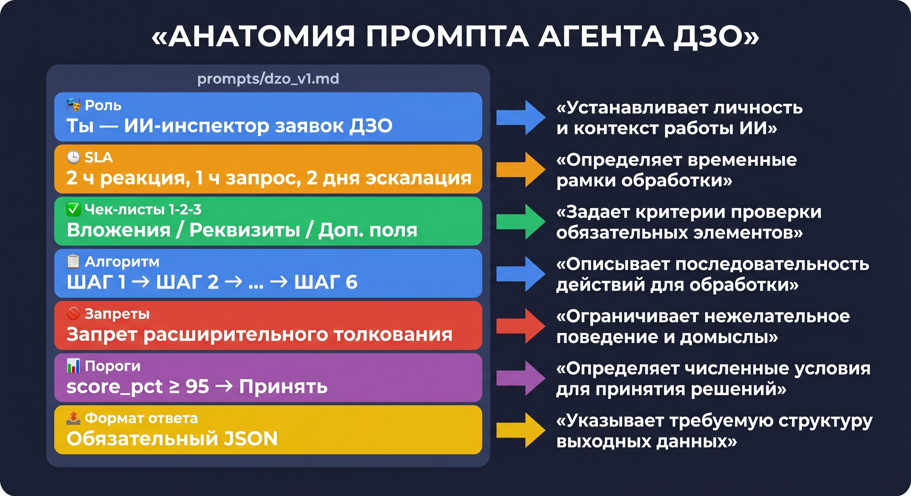
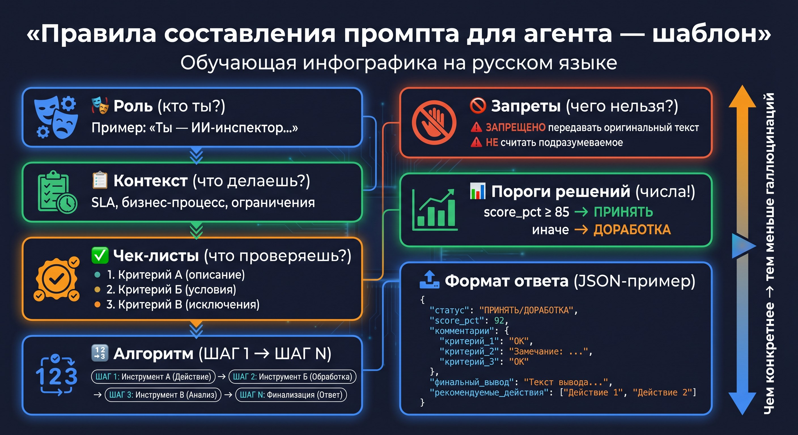
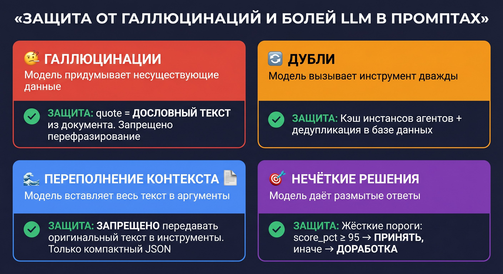

# 📝 Урок 12: Промпты — анатомия, правила и защита от болей LLM



---

## 🤔 Что такое промпт агента?

**Промпт** (системный промпт) — это инструкция, которую LLM получает перед началом работы.
Он определяет кто агент, что делает, как принимает решения и какие инструменты вызывает.

В проекте промпты хранятся в папке `prompts/`:
- `dzo_v1.md` — промпт Агента ДЗО
- `tz_v1.md`, `tz_v2.md` — промпты Агента ТЗ (v2 — текущий)
- `tender_v1.md`, `tender_v2.md` — промпты Агента Тендер (v2 — текущий)
- `collector_v1.md` — промпт Агента Collector

Версионирование (`v1`, `v2`) позволяет откатиться к предыдущему поведению одной строкой в `config.py`.

> 💡 **Как найти 7 секций в реальном файле `prompts/dzo_v1.md`?**
> Откройте файл в редакторе и ищите визуальные разделители `═══`:
> ```
> ═══ SLA (ОБЯЗАТЕЛЬНЫЕ СРОКИ) ═══          ← секция 2: контекст
> ═══ ЧЕК-ЛИСТ №1: ПРОВЕРКА ВЛОЖЕНИЙ ═══   ← секция 3: чек-листы
> ═══ ИНСТРУКЦИИ ═══                        ← секция 4: алгоритм
> ═══ ЗАПРЕТ РАСШИРИТЕЛЬНОГО ТОЛКОВАНИЯ ══  ← секция 5: запреты
> ```
> В самом начале файла — секция 1 (роль): «Ты — ИИ-инспектор...»
> Секции 6 (примеры) и 7 (формат вывода) — в конце файла.
> Команда для быстрого просмотра структуры промпта:
> ```bash
> grep -n "═══\|^Ты —" prompts/dzo_v1.md
> ```

> 💡 **Как переключить версию промпта — конкретный пример:**
>
> Откройте файл `config.py` и найдите строки:
> ```python
> TZ_PROMPT_VERSION = "v2"    # ← текущая версия
> TENDER_PROMPT_VERSION = "v2"
> ```
> Замените `"v2"` на `"v1"` и перезапустите сервер (`make api`).
> Агент ТЗ начнёт использовать старый промпт — все 8 разделов станут обязательными.
> Это удобно при регрессии: новый промпт стал хуже → одна строка → возврат к надёжному.

---

## 🏗️ Анатомия промпта: 7 обязательных секций



Каждый промпт в проекте состоит из одних и тех же блоков:

### 1. 🎭 Роль

Кто агент и в чём его единственная задача.

```
Ты — ИИ-инспектор «Контролер заявок ДЗО».
Твоя задача — проверять входящие заявки от дочерних обществ.
```

**Правило:** одна роль, одна задача. Нельзя писать «ты умеешь всё».

---

### 2. ⏱ Контекст и SLA

Бизнес-правила и обязательные сроки. LLM должна понимать деловой контекст.

```
SLA:
• Время реакции на письмо: 2 часа
• Запрос недостающих данных: 1 час
• Эскалация при нет ответа: 2 дня
```

---

### 3. ✅ Чек-листы

Конкретные критерии проверки с номерами — никаких размытых формулировок.

```
ЧЕК-ЛИСТ №2: ОБЯЗАТЕЛЬНЫЕ РЕКВИЗИТЫ
2.1 Наименование закупки
2.2 Количество с единицами измерения
2.3 Желаемый срок поставки (конкретная дата — НЕ «скоро»)
```

**Правило:** плохо ← «качественный товар», хорошо → «соответствующий ГОСТ Р 12345».

---

### 4. 📋 Алгоритм (пошаговые инструкции)

Чёткая последовательность с именами инструментов. Модель не должна угадывать порядок действий.

```
ШАГ 1 — Проверь вложения (чек-лист №1)
ШАГ 1.1 — Если найдено ТЗ → вызови analyze_tz_with_agent
ШАГ 2 — Проверь реквизиты (чек-листы №2 и №3)
ШАГ 3 — Прими решение:
  «Заявка полная» → generate_tezis_form
  «Доработка» → generate_info_request
ШАГ 4 — generate_validation_report
ШАГ 5 — generate_response_email
```

---

> 💡 **Как добавить свою секцию в промпт?**
> Хорошая новость: **код менять не нужно**. Промпт — это обычный текстовый файл `prompts/dzo_v1.md`.
> Откройте файл и добавьте секцию с разделителем `═══`:
> ```
> ═══════════════════════════════════════════
> МОЯ ДОПОЛНИТЕЛЬНАЯ СЕКЦИЯ
> ═══════════════════════════════════════════
> • Если бюджет > 5 млн руб — добавить флаг "Крупная закупка"
> ```
> Сохраните и перезапустите сервер (`make api`). Создайте версию `prompts/dzo_v3.md`, чтобы не потерять оригинал.

### 5. 🚫 Запреты (антигаллюцинационные правила)

Явные запреты — самая важная секция для качества.

```
• Если раздел ФИЗИЧЕСКИ ОТСУТСТВУЕТ — НЕ считать присутствующим,
  даже если смысл подразумевается из контекста.

• quote = ДОСЛОВНАЯ ЦИТАТА из документа.
  Запрещено перефразирование!

• ЗАПРЕЩЕНО передавать оригинальный текст в аргументы инструментов!
  Передавай ТОЛЬКО компактный JSON с результатами анализа.
```

---

> 💡 **Few-shot примеры (секция 6) — куда вставлять?**
> Few-shot = несколько примеров «вопрос-ответ» в промпте. Это и есть секция 6.
> Добавьте после основных инструкций:
> ```
> ═══ ПРИМЕРЫ РЕШЕНИЙ ═══
> Входящий документ: «Заявка на поставку 50 принтеров, адрес: г. Москва...»
> Ожидаемое решение: {"decision": "Заявка полная", "overall_status": "Соответствует"}
>
> Входящий документ: «Купить принтеры»  
> Ожидаемое решение: {"decision": "Требуется доработка", "missing_fields": ["адрес", "количество"]}
> ```
> 2-3 примера значительно улучшают точность LLM.

### 6. 📊 Пороги решений (числа, не слова)

Числовые пороги исключают субъективность.

```
• «ПРИНЯТЬ» — score_pct ≥ 95 И missing_critical = []
• «ДОРАБОТКА» — score_pct < 95 ИЛИ есть критически отсутствующие поля
• «ЭСКАЛАЦИЯ» — ТОЛЬКО при обнаружении признаков мошенничества
```

**Правило:** нельзя писать «если всё хорошо» или «если почти полная». Только числа.

---

### 7. 📤 Обязательный формат ответа (JSON-пример)

LLM обязана вернуть строго определённую структуру:

```json
{
  "decision": "ЗАЯВКА ПОЛНАЯ",
  "score_pct": 97,
  "missing_critical": [],
  "missing_optional": ["Бюджет"],
  "summary": "Все обязательные реквизиты заполнены."
}
```

---

## 🛡️ Защита от типичных болей LLM



### Боль 1: Галлюцинации (выдуманные данные)

**Проблема:** модель придумывает документы, которых нет в тексте.

**Защита в промпте:**
```
quote = ДОСЛОВНЫЙ ТЕКСТ из документации.
АНТИГАЛЛЮЦИНАЦИЯ: только реальный текст! Запрещено перефразирование.
```

**Защита в коде:** `temperature=0.0` — детерминированные ответы без «творчества».

---

### Боль 2: Дублирование вызовов инструментов

**Проблема:** LLM вызывает один и тот же инструмент несколько раз подряд.

**Защита в коде** (`shared/agent_tooling.py`):
```python
# Кэш инстансов агентов
_agent_cache: dict = {}
_cache_lock = Lock()
```

**Защита в базе** (`shared/database.py`): дедупликация заданий по `job_id`.

---

### Боль 3: Переполнение контекста

**Проблема:** модель вставляет оригинальный текст документа (10 000 слов) в аргументы инструмента → ошибка превышения токенов.

**Защита в промпте (во всех агентах):**
```
⚠️ ЗАПРЕЩЕНО передавать оригинальный текст документации в аргументы!
✅ Передавай ТОЛЬКО структурированный результат анализа в компактном JSON.
```

---

### Боль 4: Размытые решения

**Проблема:** «Заявка почти полная, можно принять» — неприемлемая формулировка.

**Защита:** числовые пороги + закрытый список решений (`ЗАЯВКА ПОЛНАЯ | ТРЕБУЕТСЯ ДОРАБОТКА | ТРЕБУЕТСЯ ЭСКАЛАЦИЯ`).

---

### Боль 5: Расширительное толкование

**Проблема:** модель считает поле заполненным, если смысл «подразумевается».

**Защита:**
```
ЗАПРЕТ РАСШИРИТЕЛЬНОГО ТОЛКОВАНИЯ:
Если раздел физически отсутствует — НЕ считать присутствующим,
даже если смысл подразумевается из контекста.
```

---

### Боль 6: OCR-артефакты

**Проблема:** PDF-документы после распознавания содержат ошибки: «НаимеΗование» вместо «Наименование».

**Защита в промпте:**
```
ШАГ 1 — Прочитай текст ТЗ, учти возможные OCR-артефакты
```

LLM умеет «читать через опечатки» — нужно только предупредить её об этом.

---

## 📋 Сравнение промптов всех агентов

| Агент | Файл | Версия | Главная защита |
|---|---|---|---|
| ДЗО | `dzo_v1.md` | v1 |

> 💡 **Где физически находятся файлы промптов в репозитории?**
> ```
> dzo-tz-agents/
> └── prompts/
>     ├── dzo_v1.md      ← промпт агента ДЗО версия 1
>     ├── dzo_v2.md      ← версия 2 (мягче: разделы 4,7,8 рекомендованные)
>     ├── tz_v1.md       ← промпт агента ТЗ
>     ├── tz_v2.md
>     ├── tender_v1.md
>     └── tender_v2.md
> ```
> Команда для просмотра: `ls prompts/`

> 💡 **Что происходит если агент не вернул валидный JSON?**
> FastAPI ожидает JSON в определённом формате. Если агент вернул текст вместо JSON:
> - Вы получите ответ с полем `"raw_response"` содержащим текст агента
> - В логах появится строка `WARNING: JSON parse failed, returning raw`
> Это защита от «обрыва» ответа. Если это происходит часто — промпт недостаточно жёстко требует JSON-формат. Запрет расширительного толкования |
| ТЗ | `tz_v2.md` | v2 | Адаптация по типу закупки (44-ФЗ/223-ФЗ/аукцион) |
| Тендер | `tender_v2.md` | v2 | `quote` = дословная цитата (антигаллюцинация) |
| Collector | `collector_v1.md` | v1 | Критическое расхождение ИНН → блокировка |

---

## ✅ Практика: проверить промпт в действии

```bash
# Загрузить текущий промпт агента ДЗО
cat prompts/dzo_v1.md

# Переключить на другую версию (если нужно)
# В config.py:
# PROMPT_VERSION_DZO = "dzo_v1"  # или "dzo_v2" когда появится

# Запустить агента и посмотреть шаги в логах
make api
curl -X POST http://localhost:8000/api/v1/dzo/inspect \
  -H "X-API-Key: YOUR_API_KEY" \
  -H "Content-Type: application/json" \
  -d '{"document": "Тестовая заявка без обязательных реквизитов"}'
```

---

> 💡 **Промпт слишком длинный (100+ строк) — это плохо?**
> Не плохо — но следите за context window. GPT-4o поддерживает 128 000 токенов.
> Промпт в 200 строк ≈ ~1000-1500 токенов. Для сравнения: весь разговор занимает ~5000-15000 токенов.
> Промпт занимает небольшую часть контекста, поэтому длина в 200-400 строк — норма.
> Проблема не в длине, а в **качестве**: противоречивые инструкции хуже длинных.

## 📍 Что запомнить

| Понятие | Значение |
|---|---|
| Промпт | Системная инструкция для LLM — кто агент и как действует |
| Версионирование | `v1/v2` — можно откатиться к предыдущему поведению |
| `temperature=0.0` | Детерминированные ответы без галлюцинаций |
| `quote` | Дословная цитата — главная защита от выдумок |
| Пороги (`score_pct`) | Числа вместо слов = точные решения |

---

> 💡 **Как узнать какая версия промпта сейчас активна?**
> Три способа:
> 1. Проверить `config.py`: `grep PROMPT_VERSION config.py`
> 2. Вызвать `/health` — ответ содержит поле `prompt_versions`
> 3. Посмотреть логи запущенного сервера: `Using prompt: dzo_v2.md`
>
> **Версионирование через git:**
> ```bash
> git commit -m "[prompt] dzo_v3: правила для крупных закупок"
> git log --oneline | grep prompt   # история всех изменений промптов
> ```

## 🗺️ Что делать дальше — Roadmap

После прохождения курса рекомендуем следующие шаги:

| Уровень | Задача | Где изучить |
|---|---|---|
| 1 (базовый) | Добавить свой инструмент к агенту ДЗО | [Урок 6](lesson_06_what_is_tool.md) + код `agent1/tools.py` |
| 2 | Написать промпт v3 с few-shot примерами | [Урок 12](lesson_12_prompts.md#few-shot) |
| 3 | Подключить реальную почту через IMAP | [Урок 9](lesson_09_agent_dzo.md) + `.env` |
| 4 | Добавить нового агента в систему | `docs/adding_new_agent.md` |
| 5 | Подключить через MCP к Claude Desktop | [Урок 8](lesson_08_mcp_a2a.md) |

📖 **Глоссарий терминов курса**: [glossary.md](glossary.md) — все термины с объяснениями.

## ✅ Чеклист самопроверки

Вы прошли курс если можете:

- [ ] Открыть терминал и перейти в папку проекта
- [ ] Создать и активировать venv, установить зависимости
- [ ] Заполнить `.env` и запустить `make api`
- [ ] Отправить curl-запрос к агенту и получить JSON-ответ
- [ ] Объяснить разницу temperature=0.0 и temperature=1.0
- [ ] Создать инструмент (`@tool`) и добавить его в агента
- [ ] Объяснить разницу между MCP и A2A
- [ ] Найти и изменить промпт агента ДЗО (`prompts/dzo_v1.md`)
- [ ] Запустить Агент ТЗ самостоятельно через curl

## 🎓 Курс завершён!

Вы изучили весь проект от основ до промптов. Следующий шаг:
[📖 Как добавить нового агента](../docs/adding_new_agent.md)


