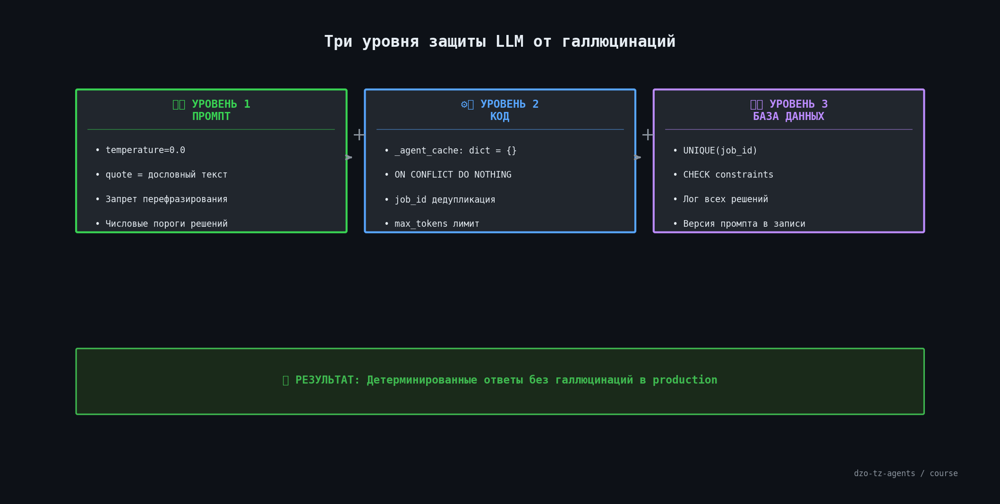

# 🛡️ Урок 13: Защита LLM — галлюцинации, контекст, дубли


---

## 🤔 Почему LLM «ошибается»?

LLM — это не база данных. Она **предсказывает** следующий токен на основе обученных паттернов.
Когда данных не хватает — она «достраивает» ответ из похожих паттернов. Это и есть галлюцинация.

В production-системе (агент ДЗО, ТЗ, Тендер) галлюцинация = **ошибочное решение по заявке**.
Поэтому защита встроена на трёх уровнях: промпт, код, база данных.
## 🛡️ Три уровня защиты — обзор




---

## 😱 Боль 1: Галлюцинации (выдуманные данные)

**Что происходит:** модель «видит» документ, которого нет, или придумывает реквизиты.

```
Входной документ: «Заявка на поставку принтеров»
Ответ без защиты: «ИНН поставщика: 7743013902, адрес: г. Москва, ул. Ленина, 5»
                   ↑ эти данные ВЫДУМАНЫ
```

**Защита в промпте:**
```
quote = ДОСЛОВНЫЙ ТЕКСТ из документа.
АНТИГАЛЛЮЦИНАЦИЯ: только реальный текст! Запрещено перефразирование.
Если поле отсутствует — пиши: "отсутствует".
```

**Защита в коде** — `temperature=0.0`:
```python
# agents/dzo/agent.py
llm = ChatOpenAI(
    model="gpt-4o",
    temperature=0.0   # ← детерминированный режим, без «творчества»
)
```

> 💡 **Как проверить что temperature работает?**
> Вызовите агента дважды с одинаковым запросом:
> ```bash
> for i in 1 2; do
>   curl -s -X POST http://localhost:8000/api/v1/dzo/inspect \
>     -H "X-API-Key: $API_KEY" \
>     -H "Content-Type: application/json" \
>     -d '{"document": "Заявка ООО Тест"}' | python3 -m json.tool
> done
> ```
> При `temperature=0.0` оба ответа будут **идентичны**.
> При `temperature=0.7` — могут отличаться.

---

## 🔁 Боль 2: Дублирование вызовов инструментов

**Что происходит:** LLM решает вызвать `generate_response_email` дважды — в очереди появляется два письма.

**Откуда берётся:** ReAct-цикл иногда «теряет» результат предыдущего шага и повторяет вызов.

**Защита в коде** (`shared/agent_tooling.py`):
```python
# Кэш инстансов агентов — один агент на весь процесс
_agent_cache: dict = {}
_cache_lock = Lock()

def get_or_create_agent(agent_name: str):
    with _cache_lock:
        if agent_name not in _agent_cache:
            _agent_cache[agent_name] = _build_agent(agent_name)
        return _agent_cache[agent_name]
```

**Защита в базе** (`shared/database.py`):
```python
# Дедупликация заданий по job_id — второй вызов игнорируется
INSERT INTO jobs (job_id, ...) ON CONFLICT (job_id) DO NOTHING
```

> 💡 **Как увидеть дубли в логах?**
> ```bash
> make api &
> tail -f logs/agent.log | grep "DUPLICATE\|already_exists\|cache_hit"
> ```

---

## 📦 Боль 3: Переполнение контекста

**Что происходит:** агент вставляет оригинальный текст ТЗ (10 000 слов) в аргумент инструмента → ошибка `context_length_exceeded`.

**Типичная ошибка в логах:**
```
openai.BadRequestError: This model's maximum context length is 128000 tokens.
However, your messages resulted in 142567 tokens.
```

**Защита в промпте:**
```
⚠️ ЗАПРЕЩЕНО передавать оригинальный текст документа в аргументы инструментов!
✅ Передавай ТОЛЬКО структурированный JSON-результат анализа:
{"decision": "...", "score_pct": 95, "missing": []}
```

**Сравнение:**
```
❌ Плохо:  analyze_tz_with_agent(text="[весь текст ТЗ на 50 страниц]")
✅ Хорошо: analyze_tz_with_agent(job_id="abc123")  ← агент сам достаёт текст по ID
```

> 💡 **Как посмотреть сколько токенов использует запрос?**
> ```bash
> curl -s -X POST http://localhost:8000/api/v1/dzo/inspect \
>   -H "X-API-Key: $API_KEY" \
>   -H "Content-Type: application/json" \
>   -d '{"document": "тест"}' | python3 -c "
> import sys, json
> r = json.load(sys.stdin)
> print('Токенов использовано:', r.get('usage', {}).get('total_tokens', 'нет данных'))
> "
> ```

---

## 🌫️ Боль 4: Размытые решения

**Что происходит:** агент возвращает «заявка почти полная» — непонятно, принять или отклонить.

**Защита — числовые пороги + закрытый список:**
```
Разрешённые решения (ТОЛЬКО эти три):
• "ЗАЯВКА ПОЛНАЯ"        — score_pct ≥ 95 И missing_critical = []
• "ТРЕБУЕТСЯ ДОРАБОТКА"  — score_pct < 95 ИЛИ есть критически важные поля
• "ТРЕБУЕТСЯ ЭСКАЛАЦИЯ"  — ТОЛЬКО при признаках мошенничества
```

**Правило написания промптов:**
```
❌  «если всё хорошо — принять»
✅  «если score_pct ≥ 95 И missing_critical = [] → ЗАЯВКА ПОЛНАЯ»
```

---

## 🔍 Боль 5: Расширительное толкование

**Что происходит:** поле «Место поставки» отсутствует, но в тексте написано «Москва» — агент считает поле заполненным.

**Защита в промпте:**
```
ЗАПРЕТ РАСШИРИТЕЛЬНОГО ТОЛКОВАНИЯ:
Если раздел ФИЗИЧЕСКИ ОТСУТСТВУЕТ в документе —
НЕ считать присутствующим, даже если смысл подразумевается из контекста.
```

---

## 📄 Боль 6: OCR-артефакты

**Что происходит:** PDF сканирован, после распознавания в тексте: `«НаимеΗование»` → агент не находит поле «Наименование».

**Защита в промпте:**
```
ШАГ 1 — Прочитай текст ТЗ, учти возможные OCR-артефакты:
         символы кириллицы могут быть заменены на похожие латинские.
```

LLM умеет «читать сквозь» опечатки — нужно только явно предупредить.

---

## 🛠️ Быстрая диагностика проблем

```bash
# Проверить что агент отвечает детерминированно
curl -s -X POST http://localhost:8000/api/v1/dzo/inspect \
  -H "X-API-Key: $API_KEY" \
  -H "Content-Type: application/json" \
  -d '{"document": "ООО Тест, ИНН: 1234567890, Принтеры, 10 шт, Москва"}' \
  | python3 -m json.tool

# Посмотреть логи агента в реальном времени
tail -f logs/agent.log | grep -E "ERROR|WARNING|tool_call|tokens"

# Проверить кэш агентов (не должен создаваться дважды)
grep "Creating agent\|Cache hit" logs/agent.log | head -20
```

---

## 📍 Что запомнить

| Боль | Защита |
|---|---|
| Галлюцинации | `temperature=0.0` + `quote` в промпте |
| Дубли вызовов | Кэш в коде + `ON CONFLICT` в БД |
| Переполнение контекста | Передавай `job_id`, не текст |
| Размытые решения | Числовые пороги + закрытый список |
| Расширительное толкование | Явный запрет в промпте |
| OCR-артефакты | Предупреждение в промпте |

---

➡️ **Следующий урок:** [Урок 14 — Агент Тендер: второй уровень](lesson_14_agent21_tender.md)
