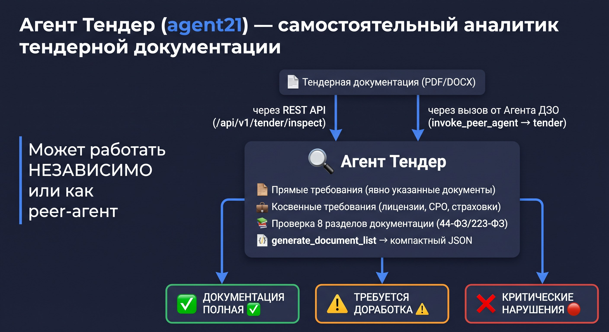
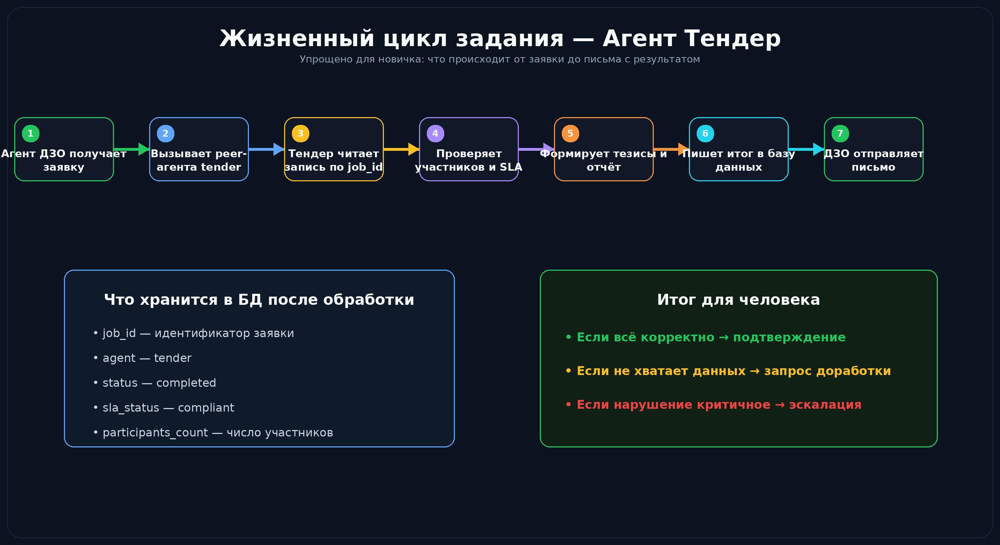

# 🏢 Урок 14: Агент Тендер — второй уровень системы



---

## 🤔 Что такое «второй уровень»?

В системе ДЗО-ТЗ-Агенты три уровня обработки:

```
Уровень 1: Агент ДЗО      ← первичная проверка заявки
Уровень 2: Агент Тендер   ← формирование тендерного пакета  ← МЫ ЗДЕСЬ
           Агент ТЗ       ← анализ технического задания
Уровень 3: Агент Collector← сбор данных из внешних систем
```

**Агент Тендер** получает задание от Агента ДЗО через `invoke_peer_agent()` и формирует тендерную документацию.

---

## 🔄 Жизненный цикл задания Агента Тендер

```
1. Агент ДЗО принял заявку → decision: "ЗАЯВКА ПОЛНАЯ"
2. ДЗО вызывает: invoke_peer_agent("tender", job_id="abc123")
3. Агент Тендер читает заявку из БД по job_id
4. Тендер вызывает инструменты:
   - fetch_participant_list()    ← список поставщиков
   - check_sla_compliance()      ← проверка сроков
   - generate_tezis_form()       ← форма тезисов
   - generate_validation_report()← отчёт
5. Тендер сохраняет результат в БД
6. ДЗО получает ответ и отправляет финальное письмо
```

---



## 📁 Где находится код Агента Тендер

```
dzo-tz-agents/
└── agents/
    └── tender/
        ├── agent.py        ← основной агент (ReAct + LangGraph)
        ├── tools.py        ← инструменты агента
        ├── router.py       ← FastAPI маршруты /api/v1/tender/...
        └── __init__.py
```

> 💡 **Как запустить только Агент Тендер для теста?**
> ```bash
> # Убедитесь что сервер запущен
> make api
>
> # Отправить задание напрямую к Агенту Тендер
> curl -s -X POST http://localhost:8000/api/v1/tender/process \
>   -H "X-API-Key: $API_KEY" \
>   -H "Content-Type: application/json" \
>   -d '{
>     "job_id": "test-001",
>     "purchase_name": "Принтеры офисные",
>     "quantity": 10,
>     "delivery_address": "Москва",
>     "deadline": "2026-06-01"
>   }' | python3 -m json.tool
> ```

---

## 🛠️ Ключевые инструменты Агента Тендер

### `fetch_participant_list()`
Получает список потенциальных поставщиков из справочника.

```python
# agents/tender/tools.py
@tool
def fetch_participant_list(purchase_category: str) -> dict:
    """
    Возвращает список участников тендера по категории закупки.
    Используй для поиска потенциальных поставщиков.
    """
    # Запрос к внутренней базе поставщиков
    ...
```

### `check_sla_compliance()`
Проверяет соответствие сроков SLA из заявки.

```python
@tool
def check_sla_compliance(deadline: str, purchase_type: str) -> dict:
    """
    Проверяет соблюдение SLA для тендера.
    purchase_type: '44-ФЗ' | '223-ФЗ' | 'прямая_закупка'
    """
    ...
```

### `generate_tezis_form()`
Генерирует форму тезисов для тендерного комитета.

> 💡 **Разница между 44-ФЗ и 223-ФЗ в контексте агента:**
> ```
> 44-ФЗ  — госзакупки, жёсткие сроки, обязательная публикация на ЕИС
> 223-ФЗ — закупки госкомпаний, гибкие правила, внутренний регламент
> ```
> Агент Тендер автоматически определяет тип по полю `purchase_type` в заявке
> и применяет соответствующий SLA-профиль из `config.py`.

---

## 🔗 Peer-вызов: как ДЗО передаёт задание Тендеру

```python
# agents/dzo/tools.py
@tool
def invoke_tender_agent(job_id: str) -> dict:
    """
    Передаёт одобренную заявку Агенту Тендер для обработки.
    Вызывай ТОЛЬКО если decision = 'ЗАЯВКА ПОЛНАЯ'.
    """
    return invoke_peer_agent(
        agent_name="tender",
        payload={"job_id": job_id}
    )
```

**Матрица разрешений** (кто кого может вызвать):
```
ДЗО    → Тендер    ✅
ДЗО    → ТЗ        ✅
Тендер → Collector ✅
ТЗ     → Collector ✅
Тендер → ДЗО       ❌  (запрещено — нет обратного вызова)
```

---

## 🐛 Типичные ошибки и решения

### Ошибка: `peer_agent_unavailable`
```
{"error": "peer_agent_unavailable", "agent": "tender"}
```
**Причина:** сервер не запущен или агент не зарегистрирован.
```bash
# Проверить что все агенты доступны
curl -s http://localhost:8000/health | python3 -m json.tool
# Ищем "tender": "ok" в ответе
```

### Ошибка: `job_id not found`
```
{"error": "job_not_found", "job_id": "abc123"}
```
**Причина:** Агент ДЗО ещё не сохранил задание в БД.
```bash
# Проверить задание в базе
sqlite3 data/jobs.db "SELECT * FROM jobs WHERE job_id='abc123';"
```

### Ошибка: `SLA_violation`
**Причина:** дедлайн в заявке нарушает минимальные сроки тендера.
**Решение:** проверьте поле `deadline` — для 44-ФЗ минимум 15 рабочих дней.

---

## 📊 Результат работы Агента Тендер

После успешной обработки в БД сохраняется:

```json
{
  "job_id": "abc123",
  "agent": "tender",
  "status": "completed",
  "result": {
    "tezis_form": "Форма тезисов сгенерирована",
    "participants_count": 5,
    "sla_status": "compliant",
    "tender_type": "44-ФЗ",
    "validation_report": "Все проверки пройдены"
  }
}
```

> 💡 **Как посмотреть результат задания в реальном времени?**
> ```bash
> # SSE-стриминг — видим каждый шаг агента
> curl -N http://localhost:8000/api/v1/tender/stream/abc123 \
>   -H "X-API-Key: $API_KEY"
> # Вывод: data: {"step": "fetch_participants", "status": "running"}
> #         data: {"step": "check_sla", "status": "done"}
> ```

---

## 📍 Что запомнить

| Понятие | Значение |
|---|---|
| Уровень 2 | Агент Тендер и Агент ТЗ — работают по заданию от ДЗО |
| `invoke_peer_agent()` | Функция передачи задания между агентами |
| `job_id` | Уникальный ID задания — связывает все агенты |
| 44-ФЗ / 223-ФЗ | Тип закупки определяет SLA-профиль |
| `fetch_participant_list` | Главный инструмент Агента Тендер |

---

➡️ **Следующий урок:** [Урок 15 — Агент Collector: сбор данных](lesson_15_agent3_collector.md)
