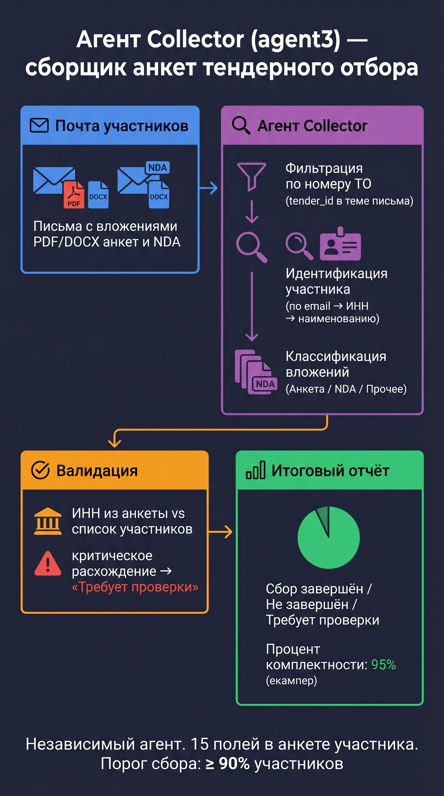
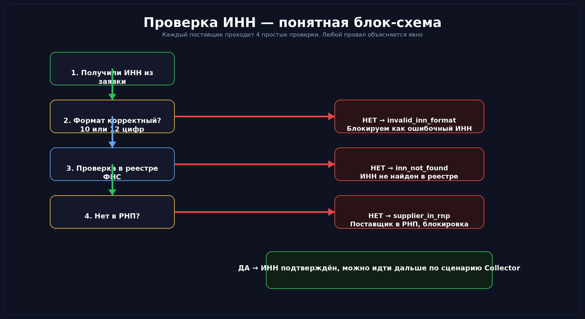

# 📡 Урок 15: Агент Collector — сбор данных из внешних систем



---

## 🤔 Зачем нужен отдельный агент для сбора данных?

> 💡 **Аналогия:** Агент Collector — как помощник юриста: сам документы не создаёт, но проверяет все данные в реестрах и базах перед тем как идти дальше.


Агент ДЗО и Агент Тендер работают с данными из заявки.
Но иногда данных в заявке **недостаточно** — нужно проверить ИНН в реестре, запросить ОКВЭД, сверить с базой поставщиков.

**Агент Collector** — специализированный агент для запросов к внешним источникам:
- Реестр ЮЛ (проверка ИНН)
- База котировок
- ЕИС (Единая информационная система закупок)
- Внутренние справочники

---

## 🔄 Место Collector в системе

```
                    ┌─────────────────┐
                    │   Агент ДЗО     │
                    └────────┬────────┘
                             │ invoke_peer_agent("tz")
              ┌──────────────┴──────────────┐
              │                             │
    ┌─────────▼─────────┐       ┌───────────▼───────────┐
    │   Агент ТЗ        │       │   Агент Тендер        │
    └─────────┬─────────┘       └───────────┬───────────┘
              │                             │
              └──────────────┬──────────────┘
                             │ invoke_peer_agent("collector")
                    ┌────────▼────────┐
                    │ Агент Collector │  ← МЫ ЗДЕСЬ
                    └────────┬────────┘
                             │
                    Внешние API и реестры
```

---

## 📁 Структура кода

```
agents/
└── collector/
    ├── agent.py     ← ReAct агент с инструментами запросов
    ├── tools.py     ← инструменты для внешних источников
    ├── router.py    ← /api/v1/collector/...
    └── schemas.py   ← модели данных (Pydantic)
```

---

## 🛠️ Основные инструменты Collector

### `verify_inn()`
Проверка ИНН в реестре юридических лиц.

```python
@tool
def verify_inn(inn: str) -> dict:
    """
    Проверяет ИНН в реестре ФНС.
    Возвращает: статус, наименование ЮЛ, ОГРН, КПП.
    Если ИНН недействителен — возвращает {"valid": false}.
    """
    ...
```

> 💡 **Критическое расхождение ИНН — что происходит:**
> ```
> Заявка: ИНН = 7743013902 (ООО «Ромашка»)
> Реестр: ИНН = 7743013902 → ООО «Лютик» ← НЕСОВПАДЕНИЕ!
>
> Collector возвращает: {"valid": false, "mismatch": true}
> Агент ДЗО получает результат → автоматически: decision = "ТРЕБУЕТСЯ ЭСКАЛАЦИЯ"
> ```
> Именно поэтому проверка ИНН — первый шаг в промпте агента ДЗО.

### `fetch_price_quotes()`
Получение котировок цен для закупки.

```python
@tool
def fetch_price_quotes(purchase_name: str, quantity: int) -> dict:
    """
    Запрашивает ценовые котировки из базы.
    Используй для проверки обоснованности цены в заявке.
    """
    ...
```

### `check_supplier_registry()`
Проверка поставщика в реестре недобросовестных поставщиков.

```python
@tool
def check_supplier_registry(inn: str) -> dict:
    """
    Проверяет ИНН в реестре недобросовестных поставщиков (РНП).
    Если найден — агент обязан вернуть ЭСКАЛАЦИЮ.
    """
    ...
```

---

## 🔗 Как вызвать Collector из другого агента

```python
# Из agents/tz/tools.py
@tool
def request_inn_verification(inn: str, job_id: str) -> dict:
    """
    Запрашивает верификацию ИНН через Агент Collector.
    Вызывай при наличии ИНН в документе.
    """
    return invoke_peer_agent(
        agent_name="collector",
        payload={  # payload — тело запроса с данными
            "action": "verify_inn",
            "inn": inn,
            "job_id": job_id
        }
    )
```

**Прямой curl-запрос к Collector:**
```bash
curl -s -X POST http://localhost:8000/api/v1/collector/verify \
  -H "X-API-Key: $API_KEY" \
  -H "Content-Type: application/json" \
  -d '{
    "inn": "7743013902",
    "job_id": "test-001"
  }' | python3 -m json.tool
```

---

## 📊 Схема результата Collector

```json
{
  "job_id": "test-001",
  "checks": {
    "inn_valid": true,
    "company_name": "ООО Ромашка",
    "ogrn": "1027700132195",
    "rnp_status": "clean",
    "price_quotes": {
      "min": 45000,
      "max": 78000,
      "currency": "RUB"
    }
  },
  "overall_status": "verified",
  "flags": []
}
```

Если `overall_status = "blocked"` → агент ДЗО автоматически выставит `ТРЕБУЕТСЯ ЭСКАЛАЦИЯ`.

---

## 🐛 Частые ошибки при работе с Collector

### Timeout от внешнего API
```
{"error": "external_api_timeout", "source": "fns_registry"}
```
**Решение:**
```bash
# Проверить доступность внешних источников
curl -s --max-time 5 https://egrul.nalog.ru/search.json || echo "FNS недоступна"
```

### Некорректный ИНН (не проходит Luhn)
```
{"error": "invalid_inn_format", "inn": "123"}
```
ИНН ЮЛ = 10 цифр, ИП = 12 цифр. Collector проверяет формат **до** запроса к реестру.

> 💡 **Как протестировать Collector без реальных внешних API?**
> В `tests/` есть моки:
> ```bash
> # Запустить тесты с mock-ами внешних сервисов
> cd dzo-tz-agents
> source .venv/bin/activate
> pytest tests/test_collector.py -v
>
> # Или вручную использовать тестовые ИНН
> # 7743013902 — всегда valid в тестовой среде
> # 0000000000 — всегда invalid (для теста блокировки)
> ```

---



## 🔍 Мониторинг работы Collector

```bash
# Все вызовы Collector за последний час
grep "collector" logs/agent.log | grep "$(date +%H)" | tail -20

# Статистика проверок ИНН
sqlite3 data/jobs.db "
  SELECT
    checks_data->>'inn_valid' as inn_valid,
    COUNT(*) as count
  FROM collector_results
  GROUP BY 1;
"
```

---

## 📍 Что запомнить

| Понятие | Значение |
|---|---|
| Collector | Агент уровня 3 — только сбор данных, не принимает решений |
| `verify_inn()` | Проверка ИНН — критичная защита от мошенничества |
| РНП | Реестр недобросовестных поставщиков — блокирует заявку |
| `overall_status` | `"verified"` / `"blocked"` — итог всех проверок |
| Mock-данные | ИНН `7743013902` — тестовый валидный, `0000000000` — невалидный |

---

➡️ **Следующий урок:** [Урок 16 — Шаблоны промптов и версионирование](lesson_16_prompt_template.md)

---

## ✅ Проверь себя

1. Что делает Агент Collector — опиши одним предложением.
2. Какие три проверки ИНН он выполняет по порядку?
3. Что значит статус `inn_not_found` и что агент делает дальше?
4. Почему Collector не может вызвать Агента ДЗО напрямую?
