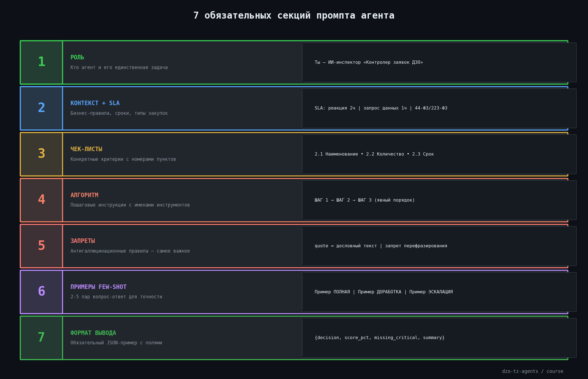
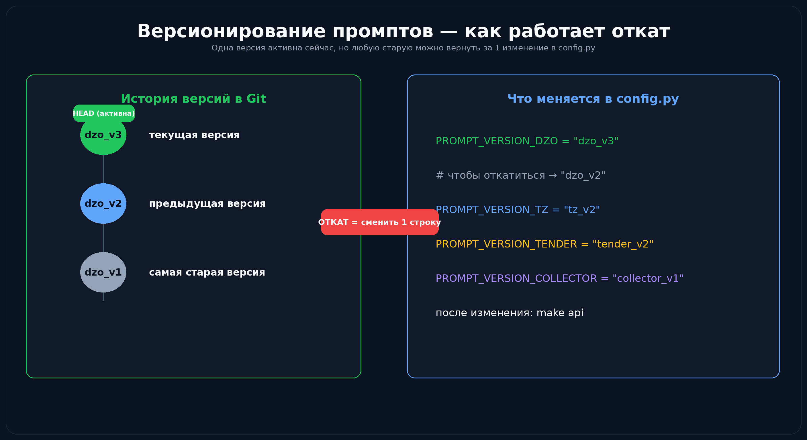

# 📝 Урок 16: Шаблоны промптов и версионирование


---

## 🤔 Почему промпты — это код?

Промпт — не просто текст. Это **управляющая программа** для LLM.
Как и обычный код, промпт нужно:
- хранить в системе контроля версий (git)
- версионировать (`v1`, `v2`, ...)
- тестировать (A/B тест поведения агента)
- документировать изменения

В проекте промпты хранятся как файлы в папке `prompts/` — это намеренное решение.

---

## 🗂️ Структура папки prompts/

```
dzo-tz-agents/
└── prompts/
    ├── dzo_v1.md        ← агент ДЗО, первая версия
    ├── dzo_v2.md        ← агент ДЗО, вторая версия (текущая)
    ├── tz_v1.md         ← агент ТЗ
    ├── tz_v2.md         ← агент ТЗ (текущая)
    ├── tender_v1.md     ← агент Тендер
    ├── tender_v2.md     ← агент Тендер (текущая)
    └── collector_v1.md  ← агент Collector
```

> 💡 **Как переключить версию промпта?**
> Откройте `config.py`:
> ```python
> PROMPT_VERSION_DZO = "dzo_v2"       # ← изменить на "dzo_v1" для отката
> PROMPT_VERSION_TZ = "tz_v2"
> PROMPT_VERSION_TENDER = "tender_v2"
> PROMPT_VERSION_COLLECTOR = "collector_v1"
> ```
> Перезапустите: `make api`
> Изменение вступит в силу немедленно — без правки кода агента.

---

## 🏗️ Канонический шаблон промпта (7 секций)

Все промпты в проекте следуют единому шаблону:

```markdown
# Роль агента
Ты — [РОЛЬ]. Твоя единственная задача — [ЗАДАЧА].

═══════════════════════════════════════════════
 СЕКЦИЯ 1: КОНТЕКСТ И SLA
═══════════════════════════════════════════════
[бизнес-правила, сроки, типы закупок]

═══════════════════════════════════════════════
 СЕКЦИЯ 2: ЧЕК-ЛИСТЫ
═══════════════════════════════════════════════
[конкретные критерии проверки с номерами]

═══════════════════════════════════════════════
 СЕКЦИЯ 3: АЛГОРИТМ
═══════════════════════════════════════════════
ШАГ 1 — ...
ШАГ 2 — ...

═══════════════════════════════════════════════
 СЕКЦИЯ 4: ЗАПРЕТЫ
═══════════════════════════════════════════════
• ЗАПРЕЩЕНО: [что нельзя делать]
• АНТИГАЛЛЮЦИНАЦИЯ: только реальный текст!

═══════════════════════════════════════════════
 СЕКЦИЯ 5: ПРИМЕРЫ (FEW-SHOT)
═══════════════════════════════════════════════
[2-3 примера входных данных и правильных решений]

═══════════════════════════════════════════════
 СЕКЦИЯ 6: ПОРОГИ РЕШЕНИЙ
═══════════════════════════════════════════════
• "ПРИНЯТЬ"    — score_pct ≥ 95
• "ДОРАБОТКА"  — score_pct < 95

═══════════════════════════════════════════════
 СЕКЦИЯ 7: ФОРМАТ ВЫВОДА
═══════════════════════════════════════════════
Всегда возвращай JSON:
{"decision": "...", "score_pct": 0-100}
```

---



## 🔍 Как читать существующий промпт

```bash
# Просмотр структуры промпта — все разделители
grep -n "═══\|^Ты —\|^# " prompts/dzo_v1.md

# Вывод:
# 1:  # Роль агента
# 5:  Ты — ИИ-инспектор «Контролер заявок ДЗО»...
# 15: ═══ SLA (ОБЯЗАТЕЛЬНЫЕ СРОКИ) ═══
# 30: ═══ ЧЕК-ЛИСТ №1: ПРОВЕРКА ВЛОЖЕНИЙ ═══
# 55: ═══ ИНСТРУКЦИИ ═══
# 90: ═══ ЗАПРЕТ РАСШИРИТЕЛЬНОГО ТОЛКОВАНИЯ ═══

# Подсчёт секций
grep -c "═══" prompts/dzo_v1.md
```

---

## ✏️ Как создать промпт v3 — пошагово

```bash
# 1. Скопировать текущую версию
cp prompts/dzo_v2.md prompts/dzo_v3.md

# 2. Открыть и отредактировать
nano prompts/dzo_v3.md
# или
code prompts/dzo_v3.md

# 3. Переключить в config.py
sed -i 's/PROMPT_VERSION_DZO = "dzo_v2"/PROMPT_VERSION_DZO = "dzo_v3"/' config.py

# 4. Перезапустить сервер
make api

# 5. Протестировать
curl -s -X POST http://localhost:8000/api/v1/dzo/inspect \
  -H "X-API-Key: $API_KEY" \
  -H "Content-Type: application/json" \
  -d '{"document": "Тестовая заявка"}' | python3 -m json.tool

# 6. Зафиксировать изменение
git add prompts/dzo_v3.md config.py
git commit -m "[prompt] dzo_v3: добавлены правила для крупных закупок >5 млн"
```

---

## 🧪 A/B тест двух версий промпта

```bash
# Тест с версией v1
sed -i 's/PROMPT_VERSION_DZO = .*/PROMPT_VERSION_DZO = "dzo_v1"/' config.py
make api &
sleep 3
echo "=== V1 ===" 
curl -s -X POST http://localhost:8000/api/v1/dzo/inspect \
  -H "X-API-Key: $API_KEY" \
  -H "Content-Type: application/json" \
  -d '{"document": "Тест"}' | python3 -c "import sys,json; r=json.load(sys.stdin); print('V1 decision:', r.get('decision'))"

# Тест с версией v2
sed -i 's/PROMPT_VERSION_DZO = .*/PROMPT_VERSION_DZO = "dzo_v2"/' config.py
make api &
sleep 3
echo "=== V2 ==="
curl -s -X POST http://localhost:8000/api/v1/dzo/inspect \
  -H "X-API-Key: $API_KEY" \
  -H "Content-Type: application/json" \
  -d '{"document": "Тест"}' | python3 -c "import sys,json; r=json.load(sys.stdin); print('V2 decision:', r.get('decision'))"
```

---



## 📊 Сравнение версий промптов агентов

| Агент | v1 → v2: что изменилось |
|---|---|
| ДЗО `dzo_v1→v2` | v2: разделы 4, 7, 8 стали рекомендованными (не обязательными) — мягче для граничных случаев |
| ТЗ `tz_v1→v2` | v2: добавлена адаптация по типу закупки 44-ФЗ / 223-ФЗ / аукцион |
| Тендер `tender_v1→v2` | v2: усилена антигаллюцинационная защита, `quote` = дословная цитата |
| Collector `collector_v1` | Только одна версия — стабильный технический агент без бизнес-логики |

---

## 🎯 Few-shot: как добавить примеры в промпт

Few-shot примеры — самый простой способ улучшить точность без изменения кода.

```markdown
═══════════════════════════════════════════════
 ПРИМЕРЫ ПРАВИЛЬНЫХ РЕШЕНИЙ
═══════════════════════════════════════════════

**Пример 1 — Заявка принята:**
Документ: «ООО Ромашка, ИНН: 7743013902, Принтеры HP LaserJet, 10 шт,
           адрес доставки: г. Москва, ул. Ленина, 5, срок: 01.06.2026»
Решение:
{
  "decision": "ЗАЯВКА ПОЛНАЯ",
  "score_pct": 98,
  "missing_critical": []
}

**Пример 2 — Требует доработки:**
Документ: «Купить принтеры»
Решение:
{
  "decision": "ТРЕБУЕТСЯ ДОРАБОТКА",
  "score_pct": 15,
  "missing_critical": ["ИНН", "количество", "адрес доставки", "срок"]
}
```

> 💡 **Сколько примеров добавлять?**
> - 2 примера — минимум (один позитивный, один негативный)
> - 3–5 примеров — оптимально для граничных случаев
> - Более 10 — нецелесообразно (занимает токены, эффект не растёт)

---

## 📍 Что запомнить

| Понятие | Значение |
|---|---|
| Промпт = код | Хранится в git, версионируется, тестируется |
| 7 секций | Роль → Контекст → Чеклисты → Алгоритм → Запреты → Примеры → Формат |
| `═══` разделитель | Визуальная граница секций — ищи через `grep "═══"` |
| `PROMPT_VERSION` | Переключение версии без правки кода агента |
| Few-shot | 2–5 примеров в промпте = значительно лучше точность |

---

## ✅ Финальный чеклист курса

Вы прошли весь курс если можете:

- [ ] Открыть терминал и перейти в папку проекта
- [ ] Создать venv, установить зависимости, заполнить `.env`
- [ ] Запустить `make api` и проверить `/health`
- [ ] Отправить curl-запрос к любому агенту
- [ ] Прочитать структуру промпта через `grep "═══"`
- [ ] Создать промпт v3 и переключить версию в `config.py`
- [ ] Объяснить цепочку: ДЗО → Тендер → Collector
- [ ] Найти и исправить типичные ошибки (401, port in use, ModuleNotFoundError)
- [ ] Добавить few-shot примеры в существующий промпт

---

🎓 **Курс завершён!** Вы знаете всю систему от терминала до промптов.

📖 [Глоссарий терминов](glossary.md) | 📋 [README курса](README.md)
