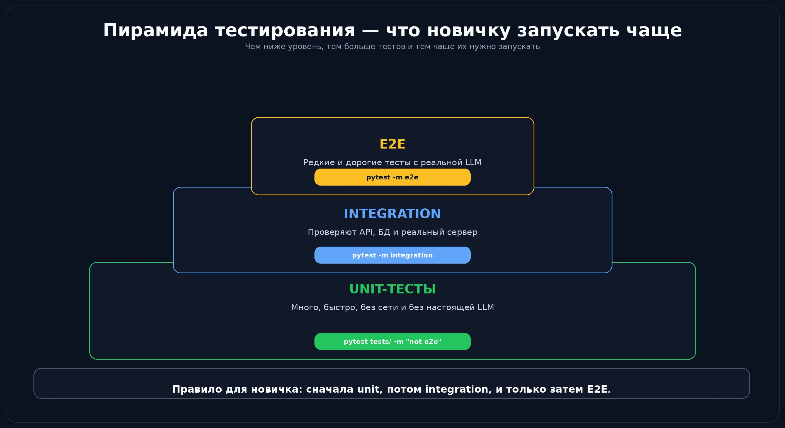
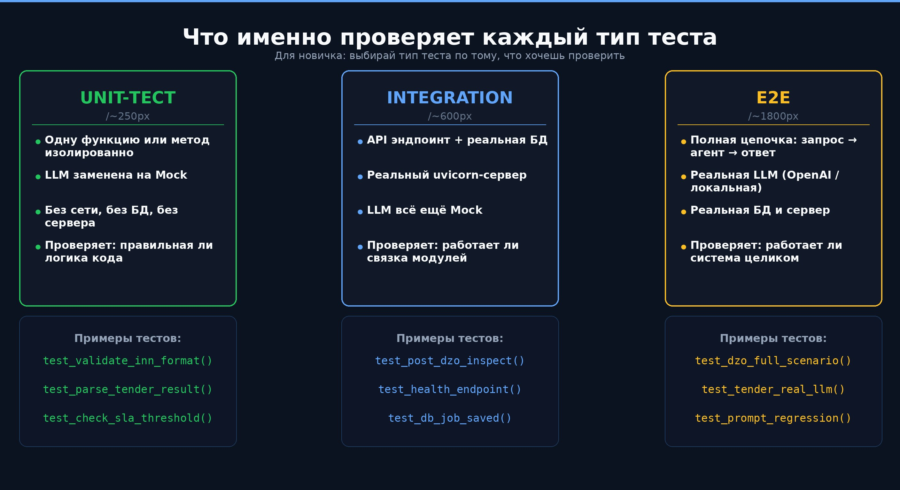
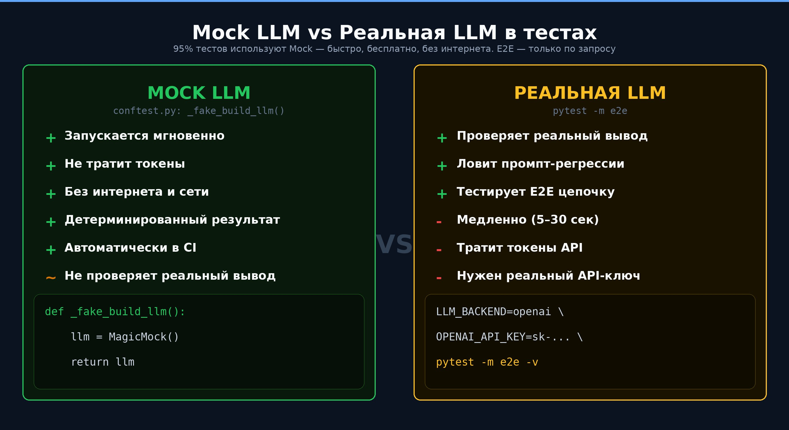
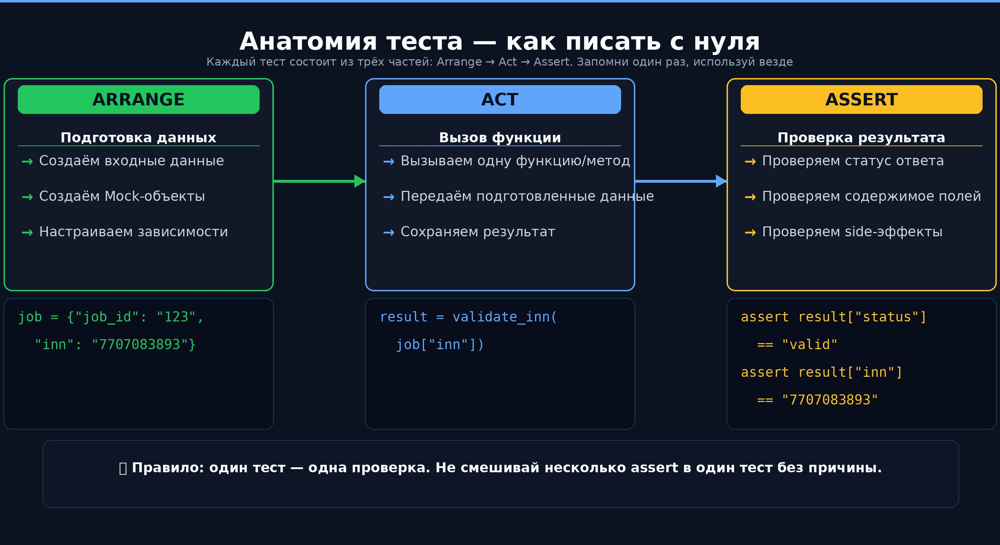
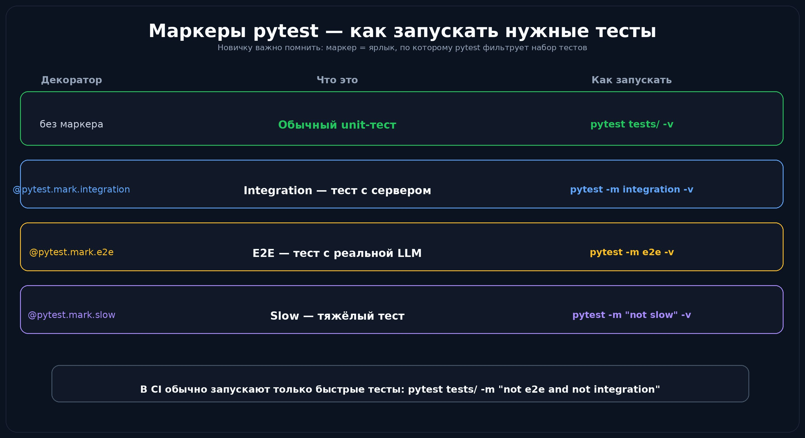
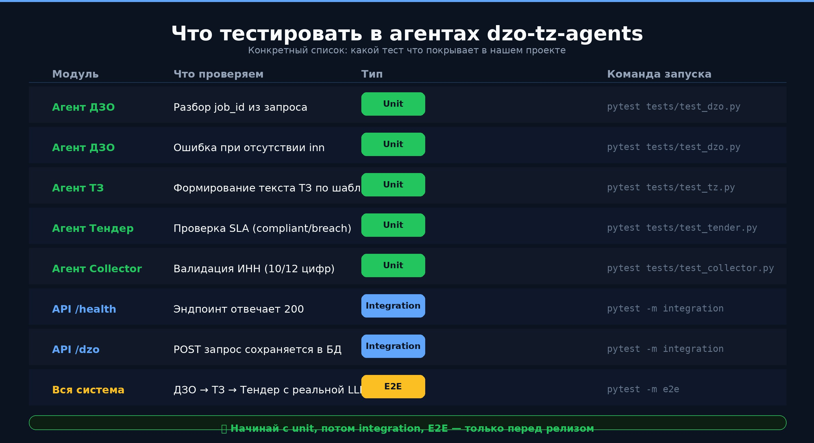

# Урок 17 — Тестирование агентов: от unit до реальной LLM

## Зачем тестировать агентов?

Агент — это не просто функция. Он вызывает LLM, запускает инструменты, работает с базой данных.
Без тестов любое изменение промпта или кода может сломать всю цепочку — и вы узнаете об этом только в продакшне.

---

## Три уровня тестирования

В проекте `dzo-tz-agents` используется **пирамида тестирования**:





| Уровень | Файлы | Когда запускать |
|---------|-------|----------------|
| **Unit** | ~35 файлов `test_*.py` | При каждом push — автоматически в CI |
| **Integration** | `test_integration.py`, `test_api.py` | После unit, с запущенным сервером |
| **E2E** | `test_e2e.py`, `test_real_*.py` | Вручную, с реальным API-ключом |

---

## Mock LLM vs Реальная LLM

Большинство тестов запускаются **без реального вызова LLM**.
Вместо этого `conftest.py` подставляет заглушку — это быстро, бесплатно, детерминировано.





### Как работает mock в conftest.py

```python
# tests/conftest.py — выполняется до всех тестов
def _fake_build_llm(*args, **kwargs):
    llm = MagicMock()
    llm.model_name = "gpt-mock"
    return llm

import shared.llm as _shared_llm
_shared_llm.build_llm = _fake_build_llm  # патчим до импорта агентов
```

### Когда нужна реальная LLM

```bash
# E2E через OpenAI
OPENAI_API_KEY=sk-ваш-ключ LLM_BACKEND=openai pytest tests/test_e2e.py -m e2e -v

# E2E через GitHub Models (бесплатно с GITHUB_TOKEN)
GITHUB_TOKEN=ghp_токен LLM_BACKEND=github_models pytest tests/test_e2e.py -m e2e -v
```

E2E-тесты используют **минимальный input** (7–8 строк) — экономия токенов.

---

## Маркеры pytest





```python
@pytest.mark.e2e
def test_full_dzo_pipeline():
    ...
```

```bash
pytest tests/ -v                          # только unit
pytest tests/ -m integration -v          # только integration
LLM_BACKEND=openai pytest -m e2e -v      # e2e с реальной LLM
pytest tests/ -m "not slow" -v           # всё кроме медленных
```

---

## Запуск тестов локально

```bash
make api         # убеждаемся что API запущен
make test        # pytest tests/ -v --tb=short --cov=. --cov-report=term-missing

# Тест конкретного агента с отладкой:
make test-agent-dzo
# AGENT_DEBUG=1 python test_agent_local.py dzo "Заявка..."
```

Вывод при `AGENT_DEBUG=1`:
```
[DEBUG] 🔧 generate_validation_report вызван
[INFO]  ✅ generate_validation_report: отчёт готов (decision=Заявка полная)
[DEBUG] 🔧 generate_tezis_form вызван
[INFO]  ✅ generate_tezis_form: HTML-форма готова
```

---

## Что покрывает `tests/`

```
tests/
├── conftest.py                     # Mock-и — работают автоматически
├── test_agent_tooling.py           # Инструменты агентов
├── test_api.py                     # HTTP-эндпоинты
├── test_collector.py               # Сборщик ответов тендера
├── test_e2e.py                     # E2E с реальной LLM (opt-in)
├── test_llm.py                     # Фабрика LLM, приоритет ключей
├── test_mcp_server.py              # MCP-сервер
├── test_real_procurement_docs.py   # Реальные закупочные документы
├── test_security.py                # Безопасность API
├── test_tools_dzo.py               # Инструменты агента ДЗО
└── ...
```

> **Совет:** Начните с `test_tools_dzo.py` — короткий, понятный, показывает
> как тестировать отдельный `@tool` без запуска всего агента.

---

## 🧠 Объяснение для новичка: почему это важно

Представь: ты изменил одну строку в промпте агента ДЗО. Как узнать, не сломал ли ты что-то?

Без тестов — только вручную запускать сценарии и смотреть глазами. Это долго и ненадёжно.

**С тестами:**
- Unit-тест запустится за 0.1 сек и скажет: «функция `validate_inn` сломалась»
- Integration-тест за 2 сек проверит: «API возвращает 200»
- E2E за 30 сек проверит: «агент дал правильный ответ на реальный запрос»

Каждый тест — это страховка. Чем больше страховок, тем смелее можно менять код.

### Почему Mock, а не реальная LLM?

Реальная LLM стоит денег и отвечает по-разному каждый раз. Mock всегда отвечает одинаково и бесплатно.
Поэтому **95% тестов используют Mock**, а реальная LLM — только в E2E перед релизом.

### Правило одного Assert

Старайся писать тесты по принципу: **один тест — одна проверка**. Так легче понять, что именно сломалось.

```python
# Плохо: два разных assert в одном тесте
def test_dzo_response():
    result = agent_dzo(job)
    assert result["status"] == "ok"        # что именно упало?
    assert result["inn"] == "7707083893"   # непонятно

# Хорошо: разделить на два теста
def test_dzo_status():
    assert agent_dzo(job)["status"] == "ok"

def test_dzo_inn_preserved():
    assert agent_dzo(job)["inn"] == "7707083893"
```

---

## ✅ Проверь себя

1. Чем unit-тест отличается от integration-теста?
2. Зачем нужен `conftest.py` с `_fake_build_llm()`?
3. Какую команду запустить, чтобы прогнать только unit-тесты (без E2E)?
4. Почему E2E-тесты не запускают в CI автоматически?
5. Напиши шаблон простого unit-теста по схеме Arrange → Act → Assert для функции `validate_inn(inn: str) -> dict`.
---

➡️ **Следующий урок:** [Урок 18 — CI/CD: GitHub Actions и деплой](lesson_18_ci.md)

📖 [Глоссарий терминов](glossary.md) | 📋 [README курса](README.md)
