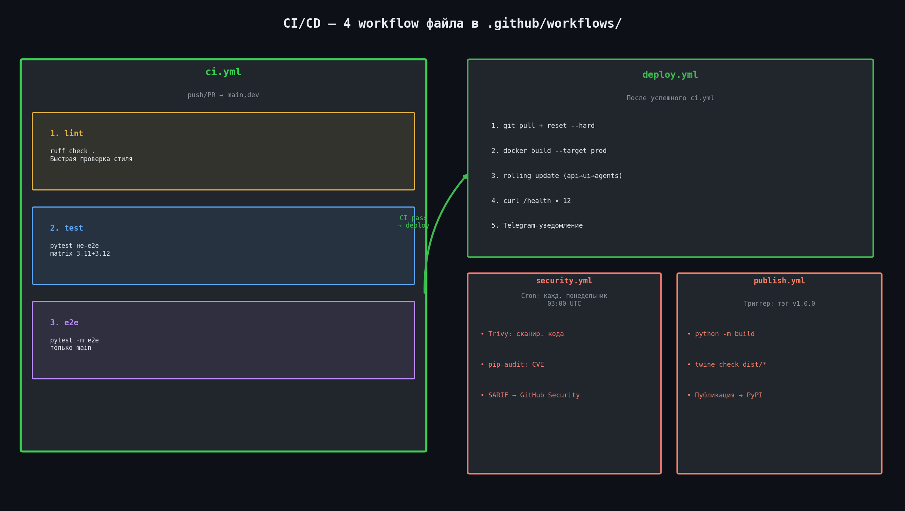
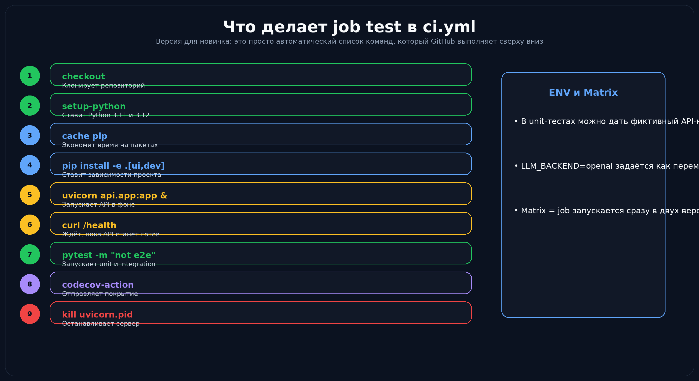
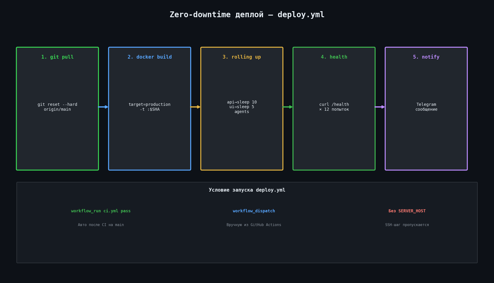

# Урок 18 — CI/CD: что такое GitHub Actions и как это устроено у нас

## Что такое CI?

**CI (Continuous Integration)** — автоматическая проверка кода при каждом `git push`.
Вместо того чтобы помнить «запустить тесты перед пушем», это происходит само.

Как только вы делаете `git push` → GitHub запускает проверки:
- ✅ Всё зелёное — можно мержить
- ❌ Что-то упало — нужно починить

---

## 4 workflow файла в проекте



| Файл | Когда | Что делает |
|------|-------|----------|
| `ci.yml` | push/PR в main/dev | Lint + unit/integration + e2e |
| `deploy.yml` | После успешного CI | Zero-downtime деплой |
| `security.yml` | Каждый понедельник | Trivy + pip-audit |
| `publish.yml` | При тэге `v1.0.0` | Публикация в PyPI |

---

## Что происходит внутри ci.yml



`ci.yml` запускает **3 job-а** последовательно: `lint → test → e2e`

### Job: lint (≈2 сек)
```bash
ruff check . --config pyproject.toml
```
Если есть ошибки — дальше не идём.

### Job: test
```yaml
strategy:
  matrix:
    python-version: ["3.11", "3.12"]
```
Запускается **параллельно** на двух версиях Python.

Шаги:
1. Клонирование репозитория (`actions/checkout@v4`)
2. Установка Python и зависимостей
3. Запуск `uvicorn` в фоне
4. Ожидание `/health` (до 20 попыток)
5. `pytest -m "not e2e and not integration"`
6. Загрузка coverage в Codecov
7. Остановка сервера (`if: always()`)

> В CI используется ключ-заглушка `sk-unit-test` — LLM **не вызывается** в unit-тестах.

### Job: e2e
Только на ветке `main` или при ручном запуске. Требует секрет `OPENAI_API_KEY`.

---

## Zero-downtime деплой



```bash
# Rolling update — по одному контейнеру:
docker compose up -d --no-deps --build api && sleep 10
docker compose up -d --no-deps --build ui && sleep 5
docker compose up -d --no-deps --build agent-dzo agent-tz

# Проверка готовности:
for i in $(seq 1 12); do
  STATUS=$(curl -sf http://localhost:8000/health | python3 -c "import sys,json; print(json.load(sys.stdin)['status'])" 2>/dev/null)
  [ "$STATUS" = "ok" ] && echo 'API готов' && break
  sleep 5
done
```

---

## Как смотреть результаты CI

1. Откройте репозиторий → вкладка **Actions**
2. Выберите workflow → конкретный run → кликните на job
3. Смотрите логи шагов — при ошибке будет traceback

```bash
# GitHub CLI:
gh workflow run ci.yml --ref main   # запустить вручную
gh run list --workflow=ci.yml       # список запусков
```

---

## Security: еженедельное сканирование

`security.yml` — каждый понедельник в 03:00:

- **Trivy** — ищет CVE в зависимостях и коде
- **pip-audit** — проверяет PyPI пакеты на уязвимости
- Результат → **Security → Code scanning alerts** на GitHub

---

## Значок CI в README

```markdown
[](
  https://github.com/OlegKarenkikh/dzo-tz-agents/actions/workflows/ci.yml
)
```

Зелёный значок = все тесты проходят на текущем коде `main`.
