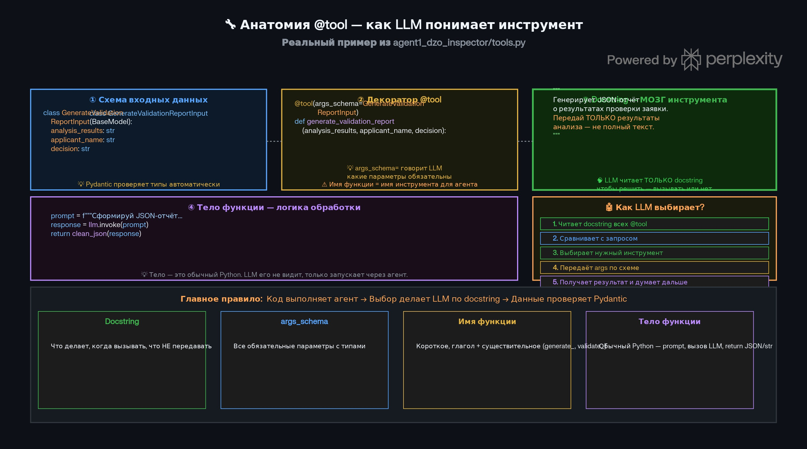
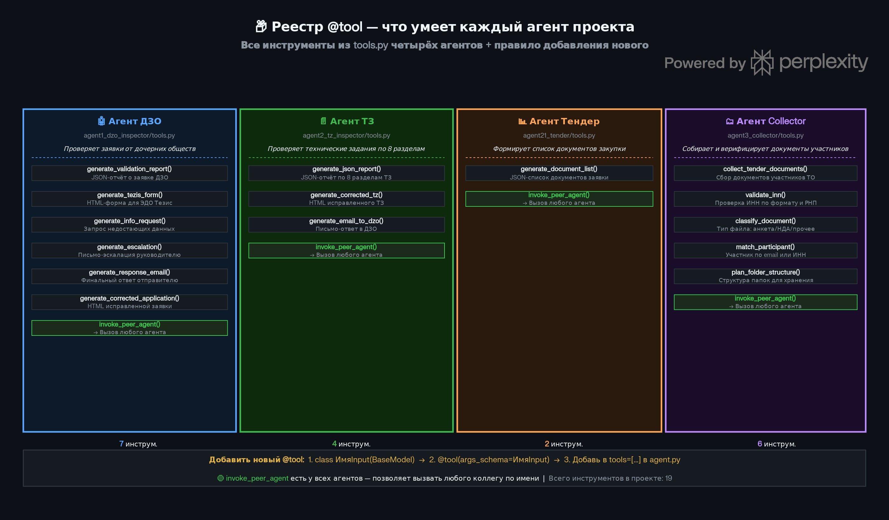
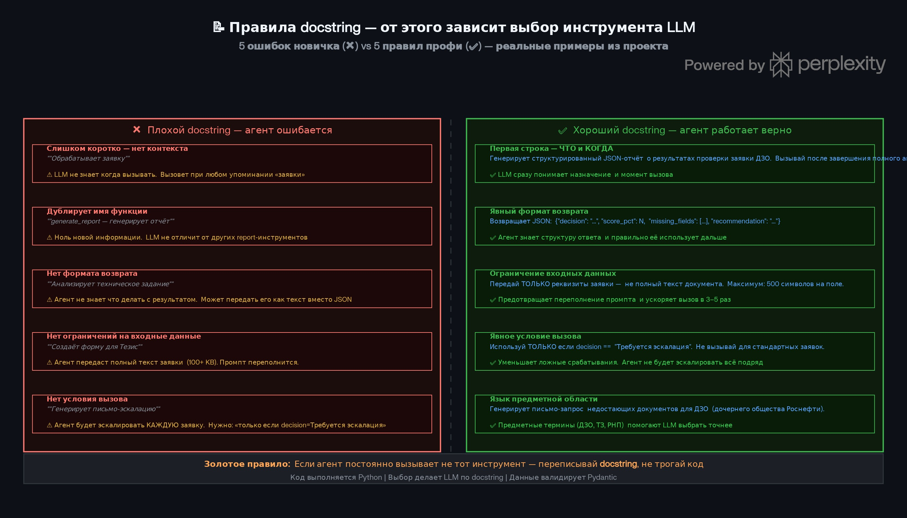

# 🔧 Урок 19: Навыки агента — инструменты, схемы и docstring

> 🎯 **Зачем этот урок?**
> Этот урок показывает, как агент получает "навыки": через Pydantic-схемы, декоратор `@tool` и понятные docstring.
> После урока ты сможешь читать `tools.py`, понимать, что именно увидит LLM, и как добавить новый инструмент без ошибок.



---

## 🤖 Что такое навык агента?

> 💡 **Аналогия:** Инструмент агента — как кнопка на пульте управления. Кнопка (функция) делает одно конкретное действие, а надпись на ней (docstring) объясняет оператору (LLM) когда и зачем её нажимать.

В этом проекте **навык** — это не абстрактное слово, а реальный Python-инструмент, который агент может вызвать сам.
Агент не "знает" всё заранее: он получает список функций, читает их описание и решает, что запустить.
Если описание написано понятно, агент выбирает инструмент правильно.
Если описание слабое или расплывчатое, агент начинает ошибаться.

> 💡 **Ключевая мысль:**
> Навык = `@tool` + схема входных данных + хороший docstring + понятная логика внутри функции.

---

## 🧱 Из чего состоит tool

Любой инструмент в проекте состоит из четырёх частей:

1. **Pydantic-схема** — описывает, какие параметры можно передавать.
2. **Декоратор `@tool`** — регистрирует функцию как инструмент.
3. **Docstring** — главное описание для LLM.
4. **Тело функции** — обычный Python-код, который выполняет работу.

Например, в `agent1_dzo_inspector/tools.py` есть инструмент `generate_validation_report`.
У него есть схема входных данных, декоратор, понятное описание и тело, которое собирает результат.

```python
class GenerateValidationReportInput(BaseModel):
    analysis_results: str
    applicant_name: str
    decision: str

@tool(args_schema=GenerateValidationReportInput)
def generate_validation_report(...):
    """Генерирует структурированный JSON-отчёт о результатах проверки заявки ДЗО.
    Передай только результаты анализа — не полный текст заявки."""
    ...
```

---

## 🧠 Как LLM выбирает инструмент

LLM не смотрит внутрь Python-кода как разработчик.
Она сначала читает **имя функции**, **docstring** и **схему аргументов**, а потом решает, подходит ли инструмент под запрос.
То есть для агента важно не только что делает функция, но и как она описана.

Если пользователь просит "сделать письмо-эскалацию", модель ищет инструмент, где в docstring есть именно это назначение.
Если docstring слишком общий, модель может выбрать не тот tool или не вызвать его вообще.

---

## 📦 Реестр инструментов проекта



В проекте есть четыре основных агента:

- **Агент ДЗО** — проверяет заявки дочерних обществ.
- **Агент ТЗ** — анализирует технические задания.
- **Агент Тендер** — формирует список документов.
- **Агент Collector** — собирает и проверяет документы участников.

У каждого агента есть свой набор `@tool` функций.
Часть инструментов выполняет локальную работу, а часть умеет вызывать другого агента через `invoke_peer_agent`.
Это удобно: один агент не обязан делать всё сам.

---

## 🛠️ Что делает каждый агент

### Агент ДЗО

Он генерирует отчёты, письма, HTML-формы и при необходимости отправляет задачу другому агенту.
Сюда входят `generate_validation_report`, `generate_tezis_form`, `generate_info_request`, `generate_escalation`, `generate_response_email`, `generate_corrected_application`.

### Агент ТЗ

Он работает с текстом технического задания и умеет делать JSON-отчёт, исправленную HTML-версию и письмо обратно в ДЗО.
Главная идея здесь — быстро показать, что не так с ТЗ и как это исправить.

### Агент Тендер

Он отвечает за структуру документов и умеет сформировать список того, что нужно от участника.
Это более узкий агент, поэтому инструментов у него меньше.

### Агент Collector

Он собирает документы, классифицирует их, проверяет ИНН, сопоставляет участника и планирует структуру папок.
Это уже не просто анализ, а работа с большим количеством входных материалов.

---

## 🖊️ Почему docstring важнее, чем кажется



Docstring — это не комментарий для человека "на потом".
Для LLM это фактически инструкция, когда и зачем использовать инструмент.
Если docstring слабый, агент начинает делать лишние вызовы, путаться в назначении или пропускать нужный шаг.

Хороший docstring должен отвечать на три вопроса:

- Что делает инструмент.
- Когда его вызывать.
- Что нельзя передавать в аргументах.

> 💡 **Практический вывод:**
> Если агент регулярно вызывает не тот tool, сначала переписывай docstring, а не код.

---

## 📏 5 правил хорошего docstring

1. **Начинай с действия и смысла.**
   Не пиши просто "обрабатывает данные". Пиши: "Генерирует JSON-отчёт о заявке ДЗО".

2. **Указывай момент вызова.**
   Например: "Используй только после полного анализа заявки".

3. **Пиши ограничения.**
   Например: "Передай только результаты анализа, не полный текст".

4. **Показывай ожидаемый результат.**
   Например: "Возвращает JSON с полями decision, score_pct и issues".

5. **Используй язык задачи, а не только язык Python.**
   Агенту помогают слова из предметной области: ДЗО, ТЗ, Тендер, ИНН, РНП.

---

## ⚠️ 5 типичных ошибок новичка

1. **Слишком короткое описание.**
   Если docstring звучит как "делает отчёт", LLM не понимает, какой именно.

2. **Повтор названия функции.**
   Фраза "generate_report генерирует отчёт" не добавляет смысла.

3. **Нет формата ответа.**
   Модель должна понимать, что результат — это JSON, HTML или письмо.

4. **Нет ограничений на вход.**
   Если не написать "не передавай полный текст", модель может отправить слишком много данных.

5. **Нет условия вызова.**
   Агент начинает вызывать инструмент слишком часто, даже когда он не нужен.

---

## 🧩 Как добавить новый инструмент

Новый tool добавляется по простой схеме:

1. Создай `class ...Input(BaseModel)`.
2. Добавь `@tool(args_schema=...)`.
3. Напиши понятный docstring.
4. Реализуй логику функции.
5. Добавь tool в список инструментов агента.

Если хочешь, чтобы агент использовал новый инструмент правильно, сначала проверь, понимает ли он описание.
Хорошо написанный docstring часто важнее, чем сложная логика внутри функции.

---

## 🧭 Главное правило урока

Навык агента — это не магия.
Это аккуратно описанная функция: схема входа, декоратор, docstring и понятный код.
Чем яснее написан docstring, тем точнее LLM выбирает инструмент.

---

## 📍 Что запомнить

| Понятие | Смысл |
|---|---|
| `@tool` | Декоратор, превращающий функцию в инструмент агента |
| `args_schema` | Pydantic-класс с описанием параметров инструмента |
| Docstring | Главная инструкция для LLM — когда и как вызывать |
| `BaseModel` | Базовый класс Pydantic для схемы входных данных |
| Плохой docstring | «Делает что-то» — LLM не знает зачем вызывать |
| Хороший docstring | «Используй когда... Возвращает... Не используй если...» |

---

## 🎓 Курс завершён!

Поздравляем! Ты прошёл все 20 уроков — от терминала до навыков агента.

**Что дальше:**
- 📖 [Глоссарий терминов](glossary.md) — все термины курса
- 📋 [README проекта](../README.md) — как запустить систему
- 🛠️ [Как добавить нового агента](../docs/adding_new_agent.md)
- 🔍 Изучи реальный код агентов в папках `agent1_dzo_inspector/`, `agent2_tz_inspector/`

📖 [Глоссарий терминов](glossary.md) | 📋 [README курса](README.md)

## ✅ Проверь себя

1. Чем декоратор `@tool` отличается от обычной Python-функции?
2. Зачем нужна `args_schema=...Input` — можно ли без неё?
3. Напиши пример хорошего docstring для инструмента `check_budget(amount: float)`.
4. Почему «короткий docstring» — это баг, а не фича?
5. Назови 5 типичных ошибок новичка при написании инструментов.
