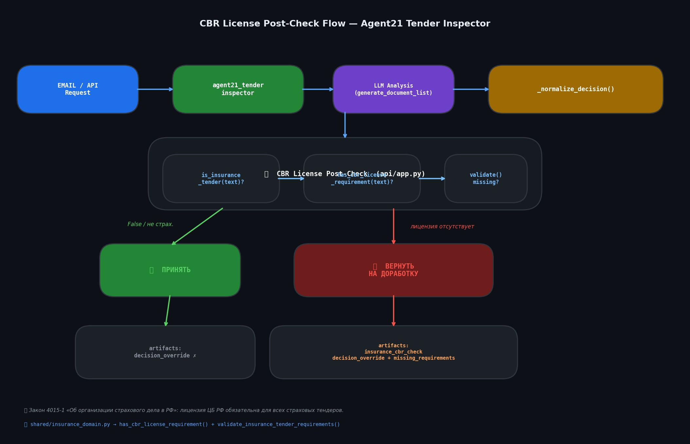

# Урок 20. Страховые тендеры: лицензия ЦБ РФ и CBR Post-Check

**← [Урок 19 — Навыки агента: инструменты, схемы и docstring](lesson_19_skills.md)**

---

## Зачем нужен отдельный урок?

Агент21 (`agent21_tender_inspector`) отлично разбирает тендеры —
выделяет перечень документов, находит НМЦК, определяет тип страхования.
Но есть одна ловушка: **rules-engine может одобрить страховой тендер,
в котором забыли потребовать лицензию ЦБ РФ**. Без этого требования
тендер де-юре незаконен, а правила-движок об этом не знает.

В этом уроке вы узнаете:
- что такое лицензия ЦБ РФ и почему она обязательна
- как работает CBR Post-Check в `api/app.py`
- как устроен `validate_insurance_tender_requirements()` в `shared/insurance_domain.py`
- как написать тесты для защиты от False-Positive

---

## Что такое лицензия ЦБ РФ

Любая страховая компания в России **обязана** иметь лицензию Банка России
на проведение страховой деятельности. Это требование закреплено в
**Законе РФ №4015-1 «Об организации страхового дела в Российской Федерации»**.

Простыми словами: лицензия ЦБ РФ — это как права на вождение, только для
страховщиков. Без неё компания не может законно выдавать полисы.

Поэтому в **каждом** страховом тендере (ОСАГО, КАСКО, ДМС, имущество, грузы...)
в разделе «Требования к участникам» **обязательно** должна быть фраза вида:

```
Наличие действующей лицензии ЦБ РФ на [вид страхования]
```

или

```
Лицензия Банка России на добровольное имущественное страхование
```

Если этой фразы нет — тендерная документация **дефектна**, её нужно
вернуть на доработку.

---

## False-Positive: почему агент может ошибиться

Представьте такой тендер:

```
Страхование имущества государственного учреждения (44-ФЗ).
Требования: опыт работы 3+ года, отсутствие в РНП.
```

Агент видит: страховой тендер, все базовые поля есть → **ПРИНЯТЬ**.

Но опытный специалист скажет: **ВЕРНУТЬ**, потому что нет требования лицензии ЦБ РФ.

Это классический **False-Positive** — решение кажется правильным, но является
ошибкой. Для таких случаев и нужен CBR Post-Check.

---

## Архитектура CBR Post-Check



После того как агент вынес первичное решение, в `api/app.py` запускается
дополнительная проверка:

```
1. agent_type == "tender"?
2. is_insurance_tender(text) == True?   ← текст содержит страховые + закупочные слова
3. has_cbr_license_requirement(text)?   ← ищем "лицензия ЦБ РФ" / "Банка России"
4. Если (2) и NOT (3) → decision = "ВЕРНУТЬ НА ДОРАБОТКУ"
```

Весь механизм живёт в двух функциях модуля `shared/insurance_domain.py`.

---

## Функция has_cbr_license_requirement()

```python
from shared.insurance_domain import has_cbr_license_requirement

text = "Требования: наличие лицензии ЦБ РФ на страховую деятельность."
print(has_cbr_license_requirement(text))   # True

text = "Требования: опыт работы от 3 лет, РНП."
print(has_cbr_license_requirement(text))   # False
```

Функция использует **два уровня поиска**:

1. **Ключевые слова** (быстро):
   - `"лицензия цб"`, `"лицензии банка"`, `"наличие лицензи"`
   - `"банка россии на"`, `"цб рф на"`

2. **Регулярные выражения** (точнее):
   - `лицензи[яи].*(?:цб|банк.*росс|центральн.*банк)`
   - `лицензи[яи] на.*страховую деятельность`
   - `лицензи[яи].*4015`

---

## Функция validate_insurance_tender_requirements()

```python
from shared.insurance_domain import validate_insurance_tender_requirements

# Тендер с лицензией ЦБ → ПРИНЯТЬ
text = "Страхование грузов 223-ФЗ. Требование: лицензия ЦБ РФ на страхование."
result = validate_insurance_tender_requirements(text)
# {
#   "has_cbr_license": True,
#   "is_valid": True,
#   "missing_requirements": [],
#   "decision": "ПРИНЯТЬ"
# }

# Тендер БЕЗ лицензии ЦБ → ВЕРНУТЬ
text = "Страхование имущества 44-ФЗ. Требования: опыт работы."
result = validate_insurance_tender_requirements(text)
# {
#   "has_cbr_license": False,
#   "is_valid": False,
#   "missing_requirements": [
#     "Требование лицензии ЦБ РФ на страховую деятельность (Закон 4015-1)"
#   ],
#   "decision": "ВЕРНУТЬ НА ДОРАБОТКУ"
# }
```

---

## Как это выглядит в api/app.py

Упрощённо, пост-чек выглядит так:

```python
if agent_type == "tender":
    from shared.insurance_domain import is_insurance_tender, validate_insurance_tender_requirements

    if is_insurance_tender(full_text):
        cbr_check = validate_insurance_tender_requirements(full_text)
        artifacts["insurance_cbr_check"] = cbr_check

        if not cbr_check["has_cbr_license"]:
            artifacts["decision_override"] = {
                "previous_decision": decision,
                "override_reason": "Отсутствует требование лицензии ЦБ РФ (Закон 4015-1)",
                "missing_requirements": cbr_check["missing_requirements"],
            }
            decision = "ВЕРНУТЬ НА ДОРАБОТКУ"
```

После завершения пост-чека в теле ответа появятся два новых артефакта:
- **`insurance_cbr_check`** — результат проверки (has_cbr_license, decision...)
- **`decision_override`** — если решение было изменено: предыдущее решение + причина

---

## Практика: запустите тесты

```bash
# Только CBR-тесты
pytest tests/test_insurance_domain.py -k "cbr" -v

# Все тесты страхового домена
pytest tests/test_insurance_domain.py -v

# Тесты rules-engine на реальных документах
pytest tests/test_real_procurement_docs.py::TestRealDocumentRulesEngine -v
```

Ожидаемый результат — все тесты зелёные:

```
test_no_cbr_license_fixture_returns_false          PASSED
test_validate_insurance_tender_missing_cbr_license PASSED
test_tender_no_cbr_license_detected               PASSED
test_tender_no_cbr_license_validate_returns_return PASSED
...
```

---

## Самопроверка

**Вопрос 1.** Какой закон делает лицензию ЦБ РФ обязательной для страховщиков?
- [ ] 44-ФЗ
- [ ] 223-ФЗ
- [x] Закон №4015-1
- [ ] 40-ФЗ

**Вопрос 2.** Что вернёт `validate_insurance_tender_requirements()`, если лицензия ЦБ есть?
- [ ] `{"decision": "ВЕРНУТЬ НА ДОРАБОТКУ"}`
- [x] `{"decision": "ПРИНЯТЬ", "missing_requirements": []}`
- [ ] `{"decision": "ПРОВЕРИТЬ"}`
- [ ] `None`

**Вопрос 3.** Что такое False-Positive в контексте тендерного агента?
- [ ] Агент отклонил правильный тендер
- [x] Агент одобрил дефектный тендер
- [ ] Агент не смог прочитать документ
- [ ] Агент вернул пустой список документов

---

## Итог урока

| Компонент | Роль |
|---|---|
| `is_insurance_tender()` | Определяет, является ли текст страховым тендером |
| `has_cbr_license_requirement()` | Ищет требование лицензии ЦБ РФ |
| `validate_insurance_tender_requirements()` | Выносит решение ПРИНЯТЬ / ВЕРНУТЬ |
| `api/app.py` post-check | Встраивает CBR-проверку в pipeline агента |
| `insurance_cbr_check` (артефакт) | Результат проверки в JSON-ответе |
| `decision_override` (артефакт) | Документирует изменение решения |

---

**🎓 Курс завершён!**

Вы прошли путь от настройки терминала (Урок 0) до понимания тонкостей
предметной валидации страховых тендеров (Урок 20).

Поздравляем! Теперь вы можете уверенно работать с кодовой базой dzo-tz-agents:
читать агентов, понимать pipeline обработки, писать тесты и добавлять новые проверки.
