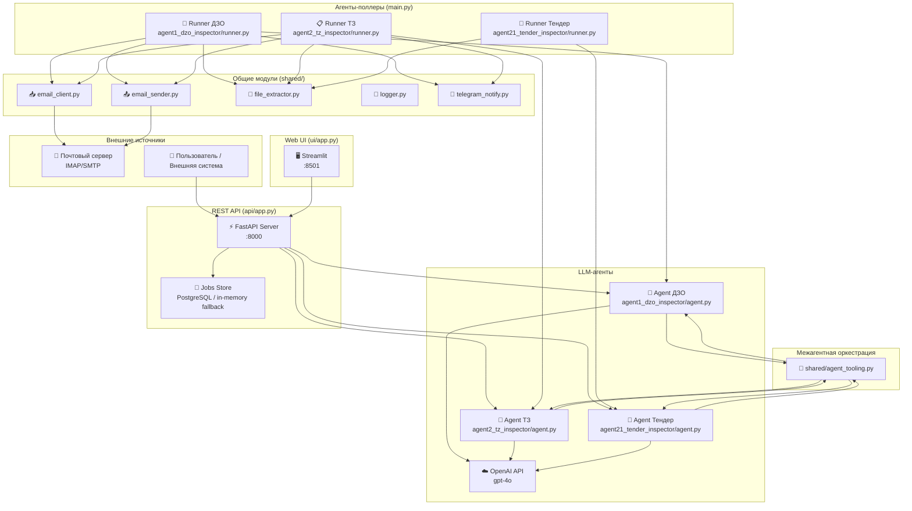

# Архитектура системы DZO/TZ Agents

## Обзор

Система состоит из нескольких независимых компонентов, взаимодействующих через REST API и почтовые протоколы (IMAP/SMTP).

## Схема компонентов



## Поток данных

### Режим поллера (main.py)

```
1. Планировщик (schedule) → вызывает runner каждые N секунд
2. Runner → fetch_unseen_emails() → IMAP-сервер
3. Runner → extract_text_from_attachment() → извлечение текста из PDF/DOCX/XLSX/IMG
4. Runner → agent.invoke(chat_input) → LLM (OpenAI)
5. LLM → вызов tool-функций (generate_validation_report, generate_tezis_form, ...)
6. Runner → send_email() → SMTP-сервер → Получатель
7. Runner → notify() → Telegram (опционально)
```

### Режим REST API (api/app.py)

```
1. Клиент → POST /api/v1/process/{agent} (с X-API-Key)
2. API → создаёт job в PostgreSQL или in-memory fallback (UUID), возвращает job_id
3. BackgroundTask → _process_with_agent()
4. → extract_text_from_attachment() → текст из вложений
5. → agent.invoke(chat_input) → LLM (OpenAI)
6. → сохраняет результат в jobs[job_id]
7. Клиент → GET /api/v1/jobs/{job_id} → получает статус/результат
```

## Описание модулей

### `api/app.py` — REST API

FastAPI-приложение с полным набором эндпоинтов. Обеспечивает:
- Асинхронную обработку заданий через `BackgroundTasks`
- Хранение заданий в PostgreSQL с fallback в in-memory store
- API-ключ аутентификацию (заголовок `X-API-Key`)
- CORS middleware
- Swagger UI по адресу `/docs`

### `ui/app.py` — Web UI

Streamlit-приложение с 5 страницами навигации. Обращается к API через `httpx`.
Поддерживает динамический список агентов из `/agents`, автоопределение агента,
просмотр тендерных артефактов и результатов межагентных вызовов.

### `ui/config.py` — Конфигурация UI

Читает `UI_API_URL` и `UI_API_KEY` из переменных окружения.

### `agent1_dzo_inspector/`

| Файл | Описание |
|------|----------|
| `agent.py` | Создание LangChain AgentExecutor с системным промптом и инструментами |
| `runner.py` | Оркестратор: IMAP → текст → агент → SMTP |
| `tools.py` | Инструменты агента: отчёты, формы, письма, вызов peer-агентов |

### `agent2_tz_inspector/`

| Файл | Описание |
|------|----------|
| `agent.py` | Создание LangChain AgentExecutor для проверки ТЗ |
| `runner.py` | Оркестратор: IMAP → текст → агент → SMTP |
| `tools.py` | Инструменты: JSON-отчёт, исправленное ТЗ, письмо ДЗО, вызов peer-агентов |

### `agent21_tender_inspector/`

| Файл | Описание |
|------|----------|
| `agent.py` | Создание агента парсинга тендерной документации |
| `runner.py` | Обработка локальных документов/URL и сохранение JSON-результата |
| `tools.py` | Инструменты: список документов и вызов peer-агентов |

### `shared/`

| Файл | Описание |
|------|----------|
| `email_client.py` | Получение UNSEEN писем с вложениями через imaplib |
| `email_sender.py` | Отправка HTML-писем с вложениями через smtplib |
| `file_extractor.py` | Извлечение текста из PDF/DOCX/XLSX/XLS/IMG через pdfplumber, python-docx, openpyxl, GPT-4o Vision |
| `logger.py` | Настройка структурированного логирования |
| `telegram_notify.py` | Уведомления в Telegram (опционально) |

### `config.py`

Централизованная конфигурация из переменных окружения с fallback-значениями,
включая настройки межагентной оркестрации (`AGENT_TOOL_*`).

### `main.py`

Точка входа для агентов-поллеров. Запускает планировщик `schedule`.
